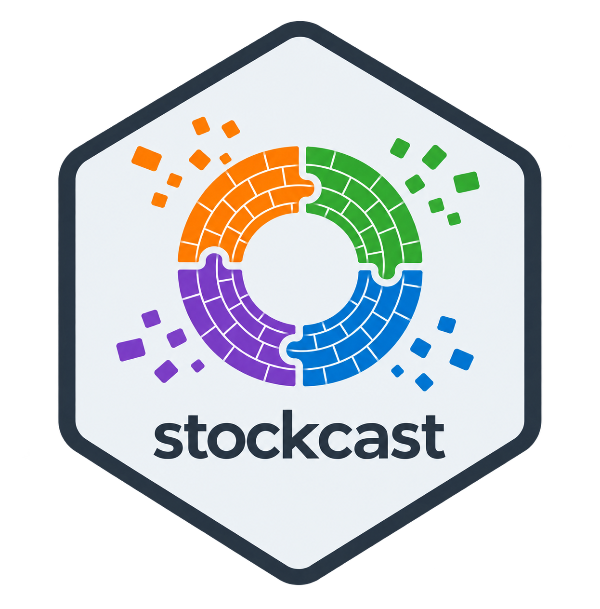

<p align="center">
  
</p>

# Stockcast

> A modular Python library for inventory decisions based on forecast-derived inputs.

Stockcast is for researchers and practitioners who have forecast-derived inputs
and need to turn them into clear replenishment decisions. It lets you simulate
the consequences of those decisions and compare forecasts and policies through
operational outcomes.

Stockcast does not replace a forecasting library. It provides the inventory
decision and evaluation layer that follows a forecasting workflow.

## Use Stockcast in a Python workflow

Stockcast can be called after a forecasting step and before a downstream ordering
or approval step. The calling application remains responsible for producing
forecasts and applying approved orders.

```text
forecasting code
    -> forecast-derived target
    -> Stockcast policy and order decision
    -> inventory simulation and event records
    -> evaluation results for the calling workflow
```

The [weekly forecast-to-order tutorial](examples/notebooks/04_forecast_to_inventory_integration.ipynb)
starts with a one-week target and shows both the periodic and one-purchase
policy APIs. The [cumulative target tutorial](examples/notebooks/04c_cumulative_protection_target.ipynb)
then adds lead time and a multi-day protection window. The
[scheduled simulation capstone](examples/notebooks/04f_scheduled_forecast_simulation.ipynb)
joins an explicit order calendar, updated forecasts, and engine events.

Forecast accuracy is useful, but a forecast is not a decision. A forecast
affects an order decision, and that decision affects stock, service, backlog,
and cost.

This supports questions such as:

- How do two forecast outputs affect inventory service and cost?
- What changes when the lead time, review period, or policy changes?
- How does a custom policy behave on the same demand path?
- What evidence explains the result of a simulation?

## Build the workflow you need

Stockcast is modular. You can keep the parts that already exist in your work and
choose the parts you want to study or change.

| You provide or choose | Stockcast provides |
|---|---|
| Forecast-derived targets or a supported forecast representation | Validation of target timing and provenance |
| Opening inventory, demand path, lead time, review period, and costs | Inventory state transitions and lead-time pipeline handling |
| A built-in or custom replenishment policy | Order decisions with validated timing |
| Constraints, callbacks, and evaluation questions | Canonical event records, audit information, and evaluation tools |

The engine owns the run lifecycle. Policies request orders but do not change
inventory directly. The event records are the source for later evaluation.

You can use the built-in components or extend the workflow:

- use forecast-derived targets from your existing forecasting process;
- choose a built-in replenishment policy or write a supported custom policy;
- update policy targets as new forecasts become available;
- add declared ordering constraints;
- add typed callbacks for supported interventions;
- run FIFO shelf life, and optionally combine it with your own physical
  processes (for example inspection discards or returns) that stay in the
  audited stock balance;
- optionally order from several suppliers with their own fixed or random lead
  times and partial deliveries, and track every open order; and
- evaluate the same demand path under different forecast, policy, and
  inventory assumptions.

## Getting started

### Install

After the first release is available, install it from PyPI:

```bash
pip install stockcast
```

Until then, install the current repository version from GitHub:

```bash
pip install "git+https://github.com/FilTheo/stockcast.git"
```

### Run a first inventory decision

This small example creates explicit inventory state, supplies a two-day
forecast-derived protection target, runs an order-up-to policy, and prints two
operational results. It does not fit a forecasting model.

```python
import pandas as pd

from stockcast import InventoryStateDataFrame, OrderUpToPolicy, SimulationEngine

sku = "tea_250g"
origin = pd.Timestamp("2026-01-05")

inventory = InventoryStateDataFrame(
    [sku], max_lead_time=1, allow_backorders=False
).initialize_from_observed(
    pd.DataFrame({"unique_id": [sku], "on_hand": [5.0]}),
    on_hand_column="on_hand",
    start_date=origin,
)

# A cumulative two-day target calculated by the caller's forecasting process.
target = pd.DataFrame({
    "unique_id": [sku],
    "target": [20.0],
    "target_end_date": [origin + pd.Timedelta(days=2)],
})
policy = OrderUpToPolicy(
    lead_time=1, review_period=1, service_level=0.95, allow_backorders=False
).fit(
    target,
    target_column="target",
    target_probability=0.95,
    protection_horizon=2,
    target_source="external_direct",
    forecast_origin=origin,
    forecast_frequency="D",
    target_end_date_column="target_end_date",
)

demand = pd.DataFrame({
    "unique_id": [sku] * 6,
    "period": range(6),
    "date": pd.date_range(origin + pd.Timedelta(days=1), periods=6, freq="D"),
    "y": [4.0] * 6,
})
result = SimulationEngine().run(
    policy=policy,
    demand_source=demand,
    inventory=inventory,
    n_periods=6,
    period_frequency="D",
    initial_decision="none",
    warmup_periods=0,
    scoring_periods=6,
    settlement_periods=0,
    order_during_settlement=False,
    demand_source_name="readme_example",
    random_seed=None,
)

summary = result.summary()
print({key: summary[key] for key in ("fill_rate", "total_order_units")})
# {'fill_rate': 1.0, 'total_order_units': 35.0}
```

The example is checked against the staging source. It must be checked again
against the released package artifact before this draft becomes the public
README.

### Continue with the notebooks

After the quick start, use these three notebook entry points:

1. [Make a first inventory decision](https://github.com/FilTheo/stockcast/blob/main/examples/notebooks/01_introduction_to_inventory_flow.ipynb) — see the explicit state, target, policy, order, and lead-time flow.
2. [Run a first simulation](https://github.com/FilTheo/stockcast/blob/main/examples/notebooks/02_first_engine_simulation.ipynb) — let the engine run the complete scenario, then inspect the event records and operational measures.
3. [Use an external forecast](https://github.com/FilTheo/stockcast/blob/main/examples/notebooks/04_forecast_to_inventory_integration.ipynb) — turn one-week forecasts into weekly orders with two policy APIs and inspect the outcomes.

These are the suggested order for a new user. The [full notebook collection](https://github.com/FilTheo/stockcast/tree/main/examples/notebooks)
contains the complete, runnable examples, including rolling forecast updates,
custom policies, suppliers and open orders, fair comparisons, FIFO and
shelf-life scenarios, physical inventory processes, and typed callbacks.

## Documentation and support

The public documentation is maintained in the
[documentation directory](https://github.com/FilTheo/stockcast/tree/main/docs).
Use the [repository](https://github.com/FilTheo/stockcast) for source code and
[GitHub Issues](https://github.com/FilTheo/stockcast/issues) for bug reports and
feature requests.

## Scope and assumptions

Stockcast is an inventory decision, simulation, and evaluation library. It is
designed for research and for use inside Python-based decision workflows.

It does not:

- fit forecasting models or estimate missing uncertainty;
- infer opening stock, lead time, costs, demand, or other business inputs;
- act as an ERP, procurement system, or order-approval application; or
- hide model, policy, or inventory assumptions behind a black box.

Users supply the information needed for a scenario. Stockcast validates and
records the inventory decision path that follows.

## Compatibility and API status

- **Python requirement:** Python 3.10 or later, as declared in the package
  metadata. The supported-version test matrix will be confirmed at release.
- **Release status:** Stockcast `0.1.0` is in release preparation; it is not yet
  published as an installable distribution.
- **API status:** The public imports, durable outputs, metrics, and documented
  scientific behaviour are frozen for the 0.1.x release line. Compatible
  additions and corrections may be made; a breaking redesign requires a later
  release line and migration decision.

## License

Stockcast is licensed under the [Apache License 2.0](https://github.com/FilTheo/stockcast/blob/main/LICENSE).

The pre-release engine now decides before demand and supports zero lead time,
separate decision schedules, and single-season targets. See the
[timing migration guide](docs/concepts/decision-schedules.md).
