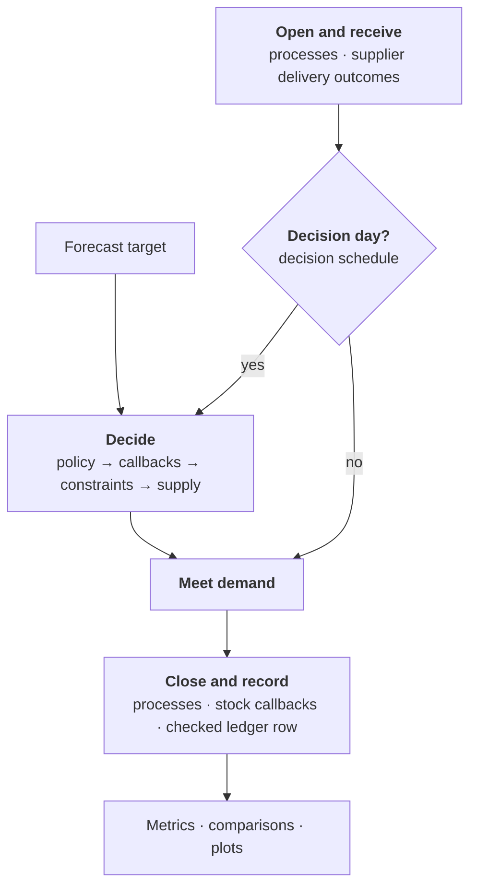

# Philosophy

Why Stockcast is built the way it is.

by Filotas Theodosiou

A forecast is not a decision. A forecast becomes useful when it changes an
order, and an order becomes useful when it changes what happens on the shelf.
Stockcast exists to make that chain explicit, executable, and measurable: from
the forecast you trust, to the order it implies, to the stock, shortages,
waste, and cost that follow.

This small article explains the choices behind the library: what we built, why we
built it this way, and what we deliberately left out. Every other page of
these docs, and every experiment you run, rests on these decisions.

## The gap we are building into

Forecasting and inventory control grew up as neighbouring fields that rarely
share a codebase. Forecasting research tends to treat the forecast as the end
product and judges it by accuracy. Inventory theory tends to assume that the
demand distribution is known and asks what to order. In a recent EJOR review,
Goltsos, Syntetos, Glock and Ioannou call this a high degree of segregation
between the two literatures, and ask for the stages in between (turning a
forecast into a replenishment decision) to be studied in their own right
(Goltsos et al., 2022; see also Syntetos et al., 2016).

The evidence that the in-between matters is old and keeps getting stronger.
Gardner (1990) compared forecasting methods by the inventory investment each
needed for a given service level, and the ranking differed from an accuracy
ranking. Petropoulos, Wang and Disney (2019) evaluated M3 forecasting methods
inside a rolling order-up-to simulation and found that inventory performance
separates methods in ways accuracy alone does not. Kourentzes, Trapero and
Barrow (2020) showed that models fitted to minimise in-sample error are not
the ones that minimise inventory cost, and tuned forecasting models directly on
inventory metrics through simulation. On M5 data, Theodorou, Spiliotis and
Assimakopoulos (2025) found that when lost sales cost more than holding stock,
the most accurate forecast is often not the best one to order with, especially
for short review periods, short lead times and intermittent demand.

The common thread is a **simulation loop that connects a forecast to a
decision rule and plays it against demand**. Every one of those studies built
its own. Stockcast is that loop as a library: explicit, tested, composable,
and fast enough to run on real portfolios.

## Principle 1: the interface between forecasting and inventory is a target

Stockcast does not fit forecasting models. It never will, because the right
model depends on the data, the domain, and the team, and the forecasting
ecosystem already offers excellent choices: statistical, machine learning,
deep learning, foundation models, and judgment.

Instead, we define the handoff precisely. A replenishment decision at period
$t$ must protect the inventory position until the next order can arrive, a
window of $H$ periods ($H = L + R$ for periodic review; Principle 2 explains
why). What the decision needs from a forecast is the distribution of **total
demand over that window**, summarised as a quantile:

$$
S_t = Q_\alpha\!\left(\sum_{h=0}^{H-1} D_{t+h} \,\middle|\, \mathcal{I}_{t-1}\right).
$$

That single, dated number, together with its provenance (probability, window,
forecast origin, frequency), is the whole interface. It has three
consequences that shape the library.

**Any model, any uncertainty method.** Sample paths, bootstrapped residuals,
conformal intervals, quantile regression, a state-space model's cumulative
interval, a Bayesian posterior, a planner's number: if it can produce the
quantity above, Stockcast can use it. We show
[smooth](https://openforecast.org/smooth-py/) in our examples (Svetunkov,
2023) because it forecasts cumulative demand directly, not because anything
depends on it. (Also because we think it is the most principled package for statistical
forecasting out there, and of course this has nothing to do with our small
contribution to it :sweat_smile:)

**The window, not the day.** Quantiles are not additive: the quantile of a sum
equals the sum of quantiles only when every period moves in lockstep. For
ordinary demand, summing daily 95% quantiles grossly overstates the 95%
quantile of the total (60 against 46 packs in our
[tea-shop example](../learn/03-forecast-targets.md)). The mirror-image error is
just as common: estimating the variance of lead-time demand as $H$ times the
one-step error variance ignores that forecast errors are correlated across
horizons, which misstates safety stocks (Prak, Teunter and Syntetos, 2017).
Forecast errors are often non-normal and heteroscedastic too (Trapero, Cardós
and Kourentzes, 2019). All of these are properties of the forecasting model,
so the target of the whole window, computed where that information lives, is
the right interface. When independence and normality are a reasonable
assumption, Stockcast will aggregate per-period means and standard deviations
for you, as an explicitly labelled mode and not as a silent default.

**No invented uncertainty.** Earlier versions of this codebase fell back on a
safety stock of 30% of mean demand when no uncertainty was supplied. We
removed it.
Uncertainty, including the uncertainty of estimated parameters themselves
(Prak and Teunter, 2019), is the forecasting model's job; a number made up
downstream makes a result look precise while describing nobody's operation.
If a target is missing, a run stops and says so.

The deep dive: [Targets cover a whole window](../user-guide/design/cumulative-targets.md).

## Principle 2: one explicit clock

Inventory results depend on *when* things happen inside a period. Does today's
delivery arrive before today's customers? Does the decision see today's sales?
Simulators answer differently, and a parameter called "lead time" silently
means different things in each: Stockpyl observes demand before ordering, and
SimOpt's $(s, S)$ model orders at the end of a period and receives at the start
of period $n + l + 1$. Neither is wrong. Each is a convention, and results
cannot be compared across tools without it.

We fixed one sequence and use it everywhere: **receive, decide, then meet
demand**. It is the classic periodic-review order: receive outstanding orders,
review and order, then observe demand (e.g. Zhu, 2022, Section 3; Zipkin, 2000;
Axsäter, 2015). An order placed in period $t$ with lead time $L$ is received at
the start of period $t + L$, before that period's demand.

This was a deliberate redesign. An earlier version of the engine served demand
first and ordered at the end of the period. Under that order the exposure
window is $L + R - 1$, which is internally consistent. We could have kept it
and patched the horizon formula. We chose to move the decision instead,
because the before-demand order gives three things at once:

1. **The textbook window.** The next decision is at $t + R$ and its order
   lands at $t + R + L$, so today's position protects periods
   $t, \dots, t + R + L - 1$:

    $$
    H = L + R ,
    $$

    the familiar "lead time plus review period" protection interval of
    periodic review (Silver, Pyke and Thomas, 2017). For a deterministic next
    opportunity $u$, the same argument gives $H = (u - t) + L$, which is how
    Stockcast checks irregular schedules. For a reorder point reviewed every
    period it gives $L + 1$.

2. **Zero lead time as a first-class case.** Goods ordered in the morning are
   on the shelf before opening. That is a well-studied model (Dubois, Allaert
   and Witlox, 2013), and it is what bakeries, kiosks and next-morning
   deliveries look like.

3. **An honest information set.** The decision happens before today's demand,
   so it can only use data up to yesterday. The forecast origin of a decision
   at $t$ is therefore the date of $t - 1$, and the engine checks it.

With that clock in place, the rest follows naturally. **When** a policy may
order is a separate object (a `DecisionSchedule`) from **how much** it orders
(the policy). A seasonal buy is a one-time schedule with a target for the
whole season, and the classical newsvendor fractile $\alpha = (p - c)/(p - v)$
(Arrow, Harris and Marschak, 1951; Qin et al., 2011) is one way to choose its
quantile. A weekly buyer, a daily base-stock rule, and a supplier's irregular
calendar are all the same engine with different schedules.

**Why discrete periods?** Forecasts arrive in buckets: days, weeks, months.
Ordering decisions are usually taken on the same grain. A discrete-period clock
keeps the simulation aligned with the forecast that drives it, and lets us
check the accounting of every period exactly. Continuous review is approached
by shortening the period, not by a second simulation paradigm;
[Notebook 05b](../notebooks/05b_reorder_points_and_review_frequency.ipynb)
shows reorder-point behaviour approaching it as reviews go from daily to
three-hourly.

The deep dives: [Timing: receive, decide, demand](../user-guide/concepts/timing.md) ·
[Decisions happen before demand](../user-guide/design/decide-before-demand.md).

## Principle 3: accounting before optimisation

Stockcast is not an optimiser. It is the place where ideas about ordering meet
physical bookkeeping, and we made the bookkeeping non-negotiable.

**The engine owns the stock.** Policies, callbacks, constraints, suppliers,
and processes all *propose*: an order, an adjustment, a delivery split, a flow.
Only the engine applies changes, in a fixed order, and records them. A policy
receives a copy of the state and returns an `OrderDecision`; it cannot receive
goods early, skip a lost sale, or forget a backorder. That is what makes
policies interchangeable: whatever rule you write, it is judged by the same
books.

**Every period balances.** Each SKU-period row of the event ledger satisfies

$$
\begin{aligned}
\mathit{OH}^{\text{end}} &= \mathit{OH}^{\text{start}} + r - b - f - x + a, \\
P^{\text{end}} &= P^{\text{start}} + q - r, \\
\mathit{IP} &= \mathit{OH} + P - B,
\end{aligned}
$$

(receipts $r$, backorders served $b$, demand fulfilled $f$, expiry $x$,
adjustments $a$, orders $q$), plus the backorder, demand-split, and
order-trail identities, and the extra flows of any process or unreliable
supplier you add. The engine checks them on every row as it runs, and
`validate_event_frame` checks any ledger you save or edit. Every metric and
plot is computed from the ledger, so service, stock, and cost numbers are
consistent with each other by construction.

**Inputs are facts you state.** Opening stock, dates, frequency, lead time,
review timing, shortage rule, run windows, costs, and the provenance of demand
are all explicit. There are no defaults for choices that change a result, and
a missing or inconsistent input stops the run before the first period with the
SKU and field that caused it. We chose loud and early over quiet and wrong.

**Evaluate, don't certify.** Order-up-to rules are simple, robust, and
asymptotically optimal in lost-sales systems as the shortage penalty grows
(Huh, Janakiraman, Muckstadt and Rusmevichientong, 2009). In general, though,
optimal lost-sales policies are complex (Bijvank and Vis, 2011; Janakiraman and
Roundy, 2004), and a target probability of 0.95 is not a guaranteed 95% fill
rate. Stockcast does not claim optimality for any rule. It gives every rule,
from a textbook heuristic to a trained neural network, the same honest
accounting, so you can see what it actually delivers.

The deep dives: [Stock accounting](../user-guide/concepts/accounting.md) ·
[The engine owns the stock](../user-guide/design/engine-owns-state.md) ·
[The ledger is the record](../user-guide/design/ledger.md) ·
[Every input is explicit](../user-guide/design/explicit-inputs.md).

## Principle 4: small parts, one base class each

The design borrows its shape from the libraries that made machine learning
composable. From scikit-learn, a small, uniform interface every component
shares: configure, `fit`, `predict` (Buitinck et al., 2013). From PyTorch, the
habit of building systems out of small modules you subclass and combine, in
plain Python (Paszke et al., 2019). From Keras, callbacks that intervene at
named moments of a loop without owning the loop.

The result is a small core and a ring of extension points.

**The core** is three objects: the `InventoryStateDataFrame` (what you have),
the `SimulationEngine` (the clock and the only place stock changes), and the
event ledger (what happened). Everything else plugs into the period between
them:

**The extension points** are one base class per concern. Each has a few
methods to fill in, and the built-ins are written with exactly the interface
you get:

| You want any… | Subclass | Implement | Built-ins |
|---|---|---|---|
| ordering rule | `BasePolicy` | `fit`, `predict` | order-up-to, reorder point $(s,Q)$/$(s,S)$, $(R,s,S)$, single order |
| ordering calendar | `DecisionSchedule` | `should_decide`, `next_decision_period` | periodic, one-time, explicit |
| way to produce $(s, S)$ | `PeriodicReviewTargetProvider` | `provide` | from columns, fixed |
| operational rule on orders | `OrderingConstraint` | `apply` | minimum, multiple, maximum, shelf space |
| planned intervention | `SimulationCallback` | `on_after_prediction`, `on_after_demand` | scheduled override, multiplier, hold, stock adjustment |
| sourcing logic | `SupplierAllocation` | `allocate` | fixed shares |
| supplier behaviour | `DeliveryOutcome` | `resolve` | (delay, short, cancel: yours to define) |
| physical flow | `InventoryProcess` | `before_demand`, `after_demand` | FIFO shelf life |
| measure of success | any function, or `BaseInventoryMetric` | `compute` | 37 service, stock and cost metrics |
| demand scenario | a DataFrame, or any `period -> DataFrame` function | – | generators for constant, normal, seasonal, trend, historical |

**One flexible class instead of many flags.** When a new need appeared (a
second supplier, an inspection, a supplier that delivers late), we resisted
adding arguments to the engine. We added one base class, wired it into the
period at a precise moment, and let users compose the specifics. A backup
supplier that takes the excess is an allocation. A supplier capacity is a
constraint or an allocation, depending on what you mean. Damaged stock found
on Mondays is a process. The engine did not grow a switch for any of them.

**Simple things stay simple.** A first simulation needs a state, a demand
table, and a policy. Every extension point is an optional argument, and a run
that does not use one executes none of its code: its results are identical,
value for value, to a run on an engine that never had the feature. The shelf-life
engine is literally the standard engine plus one process, and both forms give
the same ledger.

**Everything records itself.** Every component of a run (policy, schedule,
constraint, callback, supplier, process) reports its settings (`get_config`
or `to_manifest`) into the run manifest, and every intervention
lands in an audit table with its reason and source. A result can always be
traced back to the objects that produced it.

The deep dives: [How Stockcast fits together](../user-guide/concepts/architecture.md) ·
[Small parts you combine](../user-guide/design/composition.md).

## Principle 5: fair experiments by construction

Most questions in this field are comparisons. Is forecast A better than
forecast B *for ordering*? Is a daily reorder point better than a weekly
order-up-to rule *at these costs*? Is the backup supplier worth it? A
comparison is only as good as what it holds fixed, so we made the fair setup
the default one.

`run_comparison` builds the demand path once and gives every alternative its
own copy of the opening state. Constraints, callbacks, suppliers and processes
apply identically to every branch, and random supplier lead times are drawn
once and shared by slot, so the branches face the same future. This is the
simulation principle of common random numbers: differences between branches
come from the alternatives, not from noise, which sharpens the comparison
(Law, 2015). Warm-up, scoring and settlement windows handle the other classic
simulation concerns: initial conditions that colour early periods, and orders
placed near the end that have not arrived yet.

Every result carries a **manifest**: a fingerprint of the demand, the policy
and its target metadata, the opening state, every setting, the configuration
of every callback, constraint, supplier and process, and the software
versions. A table of results without its manifest is a claim; with it, it is
an experiment someone else can rerun.

The deep dive: [Compare forecasts and policies](../how-to/compare-policies.md).

## Principle 6: fast inside, identical outside

Interesting questions are big. A realistic study replays thousands of SKUs
over hundreds of days, for several forecasts, policies and cost settings;
simulation-based tuning of forecasting models, as in Kourentzes, Trapero and
Barrow (2020), runs such replays inside an optimisation loop. The engine has to
be fast. It also has to stay readable, because its inputs and outputs are
where people inspect their work.

So Stockcast has two faces. **At the boundaries** (the state a policy sees,
the decision it returns, the ledger you analyse) everything is a pandas
DataFrame in the long `unique_id` / date / value format the forecasting
ecosystem already uses (McKinney, 2010). **Inside the period loop**, the engine
keeps live state as NumPy arrays (Harris et al., 2020), builds DataFrames only
when user code needs one, and assembles the history and the ledger once at
the end.

We treated the original pandas implementation as the executable specification
and the array kernel as an optimisation that must never change an answer.
Every unit-test, stress-test, and notebook run was compared against the
previous implementation value for value and dtype for dtype, and a permanent
test forces the reference path and requires identical results, or the
identical error. This is
differential testing (McKeeman, 1998): two implementations of one
specification, checked against each other. When a state cannot be represented
exactly as arrays, that period simply runs on the reference path.

The new engine runs roughly **3 to 30 times faster per simulated period**
than the previous pandas implementation. The largest gains come where most periods need no user code
(weekly ordering over large portfolios), the smallest where every period calls
a custom constraint or callback. What remains is mostly the time your own
policy spends deciding, which is exactly where it should be.

## Principle 7: one set of objects from research to production

The same state, policy, schedule, constraints and suppliers that you backtest
compute real orders. A production day is two calls around your own data: a
**plan** in the morning (receive, refresh the forecast, `predict`, apply the
supplier's rules, send) and a **close** in the evening (serve the day's
sales, save the state). Because the daily job follows the same receive →
decide → demand sequence with the same objects, it reproduces its backtest
exactly; [Learn step 9](../learn/09-production.md) runs both and checks that
the stock matches on every day.

That is the property we care about most for practitioners: the policy you
evaluated is the policy you run, not a re-implementation of it.

## Where it plugs in

**Forecasting stacks.** Anything that produces a quantile of cumulative
demand, sample paths, or means and standard deviations. The target table is a
small DataFrame, so the glue is usually a `groupby`.
[Connect any forecasting model](../how-to/connect-a-forecaster.md) shows the
pattern.

**Learned policies.** Deep reinforcement learning for inventory control is an
active research line (Boute, Gijsbrechts, van Jaarsveld and Vanvuchelen, 2022),
and its benchmarks against well-understood heuristics on lost sales,
dual sourcing and multi-echelon problems are central to judging it
(Gijsbrechts, Boute, Van Mieghem and Zhang, 2022). A trained agent maps a state
to an order, which is exactly what `BasePolicy.predict` does. Wrap it, and it
runs in the same engine, on the same demand, with the same accounting as the
order-up-to baseline it has to beat.

**Agentic harnesses.** Language-model agents are at their best when they
propose and a trusted tool computes, as in the LLM-plus-solver design of Li,
Mellou, Zhang, Pathuri and Menache (2023). Stockcast has the properties such a
tool needs. Its inputs are typed objects that are validated before anything
runs, and its errors name the field (and, where it matters, the SKU and
period) at fault, so an agent can correct itself. Runs are deterministic given their inputs and seeds. Configuration and
results are machine-readable: JSON manifests, `get_config` on every
component, and a DataFrame ledger. And because the engine owns the stock, an
agent that writes a policy, a callback, or an experiment configuration cannot
bypass the accounting. Stockcast does not ship an agent integration; it is
designed to be a well-behaved tool inside one.

**Production systems.** Stockcast is the decision layer. Your application
keeps data access, forecasting, scheduling, approval, persistence and
monitoring, and calls Stockcast for the decision and its audit trail
([Use Stockcast in a daily job](../how-to/production.md)).

**Richer operations.** Multiple suppliers, random and unreliable lead times
(Minner, 2003; Snyder et al., 2016), perishable stock with FIFO lots (Nahmias,
1982; Bakker, Riezebos and Teunter, 2012), capacity and case-pack rules, and
dated interventions are all compositions of the extension points above, not
separate simulators.

## What we chose not to do

Boundaries are design decisions too.

- **No forecasting.** Covered above: the forecasting ecosystem is better at
  it, and the interface keeps Stockcast agnostic.
- **No black-box optimiser.** Stockcast executes and evaluates policies. You
  can put an optimiser *around* it (grid search over $S$, simulation-based
  tuning, a reinforcement-learning trainer), and the ledger gives it an honest
  objective.
- **One stocking point per run.** Many SKUs and many suppliers, but no
  multi-echelon network in 0.1. Supplier allocation and the order frame are the
  natural extension points for that work.
- **Discrete time.** One demand realisation per SKU and period, on the grain
  of your forecasts. Finer periods approximate continuous review.
- **Deterministic lead times inside the target.** A policy sizes its target for
  its own lead time. Suppliers may deliver differently (that is often the
  experiment), and Stockcast tells you when they do rather than silently
  re-deriving targets for a random window.

*Happy stockcasting.* *~ F*

## Deep dives

| Essay | The decision |
|---|---|
| [Decisions happen before demand](../user-guide/design/decide-before-demand.md) | Each period is receive → decide → meet demand, so lead time and the protection window have exact meanings. |
| [Targets cover a whole window](../user-guide/design/cumulative-targets.md) | A target is a quantile of total demand over the protection window, never a sum of daily quantiles. |
| [Every input is explicit](../user-guide/design/explicit-inputs.md) | Stock, dates, costs, and uncertainty come from you; Stockcast never fills them in. |
| [The engine owns the stock](../user-guide/design/engine-owns-state.md) | Policies and extensions propose; only the engine changes stock. |
| [The ledger is the record](../user-guide/design/ledger.md) | One balanced row per SKU and period is the source of every metric. |
| [Small parts you combine](../user-guide/design/composition.md) | One job per object, one base class per extension point. |

## References

**Forecasting and inventory**

- Gardner, E. S. (1990). Evaluating forecast performance in an inventory control system. *Management Science*, 36(4), 490–499. [doi:10.1287/mnsc.36.4.490](https://doi.org/10.1287/mnsc.36.4.490)
- Goltsos, T. E., Syntetos, A. A., Glock, C. H., and Ioannou, G. (2022). Inventory – forecasting: Mind the gap. *European Journal of Operational Research*, 299(2), 397–419. [doi:10.1016/j.ejor.2021.07.040](https://doi.org/10.1016/j.ejor.2021.07.040)
- Kourentzes, N., Trapero, J. R., and Barrow, D. K. (2020). Optimising forecasting models for inventory planning. *International Journal of Production Economics*, 225, 107597. [doi:10.1016/j.ijpe.2019.107597](https://doi.org/10.1016/j.ijpe.2019.107597)
- Petropoulos, F., Wang, X., and Disney, S. M. (2019). The inventory performance of forecasting methods: Evidence from the M3 competition data. *International Journal of Forecasting*, 35(1), 251–265. [doi:10.1016/j.ijforecast.2018.01.004](https://doi.org/10.1016/j.ijforecast.2018.01.004)
- Prak, D., and Teunter, R. (2019). A general method for addressing forecasting uncertainty in inventory models. *International Journal of Forecasting*, 35(1), 224–238. [doi:10.1016/j.ijforecast.2017.11.004](https://doi.org/10.1016/j.ijforecast.2017.11.004)
- Prak, D., Teunter, R., and Syntetos, A. (2017). On the calculation of safety stocks when demand is forecasted. *European Journal of Operational Research*, 256(2), 454–461. [doi:10.1016/j.ejor.2016.06.035](https://doi.org/10.1016/j.ejor.2016.06.035)
- Svetunkov, I. (2023). *Forecasting and Analytics with the Augmented Dynamic Adaptive Model (ADAM)*. Chapman and Hall/CRC. [openforecast.org/adam](https://openforecast.org/adam/)
- Syntetos, A. A., Babai, Z., Boylan, J. E., Kolassa, S., and Nikolopoulos, K. (2016). Supply chain forecasting: Theory, practice, their gap and the future. *European Journal of Operational Research*, 252(1), 1–26. [doi:10.1016/j.ejor.2015.11.010](https://doi.org/10.1016/j.ejor.2015.11.010)
- Theodorou, E., Spiliotis, E., and Assimakopoulos, V. (2025). Forecast accuracy and inventory performance: Insights on their relationship from the M5 competition data. *European Journal of Operational Research*, 322(2), 414–426. [doi:10.1016/j.ejor.2024.12.033](https://doi.org/10.1016/j.ejor.2024.12.033)
- Trapero, J. R., Cardós, M., and Kourentzes, N. (2019). Empirical safety stock estimation based on kernel and GARCH models. *Omega*, 84, 199–211. [doi:10.1016/j.omega.2018.05.004](https://doi.org/10.1016/j.omega.2018.05.004)

**Inventory theory**

- Arrow, K. J., Harris, T., and Marschak, J. (1951). Optimal inventory policy. *Econometrica*, 19(3), 250–272. [doi:10.2307/1906813](https://doi.org/10.2307/1906813)
- Axsäter, S. (2015). *Inventory Control* (3rd ed.). Springer.
- Bakker, M., Riezebos, J., and Teunter, R. H. (2012). Review of inventory systems with deterioration since 2001. *European Journal of Operational Research*, 221(2), 275–284. [doi:10.1016/j.ejor.2012.03.004](https://doi.org/10.1016/j.ejor.2012.03.004)
- Bijvank, M., and Vis, I. F. A. (2011). Lost-sales inventory theory: A review. *European Journal of Operational Research*, 215(1), 1–13. [doi:10.1016/j.ejor.2011.02.004](https://doi.org/10.1016/j.ejor.2011.02.004)
- Dubois, T., Allaert, G., and Witlox, F. (2013). Determining the fill rate for a periodic review inventory policy with capacitated replenishments, lost sales and zero lead time. *Operations Research Letters*, 41(6), 726–729. [doi:10.1016/j.orl.2013.10.006](https://doi.org/10.1016/j.orl.2013.10.006)
- Huh, W. T., Janakiraman, G., Muckstadt, J. A., and Rusmevichientong, P. (2009). Asymptotic optimality of order-up-to policies in lost sales inventory systems. *Management Science*, 55(3), 404–420. [doi:10.1287/mnsc.1080.0945](https://doi.org/10.1287/mnsc.1080.0945)
- Janakiraman, G., and Roundy, R. O. (2004). Lost-sales problems with stochastic lead times: Convexity results for base-stock policies. *Operations Research*, 52(5), 795–803. [doi:10.1287/opre.1040.0130](https://doi.org/10.1287/opre.1040.0130)
- Minner, S. (2003). Multiple-supplier inventory models in supply chain management: A review. *International Journal of Production Economics*, 81–82, 265–279. [doi:10.1016/S0925-5273(02)00288-8](https://doi.org/10.1016/S0925-5273(02)00288-8)
- Nahmias, S. (1982). Perishable inventory theory: A review. *Operations Research*, 30(4), 680–708. [doi:10.1287/opre.30.4.680](https://doi.org/10.1287/opre.30.4.680)
- Qin, Y., Wang, R., Vakharia, A. J., Chen, Y., and Seref, M. M. H. (2011). The newsvendor problem: Review and directions for future research. *European Journal of Operational Research*, 213(2), 361–374. [doi:10.1016/j.ejor.2010.11.024](https://doi.org/10.1016/j.ejor.2010.11.024)
- Silver, E. A., Pyke, D. F., and Thomas, D. J. (2017). *Inventory and Production Management in Supply Chains* (4th ed.). CRC Press.
- Snyder, L. V., Atan, Z., Peng, P., Rong, Y., Schmitt, A. J., and Sinsoysal, B. (2016). OR/MS models for supply chain disruptions: A review. *IIE Transactions*, 48(2), 89–109. [doi:10.1080/0740817X.2015.1067735](https://doi.org/10.1080/0740817X.2015.1067735)
- Zhu, H. (2022). A simple heuristic policy for stochastic inventory systems with both minimum and maximum order quantity requirements. *Annals of Operations Research*, 309, 347–363. [doi:10.1007/s10479-021-04441-1](https://doi.org/10.1007/s10479-021-04441-1)
- Zipkin, P. H. (2000). *Foundations of Inventory Management*. McGraw-Hill.

**Learning, agents and simulation**

- Boute, R. N., Gijsbrechts, J., van Jaarsveld, W., and Vanvuchelen, N. (2022). Deep reinforcement learning for inventory control: A roadmap. *European Journal of Operational Research*, 298(2), 401–412. [doi:10.1016/j.ejor.2021.07.016](https://doi.org/10.1016/j.ejor.2021.07.016)
- Gijsbrechts, J., Boute, R. N., Van Mieghem, J. A., and Zhang, D. J. (2022). Can deep reinforcement learning improve inventory management? Performance on lost sales, dual-sourcing, and multi-echelon problems. *Manufacturing & Service Operations Management*, 24(3), 1349–1368. [doi:10.1287/msom.2021.1064](https://doi.org/10.1287/msom.2021.1064)
- Law, A. M. (2015). *Simulation Modeling and Analysis* (5th ed.). McGraw-Hill.
- Li, B., Mellou, K., Zhang, B., Pathuri, J., and Menache, I. (2023). Large language models for supply chain optimization. arXiv:2307.03875. [arxiv.org/abs/2307.03875](https://arxiv.org/abs/2307.03875)

**Software**

- Buitinck, L., Louppe, G., Blondel, M., et al. (2013). API design for machine learning software: Experiences from the scikit-learn project. *ECML PKDD Workshop: Languages for Data Mining and Machine Learning*. [arXiv:1309.0238](https://arxiv.org/abs/1309.0238)
- Harris, C. R., Millman, K. J., van der Walt, S. J., et al. (2020). Array programming with NumPy. *Nature*, 585, 357–362. [doi:10.1038/s41586-020-2649-2](https://doi.org/10.1038/s41586-020-2649-2)
- McKeeman, W. M. (1998). Differential testing for software. *Digital Technical Journal*, 10(1), 100–107.
- McKinney, W. (2010). Data structures for statistical computing in Python. *Proceedings of the 9th Python in Science Conference*, 56–61. [doi:10.25080/Majora-92bf1922-00a](https://doi.org/10.25080/Majora-92bf1922-00a)
- Paszke, A., Gross, S., Massa, F., et al. (2019). PyTorch: An imperative style, high-performance deep learning library. *Advances in Neural Information Processing Systems 32*. [arXiv:1912.01703](https://arxiv.org/abs/1912.01703)
- [Stockpyl: sequence of events](https://stockpyl.readthedocs.io/en/latest/tutorial/tutorial_sim.html#sequence-of-events) and [SimOpt: $(s, S)$ inventory model](https://simopt.readthedocs.io/en/development/models/sscont.html), for other simulators' timing conventions.
