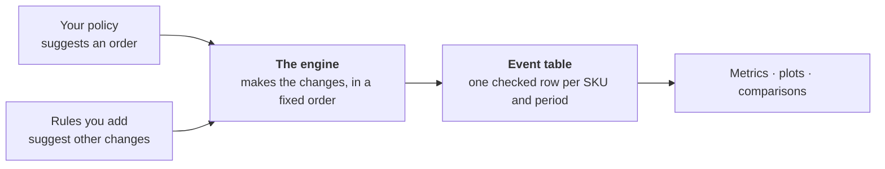
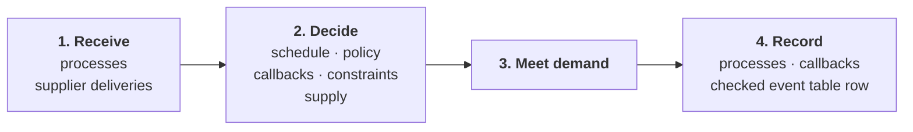
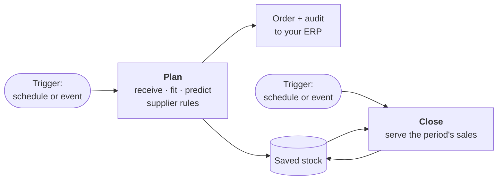

# Philosophy

<p class="sc-subtitle">Why Stockcast is built the way it is.</p>

<p class="sc-byline">by Filotas Theodosiou</p>

A forecast is not a decision.

Its real value depends on the downstream choices it improves, and ultimately on the operational performance those choices deliver. Stockcast brings this idea to inventory management: it is the layer between the forecast and the replenishment decision. It maps forecasts from **any model** into orders, simulates their execution against realised demand, and evaluates the resulting impact against business metrics such as cost, service, and waste. Its purpose is to make that chain explicit, executable, and measurable.

This small article explains the choices behind the library: what we built, and why we built it this way. Every other page of these docs, and every experiment you run, rests on these decisions.

## The gap we are building into

Forecasting and inventory control grew up as neighbouring fields that rarely share a codebase. Forecasting research tends to treat the forecast as the end product and judges it by accuracy. Inventory theory tends to assume that the demand distribution is known and asks what to order. In a recent EJOR review, Goltsos, Syntetos, Glock and Ioannou call this a high degree of segregation between the two literatures, and ask for the stages in between (turning a forecast into a replenishment decision) to be studied in their own right (Goltsos et al., 2022; see also Syntetos et al., 2016).

The evidence that the in-between matters is old and keeps getting stronger. Gardner (1990) compared forecasting methods by the inventory investment each needed for a given service level, and the ranking differed from an accuracy ranking. Petropoulos, Wang and Disney (2019) evaluated M3 forecasting methods inside a rolling order-up-to simulation and found that inventory performance separates methods in ways accuracy alone does not. Kourentzes, Trapero and Barrow (2020) showed that models fitted to minimise in-sample error are not the ones that minimise inventory cost, and tuned forecasting models directly on inventory metrics through simulation. On M5 data, Theodorou, Spiliotis and Assimakopoulos (2025) found that when lost sales cost more than holding stock, the most accurate forecast is often not the best one to order with, especially for short review periods, short lead times and intermittent demand.

The common thread is a **simulation loop that connects a forecast to a decision rule and plays it against demand**. Every one of those studies built its own. Stockcast is that loop as a library: explicit, tested, composable, and fast enough to run on any case study.

## Principle 1: the interface between forecasting and inventory is the target

Stockcast does not fit forecasting models. This was an explicit decision from the start. The right forecasting model depends on the data, the domain, and the team's expertise. Fortunately, the forecasting ecosystem already offers excellent choices: statistical, machine learning, deep learning, foundation models, anything you fancy.

Instead, Stockcast accepts these forecasts as inputs and turns them into decisions. Consequently, we needed to define this handoff precisely, and we started from the decision. A replenishment decision at period $t$ must protect the inventory position until the next order can arrive, a window of $H$ periods ($H = L + R$ for periodic review, as Principle 2 explains). What the decision needs from a forecast is the distribution of total demand over that window, summarised as a quantile:

$$
S_t = Q_\alpha\!\left(\sum_{h=0}^{H-1} D_{t+h} \,\middle|\, \mathcal{I}_{t-1}\right).
$$

That single, dated number, together with its context (probability, window, forecast origin, frequency), is the whole interface. It has three consequences that shape the library.

**Any model, any uncertainty method.** If a method can produce the quantity above, Stockcast can use it. A sample path, a cumulative forecast, a quantile regression, a conformal interval, a Bayesian posterior, or even a planner's number: all work. The next two points explain why we ask for exactly this quantity, and how each family of models can produce it. In our examples we use [smooth](https://openforecast.org/smooth-py/) (Svetunkov, 2023), because it forecasts cumulative demand directly, not because anything depends on it. (Also because we think it is the most principled package for statistical forecasting out there, and of course this has nothing to do with our small contribution to it :sweat_smile:)

**The total comes from the forecaster.** As shown above, an order often covers a window of several periods. But most forecasting models forecast one period at a time. So the per-period forecasts must be combined into one number for the whole window. There are two common shortcuts to do this, and both are wrong in general.

1. Summing per-period quantiles. Adding quantiles is exact only when all periods move in "lockstep", meaning that a high period always comes with another high period (Dhaene et al., 2002). In practice this does not hold. High and low periods partly cancel out, so the spread of the total grows more slowly than the window. For regular demand, the sum of quantiles therefore overstates the target. For sparse demand it can even understate it, because quantiles are not subadditive (Artzner, Delbaen, Eber and Heath, 1999). The forecasting literature makes the same point: point forecasts can be added, prediction intervals cannot (Hyndman and Athanasopoulos, 2021, Section 13.5).
2. Summing per-period variances. This assumes the opposite: that forecast errors in different periods are unrelated. They rarely are. Even when demand itself is uncorrelated, every period's forecast is built from the same estimate, so the errors move together. Prak, Teunter and Syntetos (2017) show that ignoring this can make safety stocks up to 30% too low. On top of that, forecast errors are often not normal, and their spread changes over time (Trapero, Cardós and Kourentzes, 2019).

Both shortcuts guess how periods relate. We leave that to the forecasting model you choose.

If you ask us, every family can produce the total:

- Statistical models can forecast the total directly (Svetunkov, 2023, Section 18.4.3), or simulate future paths and add up each one (Hyndman and Athanasopoulos, 2021, Section 13.5).
- Recursive machine-learning models can do the same: probabilistic ones, such as DeepAR, sample paths directly (Salinas et al., 2020), and point ones, such as a global LightGBM, by feeding bootstrapped residuals back into their lags (Hyndman and Athanasopoulos, 2021, Section 5.5).
- Any model can also forecast the total itself: a direct model trained on the window total with a quantile loss (Koenker and Bassett, 1978), or any model fed demand aggregated into buckets as long as the window (e.g. ADIDA; Nikolopoulos et al., 2011).
- The same is true for foundation models: those that sample paths, such as Chronos, add them up (Ansari et al., 2024), and those that return separate quantiles for each step can forecast the aggregated series.

So Stockcast asks for the total. [Notebook 04e](../notebooks/04e_cumulative_target_methods.ipynb) builds it three ways from one forecast. When independent, normal periods are a reasonable assumption, Stockcast can still add up per-period means and standard deviations for you, as an explicit, labelled mode.

**Uncertainty comes from the forecaster too.** A point forecast is not enough to make a decision. Why? Because a good decision is impossible without understanding the uncertainty around that forecast. If this is not clear, we recommend giving (among others) Kolassa, Rostami-Tabar and Siemsen (2023) a good read.

The textbook way to add that uncertainty is the safety-stock formula, $z_\alpha \sigma \sqrt{H}$, on top of the point forecast (Silver, Pyke and Thomas, 2017). It is a good starting point, but it rests on assumptions that often fail in practice:

- Demand is normal. For intermittent and low-volume items it is not (Lengu, Syntetos and Babai, 2014).
- Periods are independent. Forecast errors are not, as shown above (Prak, Teunter and Syntetos, 2017).
- The spread $\sigma$ is known. In practice it is estimated, which adds uncertainty of its own (Prak and Teunter, 2019).
- The lead time is fixed. When it varies, the normal approximation can even point the wrong way (Chopra, Reinhardt and Dada, 2004).

So Stockcast adds nothing to the target. A policy is fitted in one of two ways. Either you pass the target itself, such as the 95% quantile of total demand over the window, or you pass per-period means and standard deviations, and Stockcast combines them with the formula above, under its assumptions. There is no default buffer and no hidden safety stock.

The deep dive: [Forecast targets](../user-guide/forecast-targets.md).

## Principle 2: one explicit clock

Inventory results depend on *when* things happen inside a period. Does a delivery arrive before the period's customers? Does the decision see the period's demand? Papers and simulation libraries answer these questions differently. Some decide before demand (Zipkin, 2000; Gijsbrechts et al., 2022). Others order at the end of the period, after demand (Dejonckheere et al., 2003; Snyder, 2023; Eckman, Henderson and Shashaani, 2023). Some count the review period inside the lead time (Kourentzes, Trapero and Barrow, 2020). None of these is wrong. Yet a parameter called "lead time" then means different things in different places, and results cannot be compared until the convention is known and frozen.

So we fixed one sequence and use it everywhere: **receive, decide, then meet demand**. It is the classic periodic-review order (e.g. Zhu, 2022, Section 3; Zipkin, 2000; Axsäter, 2015). An order placed in period $t$ with lead time $L$ is received at the start of period $t + L$, before that period's demand.

The main alternative is to meet demand first and order at the end of the period. It is just as consistent, but the window an order must cover becomes $L + R - 1$. We chose to decide before demand because it gives three things at once:

1. **The textbook window.** The next decision is at $t + R$ and its order lands at $t + R + L$, so the position at $t$ protects periods $t, \dots, t + R + L - 1$:

    $$
    H = L + R ,
    $$

    the familiar "lead time plus review period" of periodic review (Silver, Pyke and Thomas, 2017). The same argument covers irregular schedules and reorder points.

2. **Zero lead time as a first-class case.** Goods ordered in the morning are on the shelf before opening. That is a well-studied model (Dubois, Allaert and Witlox, 2013), and it is what bakeries, kiosks and next-morning deliveries look like.

3. **A clean information set.** The decision happens before the period's demand, so it can only use data up to the previous period. The forecast origin of a decision at $t$ is therefore $t - 1$, and the engine checks it.

Other conventions still translate exactly: an order placed at the end of period $t$ is our order at the start of period $t + 1$. [Work with any timing convention](../how-to/timing-conventions.md) shows how to set Stockcast for the conventions you will meet in papers and other tools.

With that clock in place, the rest follows naturally. **When** a policy may order is a separate object (a `DecisionSchedule`) from **how much** it orders (the policy). A seasonal buy is a one-time schedule with a target for the whole season, and the classical newsvendor fractile $\alpha = (p - c)/(p - v)$ (Arrow, Harris and Marschak, 1951; Qin et al., 2011) is one way to choose its quantile. A weekly buyer, a daily base-stock rule, and a supplier's irregular calendar are all the same engine with different schedules.

**Why discrete periods?** Forecasts arrive in buckets: days, weeks, months. Ordering decisions are usually taken on the same grain. A discrete-period clock keeps the simulation aligned with the forecast that drives it, and lets us check the accounting of every period exactly. Continuous review is approached by shortening the period, not by a second simulation paradigm. [Notebook 05b](../notebooks/05b_reorder_points_and_review_frequency.ipynb) shows reorder-point behaviour approaching it as reviews go from daily to three-hourly.

The deep dive: [Timing: receive, decide, demand](../user-guide/concepts/timing.md).

## Principle 3: accounting before optimisation

Stockcast is not an optimiser. Before asking which policy is best, we need to trust how each one is scored. If stock is counted wrongly, for example an order received one period early, every service and cost number is wrong too. So the accounting in Stockcast is strict. Four rules make it so.

**Only the engine changes the stock.** Your policy suggests an order. Any other rule you add (Principle 4) can suggest changes too: to an order, a delivery, or the stock. Only the engine makes the changes, in a fixed order, and records them.


```mermaid
flowchart LR
    P["Your policy<br/>suggests an order"] --> E["<b>The engine</b><br/>makes the changes, in a fixed order"]
    R["Rules you add<br/>suggest other changes"] --> E
    E --> T["<b>Event table</b><br/>one checked row per SKU and period"]
    T --> M["Metrics · plots · comparisons"]
```

A policy sees a copy of the stock and returns an order. It cannot receive goods early, skip a lost sale, or forget a backorder. So every policy is scored the same way, whatever rule it uses.

**Every period adds up.** Stock never appears or disappears without a recorded reason. Each row of the event table, one per SKU and period, satisfies:

$$
\begin{aligned}
\mathit{OH}^{\text{end}} &= \mathit{OH}^{\text{start}} + r - b - f - x + a, \\
P^{\text{end}} &= P^{\text{start}} + q - r, \\
\mathit{IP} &= \mathit{OH} + P - B,
\end{aligned}
$$

with receipts $r$, backorders served $b$, demand fulfilled $f$, expiry $x$, adjustments $a$ and orders $q$. A few more checks cover backorders and orders, and any extra flows you add. The engine checks every row as it runs, and `validate_event_frame` checks any event table you save or edit. Every metric and plot comes from this one table, so service, stock and cost always agree.

**Every input is stated.** Opening stock, dates, frequency, lead time, review timing, the shortage rule and costs all come from you. Nothing is guessed. What follows from what you already gave is not asked twice: the run length comes from the demand, the period length from the policy, and a target's window from the lead time and review period. A missing or inconsistent input stops the run before the first period, and the error names the SKU and the input. We chose loud and early over quiet and wrong.

**We measure, we don't certify.** Simple rules like order-up-to come close to optimal in some settings, for example when lost sales are very costly (Huh, Janakiraman, Muckstadt and Rusmevichientong, 2009). In general, though, the best policy is complex, especially when unmet demand is lost (Bijvank and Vis, 2011). And a target probability of 0.95 is not a guaranteed [95% fill rate](../user-guide/forecast-targets.md#target-probability-and-realised-service). So Stockcast does not claim that any rule is good. It scores every rule, from a textbook heuristic to a trained neural network, the same way, so you can see what it actually delivers.

The deep dive: [The event table](../user-guide/concepts/accounting.md).

## Principle 4: small parts, one base class each

We borrowed the shape of the libraries that made machine learning easy to extend. From scikit-learn, one small interface that every part shares: configure, `fit`, `predict` (Buitinck et al., 2013). From PyTorch, building a system out of small modules you subclass and combine, in plain Python (Paszke et al., 2019). From Keras, callbacks that act at named moments of a loop without owning the loop (Chollet et al., 2015). The result is Lego for inventory systems: a small core, and parts that attach to it at fixed places.

**The core is three objects.** The `InventoryStateDataFrame` holds what you have. The `SimulationEngine` runs the clock and is the only place stock changes (Principle 3). The event table records what happened. Every other part attaches to the period between them:


```mermaid
flowchart LR
    A["<b>1. Receive</b><br/>processes<br/>supplier deliveries"] --> B["<b>2. Decide</b><br/>schedule · policy<br/>callbacks · constraints<br/>supply"]
    B --> C["<b>3. Meet demand</b>"]
    C --> D["<b>4. Record</b><br/>processes · callbacks<br/>checked event table row"]
```

**One base class per job.** Each kind of part has one base class, and the built-in parts are written with it too:

| You want any… | Subclass | Implement | Built-ins |
|---|---|---|---|
| ordering rule | `BasePolicy` | `fit`, `predict` | order-up-to, reorder point $(s,Q)$/$(s,S)$/$(R,s,S)$, single order |
| ordering calendar | `DecisionSchedule` | `should_decide`, `next_decision_period` | periodic, one-time, explicit |
| way to produce $(s, S)$ | `ReorderPointTargetProvider` | `provide` | fixed values and forecast columns, passed straight to `fit` |
| operational rule on orders | `OrderingConstraint` | `apply` | minimum, multiple, maximum, shelf space |
| planned intervention | `SimulationCallback` | `on_after_prediction`, `on_after_demand` | scheduled override, multiplier, hold, stock adjustment |
| sourcing logic | `SupplierAllocation` | `allocate` | fixed shares |
| supplier behaviour | `DeliveryOutcome` | `resolve` | none yet: you define late, short or cancelled deliveries |
| physical flow | `InventoryProcess` | `before_demand`, `after_demand` | FIFO shelf life |
| measure of success | any function, or `BaseInventoryMetric` | `compute` | 39 service, stock and cost metrics |
| demand scenario | a DataFrame, a function, or `DemandGenerator` | – | generators for constant, normal, seasonal, trend, historical |

**Build your own part, and plug it in.** When you need something Stockcast does not ship, you write it. Pick the base class for the job, fill in its one or two methods, and pass your part to the run. The engine calls it at its fixed moment in the period, and applies and records what it suggests, exactly as it does for a built-in part. For example, a quality check that discards 10% of the stock every Monday is a process:

```py
from stockcast.core import Flow, InventoryProcess, ProcessFlows

class MondayInspection(InventoryProcess):
    name = "inspection"
    flows = (Flow("discarded", "outflow"),)

    def after_demand(self, context):
        if context.date.day_name() != "Monday":
            return None
        return ProcessFlows({"discarded": (0.10 * context.on_hand).round()})

result = SimulationEngine().run(..., processes=[MondayInspection()])
```

Other needs work the same way. A backup supplier that takes the excess is an allocation. A supplier capacity is a constraint or an allocation, depending on what you mean. Shelf life is itself one process added to a standard run. Because every new need becomes a part, the engine stays small: it has no switch for any of them.

**Simple things stay simple.** A first simulation needs a state, a demand table, and a policy. Every other part is optional, and a run that does not use a part runs none of its code. So adding a feature does not change runs that do not use it.

**Every part records itself.** Each part of a run (policy, schedule, constraint, callback, supplier, process) writes its settings into the run manifest (Principle 5). The built-in parts always do, and a part you write does it through `get_config`. Every intervention lands in an audit table, with the reason and source you give it. So a result can always be traced back to the parts that produced it.

The deep dive: [every part in one run](../user-guide/index.md#all-together).

## Principle 5: easy, scalable evaluation

In forecasting, the routine for evaluating models and methods is more or less established: same data, same windows, same horizons, no leakage etc. We refer readers to Hewamalage, Ackermann and Bergmeir (2023), among others. In our opinion, comparing models and methods by the orders they lead to is not.

With this in mind, we wanted inventory comparisons to follow identical principles across runs, and to be easy and scalable. So in Stockcast, a comparison is one call. Put in any options you want: forecasts, service levels, ordering rules.

```py
comparison = SimulationEngine().run_comparison(
    policies={
        "ETS, 90%": ets_90,
        "ETS, 95%": ets_95,
        "LightGBM, 95%": lgbm_95,
        "(s, Q), 95%": sq_95,
    },
    demand_source=demand,
    inventory=inventory,
    warmup_periods=14,   # skip the start-up periods
    scoring_periods=84,  # the periods that count
    random_seed=7,       # same random draws, every time
)
```

Each forecasting principle has its counterpart here:

- **The same setup for every option.** Every option runs on the same demand, from its own copy of the same opening stock, with the same random supplier lead times. Any constraints, callbacks, suppliers or processes you add apply to every option alike. This is the simulation idea of common random numbers (Law, 2015).
- **A clear test period.** The warm-up keeps early periods, which still depend on the opening stock, out of the score. The scoring window sets the periods that count.
- **No information from the future.** Every decision uses data up to the previous period, and the engine checks the forecast origin (Principle 2).
- **More than one sample.** One demand path is one sample. For a general ranking, repeat the comparison over several paths.

Then you decide what "better" means. You can pick from our own built-in service, stock and cost metrics, or write your own as a plain function. Set your own costs. Score the whole portfolio, or each SKU on its own. All of it scales to as many options and SKUs as you like (Principle 6 shows how fast).

Every result carries a **manifest**: a fingerprint of the demand, the opening stock, the policies and their targets, every setting, every part, and the software versions. A table of results without its manifest is a claim. With it, it is an experiment someone else can rerun.

The deep dive: [Compare forecasts and policies](../how-to/compare-policies.md).

## Principle 6: fast inside, readable outside

Modern retailers manage thousands of products across many stores. For instance, the M5 data, from a single retailer, holds 30,490 product–store series (Makridakis, Spiliotis and Assimakopoulos, 2022). A realistic study replays such portfolios over hundreds of periods, for several forecasts, policies and cost settings (Principle 5). Some studies go even further. Kourentzes, Trapero and Barrow (2020), for example, tuned forecasting models on inventory cost, where every tuning step is a full replay. So the engine has to be fast. It also has to stay readable, because its inputs and outputs are where people inspect their work.

Stockcast follows two rules. First, everything you work with is a pandas DataFrame (Polars support is planned for the next version): the stock a policy sees, the order it returns, and the event table you analyse. DataFrames carry labels, so every number sits next to its SKU and date, and a mix-up between rows is hard to make. They are also what most forecasting code already produces. We use the long `unique_id` / date / value format of the forecasting ecosystem (McKinney, 2010), so a forecast usually reaches Stockcast with a simple `groupby` or merge, and you can inspect any input or output with the tools you already know.

Second, inside the engine, the stock lives in NumPy arrays. A run repeats the same small steps every period, for every SKU: receive, decide, serve demand, record. In pandas, each of these steps has a fixed cost, for checking labels and building new tables, and over thousands of periods and SKUs that cost adds up. NumPy updates all SKUs at once, with almost no such cost. So the engine works on arrays, builds a DataFrame only when your code needs one, and builds the event table once, at the end. You get readable inputs and outputs, and fast periods in between.

Every step also has a DataFrame version. When a period cannot run on arrays, it simply runs on the DataFrame version. Compared with running every period on DataFrames, the arrays make a simulated period 3 to 30 times faster. The largest gains come where most periods need no user code (weekly ordering over large portfolios), and the smallest where every period calls a custom constraint or callback.

How fast is that in practice? On the laptop this article was written on, a year of daily order-up-to decisions for 1,000 SKUs takes about 10 to 12 seconds, with every event table row checked and the manifest written. For 100 SKUs it takes about 5 seconds. About half of that time is the policy deciding. The built-in `predict` works on DataFrames, just like a policy you write yourself, so your own policy runs on equal terms (Principle 4).

## Principle 7: from research to production

Stockcast is not built with only research in mind. In practice, forecasting is one link in a longer chain. Sales flow from stores into a data warehouse. A forecasting service runs periodically, often over millions of items (Böse et al., 2017). Planners review the numbers, a replenishment step turns them into orders, and an ERP or supplier portal sends them out. A scheduler ties these steps together, and monitoring watches all of them (Fildes, Ma and Kolassa, 2022). Getting machine-learning products to run reliably inside such stacks is hard enough and we did not want to add more complexity.

Instead, Stockcast is built to be the replenishment link in that chain. Everything you research goes to production as it is: the same stock, the same policy with its forecast target, and the same supplier rules.


```mermaid
flowchart LR
    T1(["Trigger:<br/>schedule or event"]) --> P["<b>Plan</b><br/>receive · fit · predict<br/>supplier rules"]
    P --> O["Order + audit<br/>to your ERP"]
    P --> S[("Saved stock")]
    T2(["Trigger:<br/>schedule or event"]) --> C["<b>Close</b><br/>serve the period's sales"]
    S --> C
    C --> S
```

Each period is two steps, built from Stockcast's parts. At the start of the period, a plan step loads the saved stock and receives what is due. On a review period, it also fits the policy on the latest forecast, proposes the order and applies the supplier's rules. At the end of the period, a close step serves the period's sales and saves the stock. A period is whatever grain your forecasts and orders use.

Both steps are plain Python functions over a saved state: no files, no clock, no network. So any trigger can call them. In batch, a scheduler such as cron or Airflow runs them at the start and end of each period. In streaming, events run them, for example a message when a period starts or ends, or a sales file landing in storage. Their outputs are plain tables: the order to send, an audit of what the supplier's rules changed, and the stock to save. With one idempotency key per step, a retry never orders or sells twice. Every part reports its settings through `get_config`, so you can version the exact policy behind each order. And because the same parts also run in the engine, a backtest can run next to the live job, as a shadow, to monitor it. [Notebook 10](../notebooks/10_production_daily_close.ipynb) shows where each piece runs in a typical stack. Your stack keeps data access, forecasting, scheduling, approval, storage and monitoring. Stockcast adds the decision and its record.

Going from a backtest to a periodic job takes a few lines, and [Walkthrough step 9](../learn/09-production.md) shows how. [Notebook 10](../notebooks/10_production_daily_close.ipynb) builds a full job: idempotent steps, an order outbox, an event stream that triggers each step, and a shadow backtest that monitors it. [Use Stockcast in production](../how-to/production.md) is the short recipe.

## Where Stockcast fits best

When we first designed Stockcast, we wanted it to cover every use case we could think of, and to stay general enough for the ones we could not. This is why it is built like Lego, following the PyTorch way of small parts you subclass and combine (Principle 4). Any forecast enters as one target (Principle 1), every run is checked and recorded (Principles 3 and 5), and the same parts run a study and a production job (Principle 7).

Below are some of the use cases we had in mind.

**Research.** New forecasting methods, evaluated on the decisions they lead to: what they do to stock, service and cost, not only how accurate they are. New policies, judged against established ones on the same demand. Every study in our opening built its own simulation to do this. With Stockcast, the simulation becomes the shared part: any forecast enters as a target, a comparison is one call, and the manifest lets reviewers and readers rerun the experiment. Research can then focus on the fun part, methodology!

**Production systems.** Stockcast is the replenishment link in a forecasting stack (Principle 7). Each period is a plan and a close step, triggered by your scheduler or event stream, and the order comes out as a plain table with its record. [Use Stockcast in production](../how-to/production.md) shows how.

**Learning and optimising decisions.** Some studies do not just compare a few options. They search for the best one, guided by the downstream result. A reinforcement-learning agent learns to order, and then has to beat the well-understood heuristics it competes with (Boute, Gijsbrechts, van Jaarsveld and Vanvuchelen, 2022; Gijsbrechts, Boute, Van Mieghem and Zhang, 2022). An optimiser tunes a service level or a reorder point, a common way to solve inventory problems with no closed form (Jalali and Van Nieuwenhuyse, 2015). A forecasting model can even be tuned on inventory cost (Kourentzes, Trapero and Barrow, 2020). In each case, every candidate is scored by a run: on the same demand, with the same accounting, checked and fast (Principles 3 and 6).

**Agentic harnesses.** Language-model agents work best when they suggest and a trusted tool computes, as in the design of Li, Mellou, Zhang, Pathuri and Menache (2023). Forecasting already has such agents. TimeCopilot, for example, lets a language model choose, run and explain time-series forecasting models (Garza and Rosillo, 2025), and forecasting platforms such as [Nixtla](https://www.nixtla.io/blog/timegpt-2-announcement) are adding agentic features too. Stockcast is the natural next tool in that chain: it turns the agent's forecast into orders and shows what they would do. Its inputs are checked before anything runs, and its errors name the input at fault, often down to the SKU, so an agent can correct itself. Runs give the same result for the same inputs and seed. Settings and results are machine-readable: the manifest, `get_config` on every part, and the event table. And because only the engine changes the stock, an agent that writes a policy, a callback or a whole experiment cannot get around the accounting. Stockcast does not ship an agent integration. It is built to be a reliable tool inside one.

**Testing changes before they go live.** Companies change how they operate all the time. They add a second supplier, switch to a new pack size, accept a cheaper but less reliable carrier, or start selling a product with a short shelf life. Each change costs money before anyone knows whether it pays off. With Stockcast, you can try it first on your own demand. Several suppliers, random and unreliable lead times (Minner, 2003; Snyder et al., 2016), perishable stock (Nahmias, 1982; Bakker, Riezebos and Teunter, 2012), capacity and case-pack rules, and planned interventions are all built from the parts of Principle 4. Each change is then one more option to compare (Principle 5): the current setup against the new one, on the same demand.

## Closing

Throughout this article, we treated forecasts as inputs, and decisions as the place where their value shows. Stockcast is built around that view. It takes your forecast as a target, turns it into orders, and shows what those orders do to stock, service and cost, with every unit accounted for. It does not forecast, and it does not search for the best policy for you.

However, it gives you the building blocks to do both. Any forecasting model can feed it, and any optimiser can wrap it. The same goes for everything else: a new policy, a second supplier, a shelf-life rule or a learned agent is one more part on the same small core. That flexibility is the point. We could not foresee every problem Stockcast will meet, so we built it to take in new ones without changing what is already there.

If you find a use we did not think of, or a part you would like to add, we would love to hear about it on [GitHub](https://github.com/FilTheo/stockcast/issues).

*Happy stockcasting.*<br>*~ F*

## References

- Ansari, A. F., Stella, L., Turkmen, C., et al. (2024). Chronos: Learning the language of time series. *Transactions on Machine Learning Research*. [arXiv:2403.07815](https://arxiv.org/abs/2403.07815)
- Arrow, K. J., Harris, T., and Marschak, J. (1951). Optimal inventory policy. *Econometrica*, 19(3), 250–272. [doi:10.2307/1906813](https://doi.org/10.2307/1906813)
- Artzner, P., Delbaen, F., Eber, J.-M., and Heath, D. (1999). Coherent measures of risk. *Mathematical Finance*, 9(3), 203–228. [doi:10.1111/1467-9965.00068](https://doi.org/10.1111/1467-9965.00068)
- Axsäter, S. (2015). *Inventory Control* (3rd ed.). Springer.
- Bakker, M., Riezebos, J., and Teunter, R. H. (2012). Review of inventory systems with deterioration since 2001. *European Journal of Operational Research*, 221(2), 275–284. [doi:10.1016/j.ejor.2012.03.004](https://doi.org/10.1016/j.ejor.2012.03.004)
- Bijvank, M., and Vis, I. F. A. (2011). Lost-sales inventory theory: A review. *European Journal of Operational Research*, 215(1), 1–13. [doi:10.1016/j.ejor.2011.02.004](https://doi.org/10.1016/j.ejor.2011.02.004)
- Böse, J.-H., Flunkert, V., Gasthaus, J., Januschowski, T., Lange, D., Salinas, D., Schelter, S., Seeger, M., and Wang, Y. (2017). Probabilistic demand forecasting at scale. *Proceedings of the VLDB Endowment*, 10(12), 1694–1705.
- Boute, R. N., Gijsbrechts, J., van Jaarsveld, W., and Vanvuchelen, N. (2022). Deep reinforcement learning for inventory control: A roadmap. *European Journal of Operational Research*, 298(2), 401–412. [doi:10.1016/j.ejor.2021.07.016](https://doi.org/10.1016/j.ejor.2021.07.016)
- Buitinck, L., Louppe, G., Blondel, M., et al. (2013). API design for machine learning software: Experiences from the scikit-learn project. *ECML PKDD Workshop: Languages for Data Mining and Machine Learning*. [arXiv:1309.0238](https://arxiv.org/abs/1309.0238)
- Chollet, F., et al. (2015). Keras. [keras.io](https://keras.io)
- Chopra, S., Reinhardt, G., and Dada, M. (2004). The effect of lead time uncertainty on safety stocks. *Decision Sciences*, 35(1), 1–24. [doi:10.1111/j.1540-5414.2004.02332.x](https://doi.org/10.1111/j.1540-5414.2004.02332.x)
- Dejonckheere, J., Disney, S. M., Lambrecht, M. R., and Towill, D. R. (2003). Measuring and avoiding the bullwhip effect: A control theoretic approach. *European Journal of Operational Research*, 147(3), 567–590. [doi:10.1016/S0377-2217(02)00369-7](https://doi.org/10.1016/S0377-2217(02)00369-7)
- Dhaene, J., Denuit, M., Goovaerts, M. J., Kaas, R., and Vyncke, D. (2002). The concept of comonotonicity in actuarial science and finance: Theory. *Insurance: Mathematics and Economics*, 31(1), 3–33. [doi:10.1016/S0167-6687(02)00134-8](https://doi.org/10.1016/S0167-6687(02)00134-8)
- Dubois, T., Allaert, G., and Witlox, F. (2013). Determining the fill rate for a periodic review inventory policy with capacitated replenishments, lost sales and zero lead time. *Operations Research Letters*, 41(6), 726–729. [doi:10.1016/j.orl.2013.10.006](https://doi.org/10.1016/j.orl.2013.10.006)
- Eckman, D. J., Henderson, S. G., and Shashaani, S. (2023). SimOpt: A testbed for simulation-optimization experiments. *INFORMS Journal on Computing*, 35(2), 495–508. [doi:10.1287/ijoc.2023.1273](https://doi.org/10.1287/ijoc.2023.1273)
- Fildes, R., Ma, S., and Kolassa, S. (2022). Retail forecasting: Research and practice. *International Journal of Forecasting*, 38(4), 1283–1318. [doi:10.1016/j.ijforecast.2019.06.004](https://doi.org/10.1016/j.ijforecast.2019.06.004)
- Gardner, E. S. (1990). Evaluating forecast performance in an inventory control system. *Management Science*, 36(4), 490–499. [doi:10.1287/mnsc.36.4.490](https://doi.org/10.1287/mnsc.36.4.490)
- Garza, A., and Rosillo, R. (2025). TimeCopilot. arXiv:2509.00616. [arxiv.org/abs/2509.00616](https://arxiv.org/abs/2509.00616)
- Gijsbrechts, J., Boute, R. N., Van Mieghem, J. A., and Zhang, D. J. (2022). Can deep reinforcement learning improve inventory management? Performance on lost sales, dual-sourcing, and multi-echelon problems. *Manufacturing & Service Operations Management*, 24(3), 1349–1368. [doi:10.1287/msom.2021.1064](https://doi.org/10.1287/msom.2021.1064)
- Goltsos, T. E., Syntetos, A. A., Glock, C. H., and Ioannou, G. (2022). Inventory – forecasting: Mind the gap. *European Journal of Operational Research*, 299(2), 397–419. [doi:10.1016/j.ejor.2021.07.040](https://doi.org/10.1016/j.ejor.2021.07.040)
- Hewamalage, H., Ackermann, K., and Bergmeir, C. (2023). Forecast evaluation for data scientists: Common pitfalls and best practices. *Data Mining and Knowledge Discovery*, 37(2), 788–832. [doi:10.1007/s10618-022-00894-5](https://doi.org/10.1007/s10618-022-00894-5)
- Huh, W. T., Janakiraman, G., Muckstadt, J. A., and Rusmevichientong, P. (2009). Asymptotic optimality of order-up-to policies in lost sales inventory systems. *Management Science*, 55(3), 404–420. [doi:10.1287/mnsc.1080.0945](https://doi.org/10.1287/mnsc.1080.0945)
- Hyndman, R. J., and Athanasopoulos, G. (2021). *Forecasting: Principles and Practice* (3rd ed.). OTexts. [otexts.com/fpp3](https://otexts.com/fpp3/)
- Jalali, H., and Van Nieuwenhuyse, I. (2015). Simulation optimization in inventory replenishment: A classification. *IIE Transactions*, 47(11), 1217–1235. [doi:10.1080/0740817X.2015.1019162](https://doi.org/10.1080/0740817X.2015.1019162)
- Koenker, R., and Bassett, G. (1978). Regression quantiles. *Econometrica*, 46(1), 33–50. [doi:10.2307/1913643](https://doi.org/10.2307/1913643)
- Kolassa, S., Rostami-Tabar, B., and Siemsen, E. (2023). *Demand Forecasting for Executives and Professionals*. CRC Press. [dfep.netlify.app](https://dfep.netlify.app/)
- Kourentzes, N., Trapero, J. R., and Barrow, D. K. (2020). Optimising forecasting models for inventory planning. *International Journal of Production Economics*, 225, 107597. [doi:10.1016/j.ijpe.2019.107597](https://doi.org/10.1016/j.ijpe.2019.107597)
- Law, A. M. (2015). *Simulation Modeling and Analysis* (5th ed.). McGraw-Hill.
- Lengu, D., Syntetos, A. A., and Babai, M. Z. (2014). Spare parts management: Linking distributional assumptions to demand classification. *European Journal of Operational Research*, 235(3), 624–635. [doi:10.1016/j.ejor.2013.12.043](https://doi.org/10.1016/j.ejor.2013.12.043)
- Li, B., Mellou, K., Zhang, B., Pathuri, J., and Menache, I. (2023). Large language models for supply chain optimization. arXiv:2307.03875. [arxiv.org/abs/2307.03875](https://arxiv.org/abs/2307.03875)
- Makridakis, S., Spiliotis, E., and Assimakopoulos, V. (2022). M5 accuracy competition: Results, findings, and conclusions. *International Journal of Forecasting*, 38(4), 1346–1364. [doi:10.1016/j.ijforecast.2021.11.013](https://doi.org/10.1016/j.ijforecast.2021.11.013)
- McKinney, W. (2010). Data structures for statistical computing in Python. *Proceedings of the 9th Python in Science Conference*, 56–61. [doi:10.25080/Majora-92bf1922-00a](https://doi.org/10.25080/Majora-92bf1922-00a)
- Minner, S. (2003). Multiple-supplier inventory models in supply chain management: A review. *International Journal of Production Economics*, 81–82, 265–279. [doi:10.1016/S0925-5273(02)00288-8](https://doi.org/10.1016/S0925-5273(02)00288-8)
- Nahmias, S. (1982). Perishable inventory theory: A review. *Operations Research*, 30(4), 680–708. [doi:10.1287/opre.30.4.680](https://doi.org/10.1287/opre.30.4.680)
- Nikolopoulos, K., Syntetos, A. A., Boylan, J. E., Petropoulos, F., and Assimakopoulos, V. (2011). An aggregate–disaggregate intermittent demand approach (ADIDA) to forecasting: An empirical proposition and analysis. *Journal of the Operational Research Society*, 62(3), 544–554. [doi:10.1057/jors.2010.32](https://doi.org/10.1057/jors.2010.32)
- Paszke, A., Gross, S., Massa, F., et al. (2019). PyTorch: An imperative style, high-performance deep learning library. *Advances in Neural Information Processing Systems 32*. [arXiv:1912.01703](https://arxiv.org/abs/1912.01703)
- Petropoulos, F., Wang, X., and Disney, S. M. (2019). The inventory performance of forecasting methods: Evidence from the M3 competition data. *International Journal of Forecasting*, 35(1), 251–265. [doi:10.1016/j.ijforecast.2018.01.004](https://doi.org/10.1016/j.ijforecast.2018.01.004)
- Prak, D., and Teunter, R. (2019). A general method for addressing forecasting uncertainty in inventory models. *International Journal of Forecasting*, 35(1), 224–238. [doi:10.1016/j.ijforecast.2017.11.004](https://doi.org/10.1016/j.ijforecast.2017.11.004)
- Prak, D., Teunter, R., and Syntetos, A. (2017). On the calculation of safety stocks when demand is forecasted. *European Journal of Operational Research*, 256(2), 454–461. [doi:10.1016/j.ejor.2016.06.035](https://doi.org/10.1016/j.ejor.2016.06.035)
- Qin, Y., Wang, R., Vakharia, A. J., Chen, Y., and Seref, M. M. H. (2011). The newsvendor problem: Review and directions for future research. *European Journal of Operational Research*, 213(2), 361–374. [doi:10.1016/j.ejor.2010.11.024](https://doi.org/10.1016/j.ejor.2010.11.024)
- Salinas, D., Flunkert, V., Gasthaus, J., and Januschowski, T. (2020). DeepAR: Probabilistic forecasting with autoregressive recurrent networks. *International Journal of Forecasting*, 36(3), 1181–1191. [doi:10.1016/j.ijforecast.2019.07.001](https://doi.org/10.1016/j.ijforecast.2019.07.001)
- Silver, E. A., Pyke, D. F., and Thomas, D. J. (2017). *Inventory and Production Management in Supply Chains* (4th ed.). CRC Press.
- Snyder, L. V. (2023). Stockpyl: A Python package for inventory optimization and simulation. In *INFORMS TutORials in Operations Research*, 156–197. [doi:10.1287/educ.2023.0256](https://doi.org/10.1287/educ.2023.0256)
- Snyder, L. V., Atan, Z., Peng, P., Rong, Y., Schmitt, A. J., and Sinsoysal, B. (2016). OR/MS models for supply chain disruptions: A review. *IIE Transactions*, 48(2), 89–109. [doi:10.1080/0740817X.2015.1067735](https://doi.org/10.1080/0740817X.2015.1067735)
- Svetunkov, I. (2023). *Forecasting and Analytics with the Augmented Dynamic Adaptive Model (ADAM)*. Chapman and Hall/CRC. [openforecast.org/adam](https://openforecast.org/adam/)
- Syntetos, A. A., Babai, Z., Boylan, J. E., Kolassa, S., and Nikolopoulos, K. (2016). Supply chain forecasting: Theory, practice, their gap and the future. *European Journal of Operational Research*, 252(1), 1–26. [doi:10.1016/j.ejor.2015.11.010](https://doi.org/10.1016/j.ejor.2015.11.010)
- Theodorou, E., Spiliotis, E., and Assimakopoulos, V. (2025). Forecast accuracy and inventory performance: Insights on their relationship from the M5 competition data. *European Journal of Operational Research*, 322(2), 414–426. [doi:10.1016/j.ejor.2024.12.033](https://doi.org/10.1016/j.ejor.2024.12.033)
- Trapero, J. R., Cardós, M., and Kourentzes, N. (2019). Empirical safety stock estimation based on kernel and GARCH models. *Omega*, 84, 199–211. [doi:10.1016/j.omega.2018.05.004](https://doi.org/10.1016/j.omega.2018.05.004)
- Zhu, H. (2022). A simple heuristic policy for stochastic inventory systems with both minimum and maximum order quantity requirements. *Annals of Operations Research*, 309, 347–363. [doi:10.1007/s10479-021-04441-1](https://doi.org/10.1007/s10479-021-04441-1)
- Zipkin, P. H. (2000). *Foundations of Inventory Management*. McGraw-Hill.
