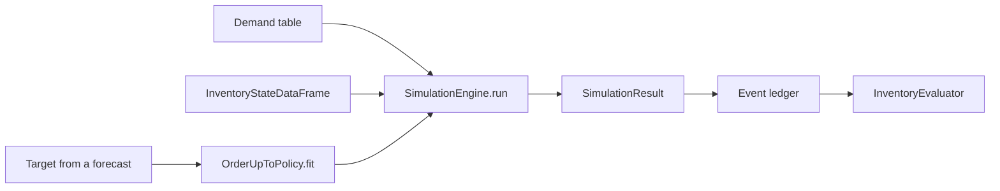

# Quickstart

In ten minutes you will build a complete Stockcast workflow for one product:
turn a forecast into an ordering rule, simulate eight weeks of trading, and
measure the result.

**The scenario.** A small shop sells 250 g packs of tea, about six a day. The
supplier delivers **2 days** after an order, and the shop orders **every 4
days**. It starts with 30 packs on the shelf. Sales that cannot be served are
lost. How much should it order, and how well does that work?

## 1. Demand

Stockcast reads demand as a long table: one row per SKU and period, with the
columns `unique_id`, `period`, `date`, and `y`. Here we generate eight weeks of
seasonal daily demand with the built-in `DemandGenerator`. In your own work
this is your sales history or a demand scenario.

```python
import numpy as np
import pandas as pd

from stockcast.utils import DemandGenerator

sku = "tea_250g"
opening_date = pd.Timestamp("2026-01-05")   # the day we count the shelf
lead_time, review_period = 2, 4

demand = DemandGenerator(
    [sku],
    start_date=opening_date + pd.Timedelta(days=1),  # first sales day
    period_frequency="D",
    seed=3,
    negative_demand_handling="clip_zero",
).seasonal(n_periods=56, base=6.0, amplitude=2.0, season_length=7, std=2.0)
demand["y"] = demand["y"].round()               # whole packs

demand.head(3)
```

```text
  unique_id     y  period       date
0  tea_250g  10.0       0 2026-01-06
1  tea_250g   2.0       1 2026-01-07
2  tea_250g   9.0       2 2026-01-08
```


## 2. Opening stock

`InventoryStateDataFrame` holds everything the shop knows about its stock:
what is on the shelf, what is on order, and what is owed to customers.

```python
from stockcast.core import InventoryStateDataFrame

inventory = InventoryStateDataFrame(
    [sku], max_lead_time=lead_time, allow_backorders=False,
).initialize_from_observed(
    pd.DataFrame({"unique_id": [sku], "on_hand": [30.0]}),
    on_hand_column="on_hand",
    start_date=opening_date,
)
```

`max_lead_time` sizes the pipeline that tracks goods on their way.
`allow_backorders=False` means unserved demand is lost, as in a shop.

## 3. A forecast target

Each order has to last until the *next* order arrives. An order placed today
arrives in $L = 2$ days, and the next chance to order is in $R = 4$ days, so
today's decision must cover demand over

$$
H = L + R = 6 \text{ days.}
$$

The target is a quantile of **total** demand over those six days. Your
forecasting model supplies it. Here we stand in for a model with 10,000 sample
paths of daily demand, sum each path, and take the 95% quantile of the totals:

```python
horizon = lead_time + review_period
paths = np.random.default_rng(42).poisson(6.0, size=(10_000, horizon))

target = pd.DataFrame({
    "unique_id": [sku],
    "target": [np.quantile(paths.sum(axis=1), 0.95)],
    "target_end_date": [opening_date + pd.Timedelta(days=horizon)],
})
target
```

```text
  unique_id  target target_end_date
0  tea_250g    46.0      2026-01-11
```

The shop aims to have an inventory position of 46 packs after each order.
[Learn step 3](../learn/03-forecast-targets.md) explains why we sum the paths
first and take the quantile second.

## 4. A policy

The **order-up-to** policy, written $(R, S)$, reviews stock every $R$ periods
and orders enough to bring the inventory position back up to $S$:

$$
q_t = \max\bigl(0,\; S - \mathit{IP}_t\bigr),
\qquad
\mathit{IP}_t = \text{on hand} + \text{on order} - \text{backorders}.
$$

Like a scikit-learn estimator, a policy is configured, then **fit** on its
target, then asked to **predict** orders:

```python
from stockcast.policies import OrderUpToPolicy

policy = OrderUpToPolicy(
    lead_time=lead_time,
    review_period=review_period,
    service_level=0.95,
    allow_backorders=False,
).fit(
    target,
    target_column="target",
    target_probability=0.95,
    protection_horizon=horizon,
    target_source="external_direct",
    forecast_origin=opening_date,
    forecast_frequency="D",
    target_end_date_column="target_end_date",
)
```

The `fit` arguments describe the target: what probability it represents, which
window it covers, and when the forecast was made. Stockcast checks that these
agree with the policy's lead time and review period.

## 5. Simulate

`SimulationEngine` plays the policy forward one day at a time. Each day it
receives deliveries, lets the policy order (on review days), then serves
demand.

```python
from stockcast.core import SimulationEngine

result = SimulationEngine().run(
    policy=policy,
    demand_source=demand,
    inventory=inventory,
    n_periods=56,
    period_frequency="D",
    warmup_periods=0,         # (1)!
    scoring_periods=56,
    settlement_periods=0,
    order_during_settlement=False,
    demand_source_name="tea_shop",  # (2)!
    random_seed=3,
)
```

1.  A run can be split into warm-up, scoring, and settlement windows. Metrics
    use the scoring window. Here we score all 56 days.
2.  A label and a seed for the demand. They are stored in the run manifest, so
    every result carries a record of how it was produced.

## 6. Read what happened

The **event ledger** has one row per SKU and day, recording every unit that
moved:

```python
events = result.to_event_frame()
events[["date", "demand", "received_units", "fulfilled_units",
        "order_quantity", "ending_on_hand", "on_order_end"]].head(7)
```

```text
        date  demand  received_units  fulfilled_units  order_quantity  ending_on_hand  on_order_end
0 2026-01-06    10.0             0.0             10.0            16.0            20.0          16.0
1 2026-01-07     2.0             0.0              2.0             0.0            18.0          16.0
2 2026-01-08     9.0            16.0              9.0             0.0            25.0           0.0
3 2026-01-09     6.0             0.0              6.0             0.0            19.0           0.0
4 2026-01-10     4.0             0.0              4.0            27.0            15.0          27.0
5 2026-01-11     4.0             0.0              4.0             0.0            11.0          27.0
6 2026-01-12     0.0            27.0              0.0             0.0            38.0           0.0
```

Read the first rows like a diary:

- **Jan 6.** Before any sales, the policy sees an inventory position of 30 and
  orders $46 - 30 = 16$ packs. It sells 10 and ends the day with 20.
- **Jan 8.** The 16 packs arrive before the shop opens: exactly $L = 2$ days
  later.
- **Jan 10.** The next review. The position is 19, so it orders $46 - 19 = 27$.

## 7. Evaluate

`InventoryEvaluator` turns the ledger into metrics:

```python
from stockcast.evaluation import (
    InventoryEvaluator, avg_on_hand, fill_rate, order_event_count,
)

InventoryEvaluator().fit(result, window="scoring").evaluate(
    metrics=[fill_rate, avg_on_hand, order_event_count],
    groupby=[],
)
```

```text
   fill_rate  avg_on_hand  order_event_count
0        1.0    18.607143                 14
```

Every sale was served, with about 18.6 packs on the shelf on average. The
picture below shows the whole run: sales, the stock on the shelf, and the
inventory position returning to $S = 46$ at each review.


## What you just built



Every box is a separate object. Change one and keep the rest: a different
forecast, a `ReorderPointPolicy`, a supplier with random lead times, a shelf
life. That is the Stockcast way of working.

## Where next

- **[Learn the basics](../learn/index.md)**: the same tea shop, one idea per
  page, ending with [running it in production](../learn/09-production.md).
- **[Guide](../user-guide/index.md)**: the theory and all options for
  each building block.
- **[Examples](../tutorials/index.md)**: complete notebooks, including real
  forecasts with smooth.
