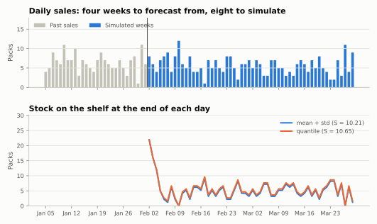
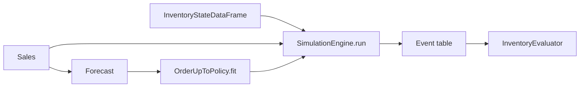

# Quickstart

In ten minutes you will build a complete Stockcast workflow for one product:
forecast tomorrow's demand, turn the forecast into orders, simulate eight
weeks of trading, and measure the result.

**The scenario.** A small shop sells 250 g packs of tea, about six a day. It
orders **every morning**, and the supplier delivers **before the shop opens**.
Today it has 30 packs on the shelf. Sales that cannot be served are lost. How
much should it order each morning, and how well does that work?

## 1. Sales

Stockcast reads demand as a long table: one row per SKU and period, with the
columns `unique_id`, `date` (or a `period` number, or both), and `y`. Here we
generate twelve weeks of daily sales with the built-in `DemandGenerator`. In
your own work this is your sales history or a demand scenario.

```python
import pandas as pd

from stockcast.utils import DemandGenerator

sku, today = "tea_250g", pd.Timestamp("2026-02-01")

sales = DemandGenerator([sku], first_date="2026-01-05", freq="D", random_seed=3).sample(
    84, lambda rng, periods: rng.poisson(6, periods.size))
past, future = sales[sales["date"] <= today], sales[sales["date"] > today]

sales.head(3)
```

```text
  unique_id    y  period       date
0  tea_250g  4.0       0 2026-01-05
1  tea_250g  5.0       1 2026-01-06
2  tea_250g  9.0       2 2026-01-07
```

Today is 1 February. The four weeks up to today are the `past` we forecast
from; the eight weeks after it are the `future` we will simulate.

## 2. A forecast

Every morning the shop needs a forecast of tomorrow's demand, with its
uncertainty. Your forecasting model supplies it, in whichever form it
produces. Here we stand in for a model with the last four weeks of sales, and
state the forecast in two common forms at once:

```python
last_4_weeks = past["y"].tail(28)
forecast = pd.DataFrame({
    "unique_id": [sku],
    "date": [today + pd.Timedelta(days=1)],   # the day it forecasts
    "fh": [1],                                # one step ahead
    "mean": [last_4_weeks.mean()],            # a moving average ...
    "std": [last_4_weeks.std()],              # ... and its spread
    "q95": [last_4_weeks.quantile(0.95)],     # or a 95% quantile forecast
})
forecast
```

```text
  unique_id       date  fh      mean       std    q95
0  tea_250g 2026-02-02   1  6.357143  2.344644  10.65
```

- `mean` and `std`: a point forecast (the four-week moving average) and how
  much a day's sales vary around it.
- `q95`: a quantile forecast. Tomorrow's sales stay at or below 10.65 packs
  on 95% of days.

## 3. Opening stock

`InventoryStateDataFrame` holds everything the shop knows about its stock:
what is on the shelf, what is on order, and what is owed to customers.

```python
from stockcast.core import InventoryStateDataFrame

shelf = InventoryStateDataFrame.from_observed(
    pd.DataFrame({"unique_id": [sku], "date": [today], "on_hand": [30]}))
```

The `date` column is the day the shelf was counted: today.

## 4. A policy

The **order-up-to** policy reviews stock every period and orders enough to
bring the inventory position back up to a level $S$:

$$
q_t = \max\bigl(0,\; S - \mathit{IP}_t\bigr),
\qquad
\mathit{IP}_t = \text{on hand} + \text{on order} - \text{backorders}.
$$

The shop wants to serve tomorrow's demand on 95% of days, so $S$ is the 95%
quantile of tomorrow's demand. Like a scikit-learn estimator, a policy is
configured, then **fit** on a forecast:

```python
from stockcast.policies import OrderUpToPolicy

policy = OrderUpToPolicy(lead_time=0, review_period=1, freq="D",
                         service_level=0.95, allow_backorders=False)

policy.fit(forecast, mean_column="mean", std_column="std")
policy.get_target_levels()
```

```text
  unique_id  target_level
0  tea_250g     10.213739
```

`freq="D"` says one period is one day; `lead_time=0` and `review_period=1`
mean an order placed this morning arrives before opening and covers one day.
From the mean and the spread, the policy computes the 95% quantile of a
normal distribution: $6.36 + 1.645 \times 2.34 = 10.21$ packs. Given a
quantile forecast instead, it takes it as it is:
`policy.fit(forecast, target_column="q95")` gives $S = 10.65$.

## 5. Simulate

`SimulationEngine` plays the policy forward one day at a time. Each day it
receives deliveries, lets the policy order, then serves demand. We run the
policy once with each form of the forecast, refitting it in between:

```python
from stockcast.core import SimulationEngine

engine = SimulationEngine()

# From a mean and a spread, the policy computes the quantile...
policy.fit(forecast, mean_column="mean", std_column="std")
from_mean_std = engine.run(policy=policy, demand_source=future, inventory=shelf)

# ...or it takes a quantile forecast as it is.
policy.fit(forecast, target_column="q95")
from_quantile = engine.run(policy=policy, demand_source=future, inventory=shelf)
```

The engine reads the run length (56 days) and the day length from the demand
and the policy, and scores every day. Both runs start from the same 30 packs
and meet the same demand, so any difference comes from the forecast alone.

## 6. Read what happened

The **event table** has one row per SKU and day, recording every unit that
moved:

```python
events = from_mean_std.to_event_frame()
events[["date", "demand", "received_units", "fulfilled_units",
        "order_quantity", "ending_on_hand"]].head(7).round(2)
```

```text
        date  demand  received_units  fulfilled_units  order_quantity  ending_on_hand
0 2026-02-02     8.0            0.00              8.0            0.00           22.00
1 2026-02-03     6.0            0.00              6.0            0.00           16.00
2 2026-02-04     4.0            0.00              4.0            0.00           12.00
3 2026-02-05     7.0            0.00              7.0            0.00            5.00
4 2026-02-06     8.0            5.21              8.0            5.21            2.21
5 2026-02-07     9.0            8.00              9.0            8.00            1.21
6 2026-02-08     4.0            9.00              4.0            9.00            6.21
```

Reading the rows:

- **Feb 2 to 5.** The shelf holds more than $S = 10.21$, so the shop orders
  nothing and sells from stock.
- **Feb 6.** The morning position is 5, so it orders $10.21 - 5 = 5.21$
  packs. They arrive before opening, and the shop sells 8.
- **Feb 7.** The position is 2.21, so it orders 8, exactly what it sold
  yesterday. From now on each order replaces the previous day's sales.

The orders are fractional because the target is.
`OrderMultiple(1, mode="adjust")` rounds them up to whole packs; see
[Constraints](../user-guide/constraints.md).

## 7. Evaluate

`InventoryEvaluator` turns each event table into metrics:

```python
from stockcast.evaluation import InventoryEvaluator, avg_on_hand, fill_rate

metrics = [fill_rate, avg_on_hand]
pd.concat({
    "mean + std": InventoryEvaluator().fit(from_mean_std).evaluate(metrics),
    "quantile": InventoryEvaluator().fit(from_quantile).evaluate(metrics),
}).droplevel(1).round(2)
```

```text
            fill_rate  avg_on_hand
mean + std       0.99         5.30
quantile         0.99         5.69
```

`fit` selects the scoring window (here every day) and `evaluate` pools all
SKUs into one row. Both forecasts serve 99% of demand; the quantile forecast
aims a little higher and keeps about 0.4 more packs on the shelf. The picture
below shows both runs.



## Summary


```mermaid
flowchart LR
    D[Sales] --> F[Forecast]
    F --> P[OrderUpToPolicy.fit]
    I[InventoryStateDataFrame] --> E
    D --> E
    P --> E[SimulationEngine.run]
    E --> L[Event table]
    L --> V[InventoryEvaluator]
```

Each box is a separate object, so you can replace one and keep the rest: a
forecast from a real model, a `ReorderPointPolicy`, a supplier with random
lead times, or a shelf life.

## Next steps

Here an order arrives the same morning, so it only has to last one day. With
a lead time of $L$ days and a review every $R$ days, each order must last
$H = L + R$ days, and the forecast covers total demand over that window.
[Learn step 3](../learn/03-forecast-targets.md) shows how, with the same tea
shop.

- [Learn the basics](../learn/index.md): one idea per page, from inventory
  state to [production](../learn/09-production.md).
- [Guide](../user-guide/index.md): theory and options for each building block.
- [Examples](../tutorials/index.md): complete notebooks, including real
  forecasts with smooth.
