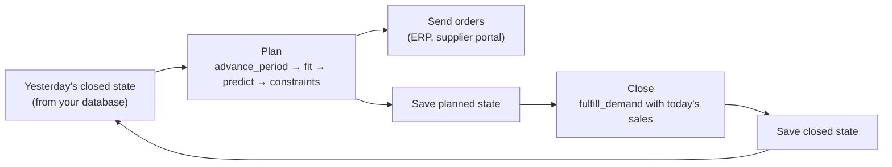

# Use Stockcast in a daily job

!!! tip "New to production with Stockcast?"

    [Learn step 9: From backtest to production](../learn/09-production.md)
    walks through the whole daily cycle and shows that the daily job matches
    its backtest exactly. This page is the compact reference version.

The same objects you simulate with can compute today's real orders. A daily
job has two phases: **plan** in the morning, before sales, and **close** in
the evening, once the day's sales are known. Stockcast provides the state,
policy, and constraint objects; your application keeps the data, calls the
forecasting model, and sends the orders.



## Plan: this morning's order

Start from the state you saved last night, fit today's target from a forecast
made with data up to yesterday, and ask the policy:

```python
import numpy as np
import pandas as pd

from stockcast.core import (
    ConstraintContext, InventoryStateDataFrame, MinimumOrderQuantity,
    OrderingConstraints, OrderMultiple,
)
from stockcast.policies import OrderUpToPolicy
from stockcast.utils import update_inventory_with_orders

LEAD_TIME, REVIEW_PERIOD = 2, 4
HORIZON = LEAD_TIME + REVIEW_PERIOD

# 1. Yesterday's closed state, as your database stores it.
yesterday = pd.Timestamp("2026-03-01")
saved = pd.DataFrame({
    "unique_id": ["tea_250g", "coffee_1kg"],
    "on_hand": [9.0, 14.0],
    "backorders": [0.0, 0.0],
    "in_transit": [np.array([12.0, 0.0]), np.array([0.0, 0.0])],
    "safety_stock": [0.0, 0.0],
    "period": [55, 55],
    "date": [yesterday, yesterday],
})
state = InventoryStateDataFrame(saved, max_lead_time=LEAD_TIME, allow_backorders=False)

# 2. Open today: receive what is due. Today is a review day.
today_state = state.advance_period(period_frequency="D", is_review_period=True)
now = int(today_state.get_dataframe()["period"].iloc[0])

# 3. Today's targets, from your forecasting service (data up to yesterday).
targets = pd.DataFrame({
    "unique_id": ["tea_250g", "coffee_1kg"],
    "target": [46.0, 25.0],
    "target_end_date": yesterday + pd.Timedelta(days=HORIZON),
})
policy = OrderUpToPolicy(lead_time=LEAD_TIME, review_period=REVIEW_PERIOD,
                         service_level=0.95, allow_backorders=False).fit(
    targets, target_column="target", target_probability=0.95,
    protection_horizon=HORIZON, target_source="external_direct",
    forecast_origin=yesterday, forecast_frequency="D",
    target_end_date_column="target_end_date",
)

# 4. Propose, then apply the supplier's rules.
proposal = policy.predict(today_state, current_period=now)
rules = OrderingConstraints([MinimumOrderQuantity(6, mode="adjust"),
                             OrderMultiple(6, mode="adjust")])
accepted = rules.apply(
    proposal, ConstraintContext(inventory=today_state, policy=policy, decision_period=now),
)
accepted.audit[["unique_id", "requested_order_quantity", "constrained_order_quantity",
                "binding_constraints"]]
```

```text
    unique_id  requested_order_quantity  constrained_order_quantity binding_constraints
0    tea_250g                      25.0                        30.0      order_multiple
1  coffee_1kg                      11.0                        12.0      order_multiple
```

This morning 12 packs of tea arrived, lifting the shelf to 21; the policy asks
for $46 - 21 = 25$ and the case rule rounds it to 30.
`accepted.order` is the `OrderDecision` to send, and `accepted.audit` explains
every change the rules made. Record both, then place the order on the state:

```python
planned_state = update_inventory_with_orders(today_state, accepted.order, policy=policy)
```

## Close: tonight's sales

When the day's sales arrive, serve them from the planned state and save the
result for tomorrow:

```python
sales = pd.DataFrame({
    "unique_id": ["tea_250g", "coffee_1kg"],
    "date": [yesterday + pd.Timedelta(days=1)] * 2,
    "y": [7.0, 4.0],
})
closed_state = planned_state.fulfill_demand(sales)
closed_state.get_dataframe()[["unique_id", "on_hand", "in_transit",
                              "latest_fulfilled", "latest_shortage"]]
```

```text
    unique_id  on_hand   in_transit  latest_fulfilled  latest_shortage
0    tea_250g     14.0  [0.0, 30.0]               7.0              0.0
1  coffee_1kg     10.0  [0.0, 12.0]               4.0              0.0
```

`closed_state.get_dataframe()` is what you store; tomorrow's job starts from
it.

## Good practice

- **Plan before sales.** Fit forecasts on data up to the previous closed day,
  as the engine does in simulation. Keep the plan and the close as separate,
  saved steps, each with its own idempotency key, so a retry never orders or
  sells twice.
- **Backtest before changing parameters.** A new target probability, lead
  time, or constraint can be replayed on recent history with
  `SimulationEngine.run` (or compared with `run_comparison`) before it goes
  live.
- **Keep the evidence.** Store the targets with their metadata, the proposal,
  the constraint audit, and the accepted order. Together they explain every
  order the job ever placed.
- **The engine for replays, primitives for live days.** The engine adds
  validation, callbacks, the ledger, and the manifest, which are ideal for
  backtests. A live daily job uses the primitives shown here.

[Notebook 10](../notebooks/10_production_daily_close.ipynb) replays four days
of a 100-SKU daily job with smooth forecasts refitted at each review.
