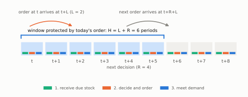
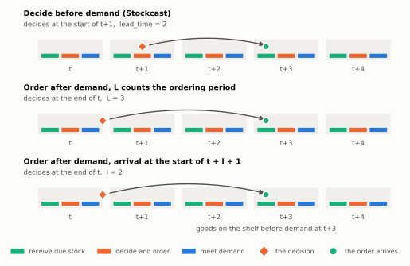

# Work with any timing convention

Papers and simulation libraries describe the same order in different words.
One says "order at the end of the day, lead time 3". Another says "decide at
the start of the day, lead time 2". Very often these are the same order,
arriving on the same morning. This page shows how to read any description and
set Stockcast so the order means what the source means. The quick reference
below summarises the result; the rest of the page explains it.

## Quick reference

| You read… | Set in Stockcast |
|---|---|
| "order at the start of the period", "review, then demand" | `lead_time = L`, same decision periods |
| "order at the end of the period", "received at the start of t + L" | `lead_time = L - 1`, decisions one period later |
| "L includes one period of ordering delay" | `lead_time = L - 1`, decisions one period later |
| "arrives at the start of period t + l + 1" | `lead_time = l`, decisions one period later |
| "lead time demand over t+1 … t+L", "review time included in L" | window $H = L$; `lead_time + review_period = L` |
| "the order arrives immediately after it is placed" | `lead_time = 0` |

## Stockcast's convention

Stockcast runs every period in the same order: **receive, decide, then meet
demand**. An order placed in period $t$ with lead time $L$ is on the shelf
before demand in period $t + L$.



[Timing: receive, decide, demand](../user-guide/concepts/timing.md) explains
this clock in full. Here we only need its two consequences: a decision never
sees the demand of its own period, and `lead_time` counts the periods from
the decision to the first period the goods can sell.

## The rule

Every convention you will meet answers two questions its own way: *where the
decision sits in the period*, and *what the lead time counts*. One rule
translates all of them:

> **`lead_time` = the first period the goods can serve demand − the period
> Stockcast decides in.**
>
> A decision "at the end of period $t$" is Stockcast's decision at the start
> of period $t + 1$.

The second line is not an approximation. At the end of period $t$ and at the
start of period $t + 1$ the decision has seen the same demand, up to period
$t$. In between, the only thing that happens is the arrival of goods already
on order, and arrivals move stock from the pipeline to the shelf without
changing the inventory position. Same information, same position, same order.



The figure shows one order, described three ways. All three put the goods on
the shelf before demand on day $t+3$, so all three become
`lead_time = 2` in Stockcast.

## Three questions for any description

Read the source with three questions in mind:

1. **What has the decision seen?** The last period whose demand it knows is
   its forecast origin. Stockcast decides in the period after it.
2. **From which period can the goods be sold?** Subtract the decision period:
   that is `lead_time`.
3. **Which periods must the order cover?** Until the next order can arrive:
   $H = (u - t) + L$, with $u$ the next decision. For review every $R$
   periods, $H = L + R$. Stockcast checks your target against this window.

The rest of this page applies these questions to the conventions you are
most likely to meet.

## Case 1: decide at the start of the period, before demand

This is Stockcast's own convention, and the classic one in inventory theory.
Receive what is due, review, order, then face the period's demand.

- Zhu (2022, Section 3): "A possibly outstanding order arrives at the
  beginning of each period. The inventory position is then reviewed and an
  order is placed if necessary."
- Janakiraman and Roundy (2004, Section 3) place the order, receive
  shipments, then observe and satisfy demand.
- Gijsbrechts et al. (2022, Section 3): "At the beginning of any period t,
  the order quantity … must be decided knowing the last observed inventory on
  hand", and orders placed $l$ periods earlier "are available at the
  beginning of period t".
- van Jaarsveld and Arts (Section 3): an order placed in period $t$ arrives
  "at the start of period t + τ".
- Michna and Nielsen place the order "at the beginning of a period t", using
  demand up to $t - 1$.

The reinforcement-learning environments for inventory control listed in the
references follow it too: the agent orders, deliveries arrive, then demand is
realised.

**In Stockcast:** use the numbers as written, `lead_time = L`, and decide in
the same periods.

## Case 2: order at the end of the period, and the lead time counts that period

Here demand comes first and the order is placed afterwards, at the end of the
period. The lead time counts from the order to the period the goods arrive,
so it includes the step from the end of one period to the start of the next.

- Dejonckheere et al. (2003, Section 3): "an order placed at the end of
  period t is received at the start of period t+L", where "the lead-time L,
  consists of one time period ordering delay and $T_p$ time periods of
  physical production or distribution delay".
- Petropoulos, Wang and Disney (2019, Section 3.3): "the term L includes the
  transportation lead-time and a one sequence of events delay"; the stock
  balance is $i_t = i_{t-1} + o_{t-L} - d_t$.
- Michna, Disney and Nielsen (2020): "At the end of the period, the inventory
  level, demand and lead times of received orders are observed and a new
  replenishment order … is placed."
- Theodorou, Spiliotis and Assimakopoulos (2025, Section 3): demand is
  subtracted, then an order is placed; the net stock follows
  $NI_t = NI_{t-1} + Q_{t-L} - D_t$.
- Chin, Cheng and Gunawan (2026, Section III-D): "Receipts precede demand;
  orders placed after demand arrive L months later."

Some simulation libraries use this order of events as well, and one of them
notes in its documentation that a lead time one period longer matches the
decide-first convention.

**In Stockcast:** the order placed at the end of period $t$ is on the shelf
before demand in period $t + L$. Stockcast decides at the start of $t + 1$,
so

$$
\texttt{lead\_time} = L - 1 ,
$$

and every decision moves one period later: a schedule that starts at period
$0$ in the source starts at period $1$ in Stockcast. With $L = 1$ the goods
arrive the next morning, which is `lead_time = 0`.

### Check it on a run

Below, the source's rule is written as a few lines of plain Python: receive,
serve demand, then order up to $S$ at the end of the day. Next to it,
Stockcast runs the same rule with `lead_time = L - 1` and decisions starting
one day later.

```python
import numpy as np
import pandas as pd

from stockcast.core import InventoryStateDataFrame, PeriodicSchedule, SimulationEngine
from stockcast.policies import OrderUpToPolicy

L, S = 3, 24.0                          # as the source writes them
demand = np.random.default_rng(7).poisson(5, 12).astype(float)


def order_after_demand(demand, L, S, on_hand):
    """Receive Q[t-L], serve demand (lost sales), then order up to S."""
    pipeline, orders, stock = {}, [], []
    for t, d in enumerate(demand):
        on_hand += pipeline.pop(t, 0.0)
        on_hand -= min(on_hand, d)
        order = max(0.0, S - on_hand - sum(pipeline.values()))
        pipeline[t + L] = order
        orders.append(order)
        stock.append(on_hand)
    return np.array(orders), np.array(stock)


source_orders, source_stock = order_after_demand(demand, L, S, on_hand=15.0)
```

```python
sku, opening = "flour_1kg", pd.Timestamp("2026-03-01")
policy = OrderUpToPolicy(
    lead_time=L - 1,
    schedule=PeriodicSchedule(every=1, start=1),
    freq="D", allow_backorders=False,
).fit(
    pd.DataFrame({"unique_id": [sku], "target": [S],
                  "date": [opening + pd.Timedelta(days=L)]}),
    target_column="target",
)
events = SimulationEngine().run(
    policy=policy,
    demand_source=pd.DataFrame({
        "unique_id": sku,
        "date": pd.date_range(opening + pd.Timedelta(days=1), periods=12, freq="D"),
        "y": demand,
    }),
    inventory=InventoryStateDataFrame.from_observed(
        pd.DataFrame({"unique_id": [sku], "date": [opening], "on_hand": [15.0]}),
        allow_backorders=False,
    ),
).to_event_frame()

print(pd.DataFrame({
    "demand": demand,
    "source order (end of day)": source_orders,
    "Stockcast order (next day)": events["order_quantity"].to_numpy(),
    "stock (both)": events["ending_on_hand"].to_numpy(),
}).head(7).to_string())
```

```text
   demand  source order (end of day)  Stockcast order (next day)  stock (both)
0     6.0                       15.0                         0.0           9.0
1     5.0                        5.0                        15.0           4.0
2     8.0                        4.0                         5.0           0.0
3     2.0                        2.0                         4.0          13.0
4     7.0                        7.0                         2.0          11.0
5     4.0                        4.0                         7.0          11.0
6     7.0                        7.0                         4.0           6.0
```

Each order appears one row later in Stockcast, because Stockcast records it
on the morning it is placed. The stock is the same every day. The order
placed on the evening of day 0 is on the shelf before demand on day 3, which
is why the stock jumps to 13 there. Both checks hold for the whole run:

```python
assert np.array_equal(events["order_quantity"].to_numpy()[1:], source_orders[:-1])
assert np.array_equal(events["ending_on_hand"].to_numpy(), source_stock)
```

The target here is a fixed level, so the policy leaves `service_level`
unset. With a forecast target you would fit it exactly as in
[Refresh targets as forecasts roll](rolling-targets.md), with each target's
origin on the last day the decision has seen.

## Case 3: order at the end of the period, and the lead time is only the delay

Some descriptions keep the end-of-period order but count only the physical
delay: an order placed at the end of period $t$ with lead time $l$ arrives at
the start of period $t + l + 1$. Dejonckheere et al. (2003) use exactly this
quantity inside their $L$: it is their physical delay $T_p$, so the two
counts sit side by side in one paper. Some simulation libraries describe
their timing this way too.

**In Stockcast:** `lead_time = l`, with every decision one period later.

## Case 4: the "lead time" already includes the review period

Many forecasting studies describe the order by the demand it must cover and
call that span the lead time.

- Kourentzes, Trapero and Barrow (2020, Section 4.2): the target sums
  forecasts over $t+1, \dots, t+L$, and "L is constant and known, and any
  review time is included in it."
- Prak, Teunter and Syntetos (2017, Section 3): the forecast is made "at the
  end of time N", and the lead time demand runs over $N+1, \dots, N+L$.

That number is the window $H$, not the delay. Choose `lead_time` and the
review period so that they add up to it: with a review every period,
`lead_time = L - 1` and `review_period = 1`. The forecast origin is the last
period the forecast has seen, as the source states.

These studies are also a good reminder of why Stockcast asks for a target
over the whole window: forecast errors are correlated across the periods of a
lead time, so the variance of the total is not the per-period variance times
$L$ (Prak, Teunter and Syntetos, 2017).

## Case 5: zero lead time

When the goods are on the shelf before the demand they are meant for, the
lead time is zero. Stockcast receives such an order right after the decision,
before the period's customers arrive.

- Dubois, Allaert and Witlox (2013, Section 2): "the lead time is zero, i.e.
  the order arrives immediately after the order is placed".
- Gijsbrechts et al. (2022, Section 3), with $l = 0$: the order "is
  immediately received and added to the on-hand inventory".
- Wang, Kang, Spiliotis and Petropoulos (2026, Section 4): "Replenishment
  decisions are finalized prior to the start of period t+1", and the
  order-up-to level is a quantile of that period's forecast.

**In Stockcast:** `lead_time = 0`.

One of the simulation libraries in the references also allows an order
placed *after* seeing a period's demand to serve that same demand. That order
knows its own demand before it is placed, so it has no counterpart in a clock
where decisions come before demand. Stockcast keeps that boundary on purpose.

## Setting the window

Once `lead_time` is set, the window follows from the same three questions,
now in Stockcast's periods:

| The source | `lead_time` | Window $H$, review every $R$ |
|---|---|---|
| Case 1: decide before demand, lead time $L$ | $L$ | $L + R$ |
| Case 2: end of period, arrival at $t + L$ | $L - 1$ | $L - 1 + R$ |
| Case 3: end of period, arrival at $t + l + 1$ | $l$ | $l + R$ |
| Case 4: "lead time" $L$ includes review | $L - R$ | $L$ |
| Case 5: zero lead time, before demand | $0$ | $R$ |

Read the window from the arrival and the next decision rather than from its
name. When a description quotes a window that differs from the one its
arrival and review imply, compute the level the way the source does, fit it
for the window the decision actually protects, and leave `service_level`
unset: a level computed over another span is not that window's quantile, so
it should not carry that window's probability. For irregular schedules the
window of each decision is $(u - t) + L$; see
[Decision schedules](../user-guide/decision-schedules.md).

If a description says the stock balance is
$NI_t = NI_{t-1} + Q_{t-L} - D_t$ but the model has lost sales, check one
more detail: whether $Q_{t-L}$ arrives before or after the demand of period
$t$. Before is Case 2. After means the goods first sell in period
$t + 1$, one period later, so `lead_time = L`.

## What the translation changes

The physical story is identical: the same orders, the same arrivals, the same
stock, and the same costs on every day. Three small things are worth knowing.

- **The ledger row.** An order placed at the end of period $t$ appears on
  Stockcast's row $t + 1$, the morning it is placed. Order counts in a
  warm-up or scoring window can shift by one at the window's edge.
- **The edges of the run.** A source's order at the end of the last period
  happens after the run and never reaches the shelf within it. The first
  decision starts one period later, as in the example.
- **Events at the start of a period.** Stockcast's decision at $t + 1$ comes
  after that morning's expiry ([`ShelfLife`](../user-guide/processes.md)) and
  supplier outcomes ([unreliable deliveries](../user-guide/unreliable-deliveries.md)).
  A decision at the end of period $t$ would not see them yet. This only
  matters when you use those features.

Every run's manifest records Stockcast's own convention under
`run_settings["timing_convention"]`, so a saved result always says which
clock produced it.

## References

- Chin, J. E., Cheng, S.-F., and Gunawan, A. (2026). Accuracy is not service:
  A decision-aware benchmark for intermittent-demand forecasting.
  [arXiv:2609.13840](https://arxiv.org/abs/2609.13840)
- Dejonckheere, J., Disney, S. M., Lambrecht, M. R., and Towill, D. R.
  (2003). Measuring and avoiding the bullwhip effect: A control theoretic
  approach. *European Journal of Operational Research*, 147(3), 567–590.
  [doi:10.1016/S0377-2217(02)00369-7](https://doi.org/10.1016/S0377-2217(02)00369-7)
- Dubois, T., Allaert, G., and Witlox, F. (2013). Determining the fill rate
  for a periodic review inventory policy with capacitated replenishments,
  lost sales and zero lead time. *Operations Research Letters*, 41(6),
  726–729. [doi:10.1016/j.orl.2013.10.006](https://doi.org/10.1016/j.orl.2013.10.006)
- Gijsbrechts, J., Boute, R. N., Van Mieghem, J. A., and Zhang, D. J. (2022).
  Can deep reinforcement learning improve inventory management? Performance
  on lost sales, dual-sourcing, and multi-echelon problems. *Manufacturing &
  Service Operations Management*, 24(3), 1349–1368.
  [doi:10.1287/msom.2021.1064](https://doi.org/10.1287/msom.2021.1064)
- Janakiraman, G., and Roundy, R. O. (2004). Lost-sales problems with
  stochastic lead times: Convexity results for base-stock policies.
  *Operations Research*, 52(5), 795–803.
  [doi:10.1287/opre.1040.0130](https://doi.org/10.1287/opre.1040.0130)
- Kourentzes, N., Trapero, J. R., and Barrow, D. K. (2020). Optimising
  forecasting models for inventory planning. *International Journal of
  Production Economics*, 225, 107597.
  [doi:10.1016/j.ijpe.2019.107597](https://doi.org/10.1016/j.ijpe.2019.107597)
- Michna, Z., Disney, S. M., and Nielsen, P. (2020). The impact of stochastic
  lead times on the bullwhip effect under correlated demand and moving
  average forecasts. *Omega*, 93, 102033.
  [doi:10.1016/j.omega.2019.02.002](https://doi.org/10.1016/j.omega.2019.02.002)
- Michna, Z., and Nielsen, P. The impact of lead time forecasting on the
  bullwhip effect. [arXiv:1309.7374](https://arxiv.org/abs/1309.7374)
- Petropoulos, F., Wang, X., and Disney, S. M. (2019). The inventory
  performance of forecasting methods: Evidence from the M3 competition data.
  *International Journal of Forecasting*, 35(1), 251–265.
  [doi:10.1016/j.ijforecast.2018.01.004](https://doi.org/10.1016/j.ijforecast.2018.01.004)
- Prak, D., Teunter, R., and Syntetos, A. (2017). On the calculation of
  safety stocks when demand is forecasted. *European Journal of Operational
  Research*, 256(2), 454–461.
  [doi:10.1016/j.ejor.2016.06.035](https://doi.org/10.1016/j.ejor.2016.06.035)
- Theodorou, E., Spiliotis, E., and Assimakopoulos, V. (2025). Forecast
  accuracy and inventory performance: Insights on their relationship from the
  M5 competition data. *European Journal of Operational Research*, 322(2),
  414–426. [doi:10.1016/j.ejor.2024.12.033](https://doi.org/10.1016/j.ejor.2024.12.033)
- van Jaarsveld, W., and Arts, J. Projected inventory level policies for lost
  sales inventory systems: Asymptotic optimality in two regimes.
  [arXiv:2101.07519](https://arxiv.org/abs/2101.07519)
- Wang, S., Kang, Y., Spiliotis, E., and Petropoulos, F. (2026).
  Multi-objective probabilistic forecast combination for inventory demand.
  [arXiv:2606.04900](https://arxiv.org/abs/2606.04900)
- Zhu, H. (2022). A simple heuristic policy for stochastic inventory systems
  with both minimum and maximum order quantity requirements. *Annals of
  Operations Research*, 309, 347–363.
  [doi:10.1007/s10479-021-04441-1](https://doi.org/10.1007/s10479-021-04441-1)

Simulation software whose documented conventions appear on this page:

- [Stockpyl: sequence of events and lead times](https://stockpyl.readthedocs.io/en/latest/tutorial/tutorial_sim.html#sequence-of-events)
- [SimOpt: (s, S) inventory model](https://simopt.readthedocs.io/en/development/models/sscont.html)
- [OR-Gym: inventory management environments](https://github.com/hubbs5/or-gym)
- [gym-invmgmt (Barati and Hu, 2026)](https://arxiv.org/abs/2605.11355)

**See also:** [Timing: receive, decide, demand](../user-guide/concepts/timing.md) ·
[Decisions happen before demand](../user-guide/design/decide-before-demand.md) ·
[Decision schedules](../user-guide/decision-schedules.md)
