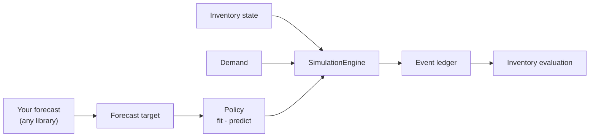
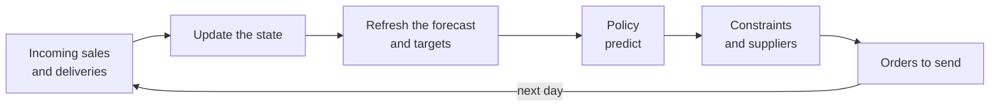

---
hide:
  - navigation
  - toc
---

<div class="sc-hero" markdown>


# Stockcast

<p class="sc-tagline">Turn forecasts into inventory decisions you can simulate, inspect, and evaluate.</p>

[Get started](get-started/quickstart.md){ .md-button .md-button--primary }
[Learn the basics](learn/index.md){ .md-button }
[Our philosophy](get-started/philosophy.md){ .md-button }

</div>

Stockcast is a Python library for the step that comes **after** forecasting.
You bring a forecast from any model you like. Stockcast maps it into orders,
simulates their execution against historical or simulated demand, and
evaluates the resulting impact against business metrics such as cost, service,
and waste. And when you are happy with a policy, the same objects
compute your real orders every day.

It is built like PyTorch and assembled like Lego: a handful of bricks that
snap onto one engine. Swap the policy, the demand, the supplier, or the shelf-life rule, and
everything else stays exactly the same. The reasoning behind every design
choice, and the literature it rests on, is in our
[philosophy](get-started/philosophy.md).

## Find your way

The docs have four parts. Pick the one that matches what you want right now:

<div class="grid cards sc-grid-2" markdown>

-   :material-rocket-launch-outline:{ .lg .middle } **Get started**

    ---

    *"I'm new."* Install, run the ten-minute
    [Quickstart](get-started/quickstart.md), then follow
    [Learn the basics](learn/index.md): nine short steps from the first
    simulation to a production daily job.

    [:octicons-arrow-right-24: Start here](get-started/quickstart.md)

-   :material-book-open-variant:{ .lg .middle } **Guide**

    ---

    *"How does X work?"* or *"How do I do Y?"* The theory and options of every
    building block (timing, targets, policies, suppliers, shelf life,
    metrics), plus short **recipes** for everyday jobs.

    [:octicons-arrow-right-24: Open the guide](user-guide/index.md)

-   :material-notebook-outline:{ .lg .middle } **Examples**

    ---

    *"Show me a complete project."* Twenty-one runnable notebooks with real
    forecasts, multiple suppliers, perishable stock, and a production
    workflow.

    [:octicons-arrow-right-24: Browse examples](tutorials/index.md)

-   :material-api:{ .lg .middle } **API reference**

    ---

    *"What are the arguments of this function?"* Every public class and
    function, with parameters, return values, and examples.

    [:octicons-arrow-right-24: Look it up](reference/index.md)

</div>

**Suggested paths**

- **Researchers:** [Quickstart](get-started/quickstart.md) → [Learn steps 1–8](learn/index.md) →
  [Compare forecasts and policies](how-to/compare-policies.md) →
  [experiment examples](tutorials/index.md#experiments-and-operations)
- **Engineers:** [Quickstart](get-started/quickstart.md) → [Learn steps 1–9](learn/index.md) →
  [Use Stockcast in a daily job](how-to/production.md) →
  [Example 10: production daily close](notebooks/10_production_daily_close.ipynb)

## Two pipelines

**Research: backtest and compare.**



**Production: run the chosen policy every day.**



## For researchers and for engineers

<div class="grid cards" markdown>

-   :material-flask-outline:{ .lg .middle } **Researchers and analysts**

    ---

    Measure forecasts by the decisions they lead to. Compare policies,
    forecasting models, lead times, suppliers, and shelf-life rules on
    identical demand, with every unit accounted for and every run
    reproducible.

    [:octicons-arrow-right-24: Compare scenarios](learn/08-compare.md)

-   :material-cog-outline:{ .lg .middle } **Engineers in production**

    ---

    Put the chosen policy behind a daily job: load stock, refresh the
    forecast, compute orders with the supplier's rules, and save the state.
    The daily job gives exactly the results of its backtest.

    [:octicons-arrow-right-24: From backtest to production](learn/09-production.md)

</div>

## Stockcast in one screen

```python
import numpy as np
import pandas as pd

from stockcast.core import InventoryStateDataFrame, SimulationEngine
from stockcast.policies import OrderUpToPolicy
from stockcast.utils import DemandGenerator

sku, opening = "tea_250g", pd.Timestamp("2026-01-05")

# Demand to play forward, and the stock we start with.
demand = DemandGenerator([sku], start_date=opening + pd.Timedelta(days=1),
                         period_frequency="D", seed=3,
                         negative_demand_handling="clip_zero").seasonal(
    n_periods=56, base=6.0, amplitude=2.0, season_length=7, std=2.0)
inventory = InventoryStateDataFrame([sku], max_lead_time=2, allow_backorders=False)
inventory.initialize_from_observed(pd.DataFrame({"unique_id": [sku], "on_hand": [30.0]}),
                                   on_hand_column="on_hand", start_date=opening)

# A forecast target: the 95% quantile of total demand over the next 6 days.
paths = np.random.default_rng(42).poisson(6.0, size=(10_000, 6))
target = pd.DataFrame({"unique_id": [sku],
                       "target": [np.quantile(paths.sum(axis=1), 0.95)],
                       "end": [opening + pd.Timedelta(days=6)]})

# Order up to that target every 4 days; deliveries take 2 days.
policy = OrderUpToPolicy(lead_time=2, review_period=4, service_level=0.95,
                         allow_backorders=False).fit(
    target, target_column="target", target_probability=0.95, protection_horizon=6,
    target_source="external_direct", forecast_origin=opening,
    forecast_frequency="D", target_end_date_column="end")

result = SimulationEngine().run(
    policy=policy, demand_source=demand, inventory=inventory, n_periods=56,
    period_frequency="D", warmup_periods=0, scoring_periods=56,
    settlement_periods=0, order_during_settlement=False,
    demand_source_name="tea_shop", random_seed=3)

result.to_event_frame()   # one row per SKU and day: every unit, accounted for
```

The [Quickstart](get-started/quickstart.md) walks through each of these lines.

## What makes Stockcast different

<div class="grid" markdown>

!!! abstract "Forecasts become decisions"

    Forecast accuracy is one number. What a business feels is the stock on the
    shelf, the sales it missed, and the money tied up in inventory. Stockcast
    measures forecasts by the decisions they lead to.

!!! abstract "Composable, like PyTorch"

    Policies, schedules, constraints, suppliers, callbacks, and physical
    processes are separate objects with one job each. Combine the built-in ones
    or subclass a base class to add your own.

!!! abstract "Every unit is accounted for"

    Each simulated day produces a row in an event ledger. The engine checks
    that stock, backorders, and pipeline balance on every row, so your
    results rest on consistent accounting.

!!! abstract "Timing you can read"

    Receive, decide, then meet demand. The order of events is written down,
    drawn, and tested, so a lead time means the same thing in every experiment.

</div>

## Works with your forecasting stack

Stockcast does not fit forecasting models. It accepts what any forecasting
library produces: quantiles of cumulative demand, mean and standard deviation,
or sample paths. The examples use [smooth](https://openforecast.org/smooth-py/),
from the same open-source ecosystem, and the same steps apply to statsforecast,
skforecast, Prophet, scikit-learn, deep learning models, or your own code. See
[Connect any forecasting model](how-to/connect-a-forecaster.md).
