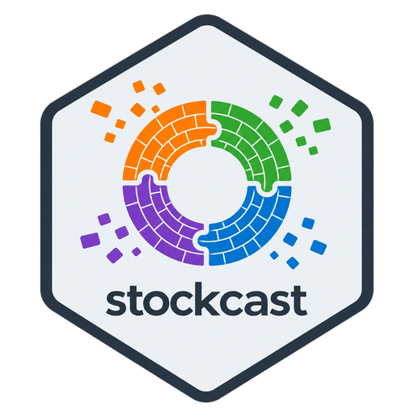

---
hide:
  - navigation
  - toc
---

<div class="sc-hero" markdown>



# Stockcast

<p class="sc-tagline">Turn forecasts into inventory decisions you can simulate, inspect, and evaluate.</p>

[Get started](get-started/quickstart.md){ .md-button .md-button--primary }
[Guide](user-guide/index.md){ .md-button }
[Examples](tutorials/index.md){ .md-button }

</div>

Stockcast is a Python library for the step that comes **after** forecasting.
You bring a forecast from any model you like. Stockcast maps it into orders,
simulates their execution against historical or simulated demand, and
evaluates the resulting impact against business metrics such as cost, service,
and waste. Happy with a policy?
[Put it into production](how-to/production.md) with the same objects.

Inspired by PyTorch-style libraries, it is built like Lego: small parts that
snap onto one engine. Each part is a class you can subclass and adjust. Swap
the policy, the demand, the supplier, or the shelf-life rule, and everything
else stays the same.

:octicons-arrow-right-24: **[Read our philosophy](get-started/philosophy.md)**:
why Stockcast is built this way, and the research behind it.

## How it works

<figure class="sc-diagram">
--8<-- "how-it-works.svg"
</figure>

## Two pipelines

**Research: backtest and compare.** For researchers and analysts who measure
forecasts by the decisions they lead to. Compare policies, forecasting models,
lead times, suppliers, and shelf-life rules on identical demand.

<figure class="sc-diagram">
--8<-- "compare.svg"
</figure>

[:octicons-arrow-right-24: Compare scenarios](learn/08-compare.md)

**Production: run the chosen policy every day.** For engineers who put the
chosen policy behind a daily job: load stock, refresh the forecast, compute
orders with the supplier's rules, and save the state.

<figure class="sc-diagram">
--8<-- "production-loop.svg"
</figure>

[:octicons-arrow-right-24: From backtest to production](learn/09-production.md)

## Example

```python
import pandas as pd

from stockcast.core import InventoryStateDataFrame, SimulationEngine
from stockcast.evaluation import InventoryEvaluator, avg_on_hand, fill_rate
from stockcast.policies import OrderUpToPolicy
from stockcast.utils import DemandGenerator

sku, today = "tea_250g", pd.Timestamp("2026-02-01")

# Twelve weeks of daily tea sales, about six packs a day.
sales = DemandGenerator([sku], first_date="2026-01-05", freq="D", random_seed=3).sample(
    84, lambda rng, periods: rng.poisson(6, periods.size))
past, future = sales[sales["date"] <= today], sales[sales["date"] > today]

# Forecast tomorrow from the last four weeks. Any model works; here, two
# common ways to state the uncertainty.
last_4_weeks = past["y"].tail(28)
forecast = pd.DataFrame({
    "unique_id": [sku],
    "date": [today + pd.Timedelta(days=1)],   # the day it forecasts
    "fh": [1],                                # one step ahead
    "mean": [last_4_weeks.mean()],            # a moving average ...
    "std": [last_4_weeks.std()],              # ... and its spread
    "q95": [last_4_weeks.quantile(0.95)],     # or a 95% quantile forecast
})

# 30 packs on the shelf today. Order every morning, delivered before opening,
# up to the 95% quantile of tomorrow's demand.
shelf = InventoryStateDataFrame.from_observed(
    pd.DataFrame({"unique_id": [sku], "date": [today], "on_hand": [30]}))
policy = OrderUpToPolicy(lead_time=0, review_period=1, freq="D",
                         service_level=0.95, allow_backorders=False)
engine = SimulationEngine()

# From a mean and a spread, the policy computes the quantile...
policy.fit(forecast, mean_column="mean", std_column="std")
from_mean_std = engine.run(policy=policy, demand_source=future, inventory=shelf)

# ...or it takes a quantile forecast as it is.
policy.fit(forecast, target_column="q95")
from_quantile = engine.run(policy=policy, demand_source=future, inventory=shelf)

# Score the next eight weeks of each.
metrics = [fill_rate, avg_on_hand]
pd.concat({
    "mean + std": InventoryEvaluator().fit(from_mean_std).evaluate(metrics),
    "quantile": InventoryEvaluator().fit(from_quantile).evaluate(metrics),
}).droplevel(1).round(2)
```

```text
            fill_rate  avg_on_hand
mean + std       0.99         5.30
quantile         0.99         5.69
```

The [Quickstart](get-started/quickstart.md) walks through each of these lines.

## Key features

- **Any forecasting model.** Stockcast does not fit models; it takes quantiles,
  a mean and standard deviation, or sample paths from statsforecast,
  skforecast, [smooth](https://openforecast.org/smooth-py/), Prophet, deep
  learning, or your own code.
  [Connect any forecasting model](how-to/connect-a-forecaster.md).
- **Forecasts become decisions.** Judge a forecast by the stock, missed sales,
  and cost it leads to, not only by its accuracy.
- **Small parts you combine.** Policies, schedules, constraints, suppliers,
  callbacks, and shelf-life processes each do one job. Use the built-in ones
  or subclass a base class.
- **Every unit is accounted for.** Each simulated period is an event table row, and
  the engine checks that stock, backorders, and pipeline balance on every row.
- **Timing you can read.** Receive, decide, then meet demand, in that order.
  Other conventions map onto it:
  [work with any timing convention](how-to/timing-conventions.md).

## About

Stockcast is built and maintained by
[Filotas Theodosiou](https://filtheo.github.io/) at the Predictive AI and
Digital Shift (PADS) research group, VIVES University of Applied Sciences,
where it supports our research on turning forecasts into inventory
decisions.

## Citation

If you use Stockcast in your work, please cite the version you used. The
repository's
[`CITATION.cff`](https://github.com/FilTheo/stockcast/blob/main/CITATION.cff)
has the details, and GitHub's *Cite this repository* button formats them:

```text
Theodosiou, F. Stockcast: forecast-driven inventory decisions, simulation, and
evaluation in Python. Version 0.1.0. https://github.com/FilTheo/stockcast
```

## Contributing

Contributions are welcome, from typo fixes to new building blocks. See the
[contributing guide](contributing.md) and the [release notes](release-notes.md).

## Getting help

Open an [issue on GitHub](https://github.com/FilTheo/stockcast/issues) for
questions, ideas, and bugs. For a bug, include a small example and the run
manifest (`result.run_manifest`), which records the versions and settings
behind a result.

Stockcast is released under the
[Apache License 2.0](https://github.com/FilTheo/stockcast/blob/main/LICENSE).
