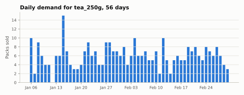

<span class="sc-step">Step 2 of 9</span>

# Demand and time

A simulation plays demand forward one **period** at a time. This page shows
the demand table Stockcast reads and how periods map to calendar dates.

## The demand table

Demand is a long table with one row per SKU and period:

| Column | Meaning |
|---|---|
| `unique_id` | The SKU, matching the inventory state. |
| `period` | Zero-based period number: `0, 1, 2, …` |
| `date` | The calendar date of that period. |
| `y` | Units demanded in that period. |

This is the same long format used by Nixtla's libraries and many other
forecasting tools, so forecast outputs and demand tables line up naturally.

## Periods and dates

The opening state has a date: the moment you counted the shelf. **Demand
period 0 is one step after it.** With a daily frequency and an opening date of
Monday 5 January, the calendar looks like this:

| | Opening state | Period 0 | Period 1 | Period 2 | … |
|---|---|---|---|---|---|
| Date | Mon 5 Jan | Tue 6 Jan | Wed 7 Jan | Thu 8 Jan | … |

In general, period $p$ is dated

$$
\text{date}_p = \text{opening date} + (p + 1)\,\Delta,
$$

where $\Delta$ is the period length, given as a pandas frequency: `"D"` for
days, `"W-MON"` for weeks starting Monday, `"h"` for hours, and so on. Lead
time and review period are counted in these periods.

## Generate demand

`DemandGenerator` makes reproducible synthetic demand, which is handy for
learning and for stress tests. The tea shop's eight weeks:

```python
import pandas as pd

from stockcast.utils import DemandGenerator

sku = "tea_250g"
opening_date = pd.Timestamp("2026-01-05")

demand = DemandGenerator(
    [sku],
    start_date=opening_date + pd.Timedelta(days=1),   # date of period 0
    period_frequency="D",
    seed=3,
    negative_demand_handling="clip_zero",
).seasonal(n_periods=56, base=6.0, amplitude=2.0, season_length=7, std=2.0)
demand["y"] = demand["y"].round()

demand.head()
```

```text
  unique_id     y  period       date
0  tea_250g  10.0       0 2026-01-06
1  tea_250g   2.0       1 2026-01-07
2  tea_250g   9.0       2 2026-01-08
3  tea_250g   6.0       3 2026-01-09
4  tea_250g   4.0       4 2026-01-10
```



A normal distribution with a standard deviation of 2 can draw a negative
value. `negative_demand_handling="clip_zero"` clips those draws to zero and
tells you with a warning. The default, `"raise"`, stops instead.

The generator also offers `constant`, `normal`, `trend`, and
`from_historical` (normal draws that match the mean and spread of your own
history). Each has a callable `_fn` twin that produces demand period by
period.

## Use your own data

Real sales history usually arrives wide or unlabelled. Reshape it into the
long format and number the periods:

```python
sales = pd.DataFrame({
    "date": pd.date_range("2026-01-06", periods=4, freq="D"),
    "tea_250g": [10, 2, 9, 6],
    "coffee_1kg": [3, 4, 2, 5],
})

my_demand = sales.melt(id_vars="date", var_name="unique_id", value_name="y")
my_demand = my_demand.sort_values(["unique_id", "date"])
my_demand["period"] = my_demand.groupby("unique_id").cumcount()
my_demand.head(4)
```

```text
        date   unique_id  y  period
4 2026-01-06  coffee_1kg  3       0
5 2026-01-07  coffee_1kg  4       1
6 2026-01-08  coffee_1kg  2       2
7 2026-01-09  coffee_1kg  5       3
```

## A complete grid

Before a run starts, the engine checks the whole calendar: every SKU appears
in every period exactly once, the dates advance by exactly one frequency step,
and every value is finite and non-negative. Days without sales are rows with
`y = 0`. Because the check happens up front, a finished run always rests on a
complete demand history.

!!! summary "Recap"

    - Demand is a long table: `unique_id`, `period`, `date`, `y`.
    - Period 0 is one frequency step after the opening state.
    - Lead times and review periods count periods, at the frequency you
      declare.

**Go deeper:** [Demand and calendars](../user-guide/demand.md) ·
[Timing: receive, decide, demand](../user-guide/concepts/timing.md)

[Next: Forecast targets :octicons-arrow-right-24:](03-forecast-targets.md){ .md-button }
