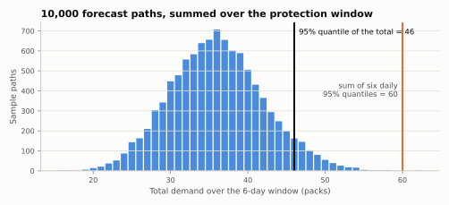

<span class="sc-step">Step 3 of 9</span>

# Forecast targets

A forecast says what demand might be. A policy needs something more specific:
**how much stock to aim for**. This page shows how one becomes the other.

## How far ahead an order has to reach

The tea shop orders every $R = 4$ days, and deliveries take $L = 2$ days.
Today's order is the last one that can arrive before the order placed at the
next review. That next order only arrives $R + L$ days from now. So today's
decision has to protect demand for

$$
H = L + R = 2 + 4 = 6 \text{ days.}
$$

This window $H$ is the **protection horizon**. The
[timing page](../user-guide/concepts/timing.md) derives it day by day.

## The target is a quantile of total demand

Let $D_{t}, D_{t+1}, \dots, D_{t+H-1}$ be demand over the window. The
order-up-to level $S$ is a high quantile of their **sum**:

$$
S \;=\; Q_{\alpha}\!\left(\,\sum_{h=0}^{H-1} D_{t+h}\right),
$$

where $\alpha$ is the target probability, for example $0.95$. If the forecast
is right, the six-day total stays at or below $S$ with probability $\alpha$.

## Sum first, then take the quantile

Your forecasting model can often give you a daily 95% quantile. Adding six of
those does **not** give the 95% quantile of the six-day total. A day with
unusually high sales is often balanced by a quieter day, so totals vary less
than "every day at its 95% high" suggests. The picture shows it with 10,000
forecast paths:



```python
import numpy as np
import pandas as pd

rng = np.random.default_rng(42)
paths = rng.poisson(6.0, size=(10_000, 6))   # 10,000 possible futures, 6 days each

quantile_of_sum = np.quantile(paths.sum(axis=1), 0.95)
sum_of_quantiles = np.quantile(paths, 0.95, axis=0).sum()
quantile_of_sum, sum_of_quantiles
```

```text
(np.float64(46.0), np.float64(60.0))
```

Both numbers come from the same forecast, but they answer different
questions. The first is what "95% protection over six days" means: 46 packs.
The second would hold 14 extra packs on the shelf all the time. That is why
Stockcast asks for the target of the whole window.
[Targets cover a whole window](../user-guide/design/cumulative-targets.md) has
the full argument.

## Three ways to get the target

Every forecasting library can produce one of these. Pick the one that matches
your model's output.

=== "1. Sample paths"

    Many models can simulate future paths: bootstrapped residuals, Monte Carlo
    from a state-space model, or samples from a probabilistic neural network.
    Sum each path over the window, then take the quantile across paths. This
    also captures dependence between days.

    ```python
    horizon = 6
    target_value = np.quantile(paths[:, :horizon].sum(axis=1), 0.95)
    ```

=== "2. A cumulative forecast"

    Some models forecast the total directly. In
    [smooth](https://openforecast.org/smooth-py/), for example, ask for the
    upper bound of the cumulative forecast:

    ```py
    from smooth import ES

    model = ES(model="ANN")
    model.fit(history["y"])
    total = model.predict(h=6, interval="prediction", level=0.95,
                          side="upper", cumulative=True)
    target_value = float(total.upper.iloc[-1, 0])
    ```

=== "3. Daily mean and standard deviation"

    If your model gives each day's mean $\mu_h$ and standard deviation
    $\sigma_h$, and you are happy to treat days as independent and normal,
    Stockcast can combine them for you:

    $$
    S = \sum_{h=1}^{H} \mu_h \;+\; z_{\alpha}\sqrt{\sum_{h=1}^{H} \sigma_h^{2}},
    $$

    where $z_{\alpha}$ is the standard normal quantile ($z_{0.95} \approx
    1.645$). See the example below.

## Give the target its context

A target is only meaningful together with the window it covers. A target
table carries one row per SKU with the value and the last date it covers:

```python
sku = "tea_250g"
opening_date = pd.Timestamp("2026-01-05")

target = pd.DataFrame({
    "unique_id": [sku],
    "target": [quantile_of_sum],
    "target_end_date": [opening_date + pd.Timedelta(days=horizon)],
})
target
```

```text
  unique_id  target target_end_date
0  tea_250g    46.0      2026-01-11
```

When a policy is fitted (next step), you also say when the forecast was made
(`forecast_origin`), the period length, the probability, and the horizon.
Stockcast checks that the end date equals origin + $H$ periods and that $H$
matches the policy's lead time and review period. A target built for a
different window is caught at `fit`, before any simulation runs.

## Letting Stockcast combine means and standard deviations

Route 3 uses a forecast table with one row per future period, numbered by
`fh` (forecast horizon $1 \dots H$):

```python
from stockcast.policies import OrderUpToPolicy

daily = pd.DataFrame({
    "unique_id": sku,
    "fh": range(1, 7),
    "date": pd.date_range(opening_date + pd.Timedelta(days=1), periods=6, freq="D"),
    "mean": 6.0,
    "std": np.sqrt(6.0),
})

policy = OrderUpToPolicy(lead_time=2, review_period=4, service_level=0.95,
                         allow_backorders=False).fit(
    daily,
    mean_column="mean", std_column="std", forecast_date_column="date",
    aggregation_method="independent_normal", target_probability=0.95,
    protection_horizon=6, forecast_origin=opening_date, forecast_frequency="D",
)
policy.get_target_levels()
```

```text
  unique_id  target_level
0  tea_250g     45.869122
```

With a mean and variance of 6 per day, the normal approximation gives
$36 + 1.645 \times \sqrt{36} = 45.9$: very close to the 46 from the sample paths.

!!! summary "Recap"

    - A policy's target covers the whole protection window $H = L + R$.
    - The target is a quantile of **total** demand over that window: sum
      first, then take the quantile.
    - Any forecasting model works: use sample paths, a cumulative forecast,
      or means and standard deviations.

**Go deeper:** [Forecast targets](../user-guide/forecast-targets.md) ·
[Connect any forecasting model](../how-to/connect-a-forecaster.md) ·
[Notebook 04c](../notebooks/04c_cumulative_protection_target.ipynb) ·
[Notebook 04e](../notebooks/04e_cumulative_target_methods.ipynb)

[Next: Policies :octicons-arrow-right-24:](04-policies.md){ .md-button }
