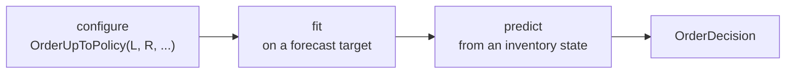

<span class="sc-step">Step 4 of 9</span>

# Policies

A **policy** is the ordering rule. It looks at the inventory state and says how
much to order. Stockcast policies follow the familiar scikit-learn rhythm:



## Configure and fit

We build the tea shop's policy from the target of the previous step:

```python
import numpy as np
import pandas as pd

from stockcast.core import InventoryStateDataFrame
from stockcast.policies import OrderUpToPolicy

sku = "tea_250g"
opening_date = pd.Timestamp("2026-01-05")
lead_time, review_period = 2, 4
horizon = lead_time + review_period

paths = np.random.default_rng(42).poisson(6.0, size=(10_000, horizon))
target = pd.DataFrame({
    "unique_id": [sku],
    "target": [np.quantile(paths.sum(axis=1), 0.95)],
    "target_end_date": [opening_date + pd.Timedelta(days=horizon)],
})

policy = OrderUpToPolicy(
    lead_time=lead_time,          # L: periods from order to delivery
    review_period=review_period,  # R: periods between ordering opportunities
    service_level=0.95,           # the probability the target represents
    allow_backorders=False,       # lost sales
).fit(
    target,
    target_column="target",
    target_probability=0.95,               # must match service_level
    protection_horizon=horizon,            # must equal L + R
    target_source="external_direct",       # the target was computed outside Stockcast
    forecast_origin=opening_date,          # the forecast used data up to this date
    forecast_frequency="D",
    target_end_date_column="target_end_date",
)
policy
```

```text
OrderUpToPolicy(lead_time=2, review_period=4, service_level=0.95, allow_backorders=lost_sales, status=fitted)
```

**Configuration** describes the operation: lead time, review rhythm, shortage
rule. **Fitting** binds the forecast information: the target and its context.
Keeping the two apart means you can refit the same policy on a fresh forecast
every week without touching its configuration.

## Predict an order

Give the policy a state and it returns an `OrderDecision`:

```python
inventory = InventoryStateDataFrame(
    [sku], max_lead_time=lead_time, allow_backorders=False,
).initialize_from_observed(
    pd.DataFrame({"unique_id": [sku], "on_hand": [30.0]}),
    on_hand_column="on_hand", start_date=opening_date,
)

decision = policy.predict(inventory, current_period=0)
decision.get_dataframe()
```

```text
  unique_id  order_quantity  target_level  inventory_position  reorder_point  order_period  expected_delivery_period
0  tea_250g            16.0          46.0                30.0            NaN             0                         2
```

The rule at work:

$$
q = \max(0,\; S - \mathit{IP}) = \max(0,\; 46 - 30) = 16 .
$$

The decision also records *why*: the target level, the inventory position it
saw, and when the order should arrive ($0 + L = 2$).

!!! info "A policy never changes stock"

    `predict` returns a request. It does not touch the inventory. Placing the
    order, receiving it, and serving demand are the engine's job (next step).
    That separation is what lets you swap policies freely: every policy is
    judged by the same bookkeeping.

## The built-in policies

| Policy | Rule | Typical use |
|---|---|---|
| `OrderUpToPolicy` $(R, S)$ | Every $R$ periods, order $\max(0, S - \mathit{IP})$ | Regular ordering days, one target per SKU |
| `ReorderPointPolicy` $(s, Q)$ | When $\mathit{IP} \le s$, order a fixed $Q$ | Case packs, fixed lot sizes |
| `ReorderPointPolicy` $(s, S)$ | When $\mathit{IP} \le s$, order up to $S$ | Order only when stock gets low |
| `PeriodicReviewPolicy` $(R, s, S)$ | Every $R$ periods, if $\mathit{IP} \le s$, order up to $S$ | Periodic review with a trigger level |
| `SingleOrderPolicy` | One purchase for a selling season | Newsvendor, seasonal, and fresh products |

Each has its own page in the [policy guide](../user-guide/policies/index.md),
with the formulas and when to use it.

## Your own policy

Any rule can become a policy. Subclass `BasePolicy`, implement `fit` and
`predict`, and return an `OrderDecision`. Here is a "days of cover" rule that
orders up to a number of days of average demand:

```python
from stockcast.core import BasePolicy, OrderDecision


class DaysOfCover(BasePolicy):
    """Order up to `days` times the forecast daily demand."""

    def __init__(self, days, **kwargs):
        super().__init__(**kwargs)
        self.days = days

    def fit(self, forecast_df, **kwargs):
        self.daily_mean_ = forecast_df.set_index("unique_id")["daily_mean"]
        self.fitted_ = True
        return self

    def predict(self, inventory_state_df, *, current_period, **kwargs):
        state = inventory_state_df.inventory_position()
        level = state["unique_id"].map(self.daily_mean_) * self.days
        orders = pd.DataFrame({
            "unique_id": state["unique_id"],
            "order_quantity": (level - state["inventory_position"]).clip(lower=0),
            "order_period": current_period,
            "expected_delivery_period": current_period + self.lead_time,
        })
        return OrderDecision(orders, lead_time=self.lead_time,
                             review_period=self.review_period)


cover = DaysOfCover(8, lead_time=2, review_period=4, allow_backorders=False).fit(
    pd.DataFrame({"unique_id": [sku], "daily_mean": [6.0]}))
cover.predict(inventory, current_period=0).get_dataframe()[["unique_id", "order_quantity"]]
```

```text
  unique_id  order_quantity
0  tea_250g            18.0
```

It plugs into the engine exactly like the built-in policies.

!!! summary "Recap"

    - Configure a policy with the operation, `fit` it on a target, `predict`
      orders from a state.
    - `OrderUpToPolicy` orders $\max(0, S - \mathit{IP})$ at each review.
    - Policies request orders; the engine carries them out.

**Go deeper:** [Policies](../user-guide/policies/index.md) ·
[Write your own policy](../user-guide/policies/custom-policies.md) ·
[Notebook 05](../notebooks/05_custom_policies.ipynb)

[Next: The engine :octicons-arrow-right-24:](05-engine.md){ .md-button }
