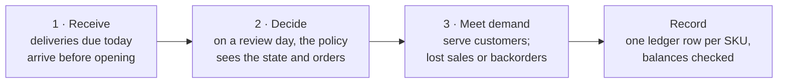
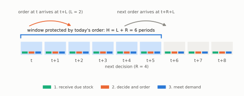
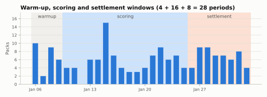

<span class="sc-step">Step 5 of 9</span>

# The engine

`SimulationEngine` is the clock of a Stockcast run. It takes the demand, the
opening state, and a fitted policy, and simulates them period by period.
It is the only object that changes stock.

## One period, three moves

Every period follows the same order: **receive, decide, then meet demand.**



Because the decision comes before demand, the policy never sees today's sales
when it orders. An order placed in period $t$ with lead time $L$ is received
at the start of period $t + L$, in time for that period's demand. With
$L = 0$ it arrives immediately and can serve today's customers.



The coloured strips inside each day are the three moves. Today's order (at
$t$) arrives at $t + 2$. The next review is at $t + 4$, and its order arrives
at $t + 6$. So today's order must cover demand on days $t$ to $t + 5$: the
$H = L + R$ window from step 3.

## Run it

```python
import numpy as np
import pandas as pd

from stockcast.core import InventoryStateDataFrame, SimulationEngine
from stockcast.policies import OrderUpToPolicy
from stockcast.utils import DemandGenerator

sku = "tea_250g"
opening_date = pd.Timestamp("2026-01-05")
lead_time, review_period = 2, 4
horizon = lead_time + review_period

demand = DemandGenerator(
    [sku], start_date=opening_date + pd.Timedelta(days=1), period_frequency="D",
    seed=3, negative_demand_handling="clip_zero",
).seasonal(n_periods=56, base=6.0, amplitude=2.0, season_length=7, std=2.0)
demand["y"] = demand["y"].round()

inventory = InventoryStateDataFrame(
    [sku], max_lead_time=lead_time, allow_backorders=False,
).initialize_from_observed(
    pd.DataFrame({"unique_id": [sku], "on_hand": [30.0]}),
    on_hand_column="on_hand", start_date=opening_date,
)

paths = np.random.default_rng(42).poisson(6.0, size=(10_000, horizon))
target = pd.DataFrame({
    "unique_id": [sku],
    "target": [np.quantile(paths.sum(axis=1), 0.95)],
    "target_end_date": [opening_date + pd.Timedelta(days=horizon)],
})
policy = OrderUpToPolicy(
    lead_time=lead_time, review_period=review_period,
    service_level=0.95, allow_backorders=False,
).fit(
    target, target_column="target", target_probability=0.95,
    protection_horizon=horizon, target_source="external_direct",
    forecast_origin=opening_date, forecast_frequency="D",
    target_end_date_column="target_end_date",
)

engine = SimulationEngine()
result = engine.run(
    policy=policy,
    demand_source=demand,
    inventory=inventory,
    n_periods=56,
    period_frequency="D",
    warmup_periods=0,
    scoring_periods=56,
    settlement_periods=0,
    order_during_settlement=False,
    demand_source_name="tea_shop",
    random_seed=3,
)
result
```

```text
SimulationResult(policy=Order-Up-To (R,S), n_periods=56, history_rows=56)
```

The policy orders on periods 0, 4, 8, …: every $R = 4$ periods, starting
with the very first one. That rhythm is the policy's **decision schedule**.
`review_period=4` is shorthand for `PeriodicSchedule(every=4)`; one-off and
irregular calendars are covered in
[Decision schedules](../user-guide/decision-schedules.md).

## Every argument is a decision you make

`run` has no hidden defaults for things that change results. Each argument is
part of the experiment you are describing:

| Argument | Why you set it |
|---|---|
| `n_periods`, `period_frequency` | How long the run is, and what one period means |
| `warmup_periods`, `scoring_periods`, `settlement_periods` | Which periods count towards the metrics |
| `order_during_settlement` | Whether the policy keeps ordering in the settlement tail |
| `demand_source_name`, `random_seed` | A record of which demand this run used |

## Warm-up, scoring, settlement

A run can be split into three consecutive windows that add up to `n_periods`:



- **Warm-up** lets the system settle, so the opening stock does not colour the
  results.
- **Scoring** is the window your metrics describe.
- **Settlement** plays demand a little longer, so orders placed near the end
  of scoring can arrive. Set `order_during_settlement=False` to stop new
  orders there.

All three windows move stock. Only the scoring window counts by default.

## The engine works on copies

The engine copies the state and the policy before it starts. Your `inventory`
and `policy` objects are exactly as you left them, so you can reuse them for
the next run:

```python
inventory.inventory_position()[["on_hand", "inventory_position"]]
```

```text
   on_hand  inventory_position
0     30.0                30.0
```

## A receipt for every run

Each result carries a **run manifest**: the demand fingerprint, the policy and
its target metadata, the opening state, every run setting, and the package
versions. Share a result and its manifest travels with it.

```python
result.run_manifest["run_settings"]["decision_schedule"]
```

```text
{'type': 'periodic', 'every': 4, 'start': 0}
```

!!! summary "Recap"

    - Each period: **receive → decide → meet demand**, then record.
    - An order placed at $t$ arrives at the start of $t + L$.
    - `run` takes every experimental choice explicitly and never changes your
      input objects.

**Go deeper:** [The simulation engine](../user-guide/engine.md) ·
[Timing: receive, decide, demand](../user-guide/concepts/timing.md) ·
[Notebook 02](../notebooks/02_first_engine_simulation.ipynb)

[Next: The event ledger :octicons-arrow-right-24:](06-event-ledger.md){ .md-button }
