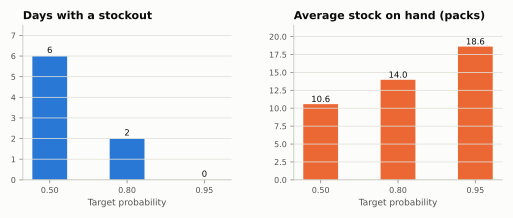
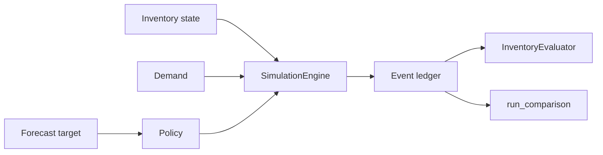

<span class="sc-step">Step 8 of 9</span>

# Compare scenarios

The real power of simulation is comparison. Is a 95% target worth the extra
stock over an 80% one? Is a better forecast worth more than a smarter ordering
rule? To answer fairly, every alternative must face **exactly the same
demand** from **exactly the same starting point**.

??? example "Setup: the tea shop from steps 1 to 5"

    ```python
    --8<-- "learn-setup.py"
    ```

## Run three targets side by side

`run_comparison` takes a list of fitted policies and runs each one on the same
demand, each from its own fresh copy of the opening state:

```python
from stockcast.core import SimulationEngine

comparison = SimulationEngine().run_comparison(
    policies=[tea_policy(0.50), tea_policy(0.80), tea_policy(0.95)],
    labels=["target 0.50", "target 0.80", "target 0.95"],
    demand_source=demand,
    inventory=inventory,
    **run_settings,
)
comparison.summary()[["fill_rate", "stockout_periods",
                      "mean_ending_on_hand_per_sku_period", "total_order_units"]]
```

```text
             fill_rate  stockout_periods  mean_ending_on_hand_per_sku_period  total_order_units
policy
target 0.50   0.946746                 6                           10.571429              305.0
target 0.80   0.994083                 2                           13.964286              326.0
target 0.95   1.000000                 0                           18.607143              333.0
```

`tea_policy(p)` (in the setup above) sets the target to the $p$-quantile of
six-day demand: 36, 41, and 46 packs. Higher targets buy service with stock:



## Why the comparison is fair

- **One demand path.** The demand is read once and shared by every branch.
- **Separate stock.** Each branch starts from its own copy of the opening
  state, so one policy's orders never leak into another's shelf.
- **Same rules.** Constraints, suppliers, callbacks, and processes you pass
  apply identically to every branch. Random supplier lead times are drawn
  once and shared, so branches differ only by the policy.

Any difference in the results is therefore caused by the policies alone.

## Decide with costs

Service and stock pull in opposite directions. Costs put them on one scale.
Each branch is a normal `SimulationResult`, so the evaluator works as in step 7:

```python
import pandas as pd

from stockcast.evaluation import InventoryEvaluator, fill_rate, total_cost

costs = {
    "holding_cost_per_unit_period": 0.02,
    "shortage_cost_per_unit": 2.00,
    "order_cost_per_sku_line": 5.00,
    "order_cost_per_unit": 0.0,
    "cost_components": ["holding", "shortage", "ordering"],
}
scores = pd.concat({
    label: InventoryEvaluator().fit(comparison[label], window="scoring").evaluate(
        [fill_rate, total_cost], groupby=[], context=costs)
    for label in comparison
}).droplevel(1)
scores.round(3)
```

```text
             fill_rate  total_cost
target 0.50      0.947      117.84
target 0.80      0.994       89.64
target 0.95      1.000       90.84
```

With lost margin at €2 per pack and shelf space at €0.02 a day, the 80% target
is the cheapest of the three: its two small stockouts cost less than the extra
stock the 95% target carries. The 50% target loses too many sales. Raise the
lost margin and the 95% target wins. Weighing these trade-offs on your own
numbers is exactly what Stockcast is built for.

## Beyond targets

The same pattern compares anything that is a policy:

- two **forecasting models**, by fitting the same policy on each model's
  target;
- two **ordering rules**, such as order-up-to against a reorder point;
- a **custom policy** against a built-in one.

For longer studies with rolling forecasts, see
[Compare forecasts and policies](../how-to/compare-policies.md) and
[Notebook 06](../notebooks/06_fair_forecast_and_policy_comparisons.ipynb).

## The research pipeline, complete

You now know every piece of a Stockcast run:



One step remains: taking the policy you chose into production, where it runs
every day on live stock and fresh forecasts.

From here:

- [Step 9: From backtest to production](09-production.md) runs the chosen
  policy as a daily job;
- the [Guide](../user-guide/index.md) explains each building block in
  depth, with the theory behind it;
- the [Recipes](../how-to/index.md) answer specific questions;
- the [Examples](../tutorials/index.md) show larger, realistic workflows.

!!! summary "Recap"

    - `run_comparison` runs several policies on identical demand from
      identical, separate starting states.
    - Differences in results come from the policies alone.
    - Metrics and costs turn the comparison into a decision.

[Next: From backtest to production :octicons-arrow-right-24:](09-production.md){ .md-button }
