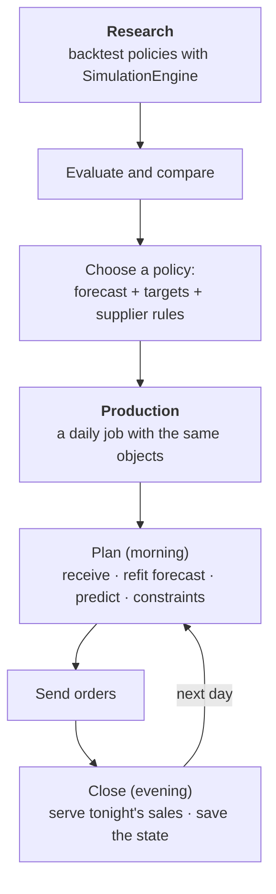

<span class="sc-step">Step 9 of 9</span>

# From backtest to production

So far the tea shop lived inside a simulation: the engine played eight weeks
of demand and we measured the result. That is the **research pipeline**:
compare forecasts and policies on past or simulated demand until you trust
one.

The next step is to **run that policy for real**, every day, on live stock
and fresh forecasts. That is the **production pipeline**. Stockcast uses the
same objects for both, so what you backtested is exactly what you run.



## The daily cycle

A production day has two moments:

| Moment | When | What happens | Stockcast calls |
|---|---|---|---|
| **Plan** | morning, before sales | receive due deliveries; on a review day, refresh the forecast, fit the policy, propose an order, apply supplier rules, send it | `advance_period`, `fit`, `predict`, `OrderingConstraints.apply`, `update_inventory_with_orders` |
| **Close** | evening, after sales | serve the day's demand from the planned state and save it for tomorrow | `fulfill_demand` |

This is the same order as inside the engine: receive, decide, then meet
demand. The forecast only ever uses data up to yesterday.

??? example "Setup: the tea shop from steps 1 to 5"

    ```python
    --8<-- "learn-setup.py"
    ```

## 1. A forecast that updates every day

In production the forecast is refitted on the latest sales. Here a small
stand-in model uses the mean of the last 28 days and a normal approximation
for the six-day window; your forecasting library goes in its place.

```python
from statistics import NormalDist

from stockcast.core import ConstraintContext, OrderingConstraints, OrderMultiple
from stockcast.utils import update_inventory_with_orders

# Four weeks of sales before the opening day: the model's starting history.
history = DemandGenerator(
    [sku], start_date=opening_date - pd.Timedelta(days=27), period_frequency="D",
    seed=4, negative_demand_handling="clip_zero",
).seasonal(n_periods=28, base=6.0, amplitude=2.0, season_length=7, std=2.0)
history = history[["unique_id", "date", "y"]].assign(y=lambda d: d["y"].round())

z = NormalDist().inv_cdf(0.95)


def fit_policy(observed, origin):
    """Refit the forecast on sales up to `origin` and return a fitted policy."""
    rate = observed.sort_values("date")["y"].tail(28).mean()
    target = pd.DataFrame({
        "unique_id": [sku],
        "target": [round(horizon * rate + z * np.sqrt(horizon * rate))],
        "target_end_date": [origin + pd.Timedelta(days=horizon)],
    })
    return OrderUpToPolicy(
        lead_time=lead_time, review_period=review_period,
        service_level=0.95, allow_backorders=False,
    ).fit(
        target, target_column="target", target_probability=0.95,
        protection_horizon=horizon, target_source="external_direct",
        forecast_origin=origin, forecast_frequency="D",
        target_end_date_column="target_end_date",
    )


supplier_rules = OrderingConstraints([OrderMultiple(6, mode="adjust")])   # cases of 6
```

## 2. Plan and close

Two small functions are the whole production job:

```python
def plan(state, observed, is_review):
    """Morning: receive, and on review days refit, predict, and apply the rules."""
    today = state.advance_period(period_frequency="D", is_review_period=is_review)
    if not is_review:
        return today, None
    yesterday = pd.Timestamp(state.get_dataframe()["date"].iloc[0])
    policy = fit_policy(observed, origin=yesterday)
    now = int(today.get_dataframe()["period"].iloc[0])
    proposal = policy.predict(today, current_period=now)
    accepted = supplier_rules.apply(
        proposal, ConstraintContext(inventory=today, policy=policy, decision_period=now),
    )
    return update_inventory_with_orders(today, accepted.order, policy=policy), accepted


def close(planned_state, sales):
    """Evening: serve the day's sales."""
    return planned_state.fulfill_demand(sales)
```

`accepted.order` is what you send to the supplier, and `accepted.audit`
records what the rules changed.

## 3. Run four weeks, one day at a time

Here the "live" sales come from the demand table, one day at a time. In
production they arrive from your point-of-sale system:

```python
state, observed, order_log, daily_stock = inventory, history.copy(), [], []

for day in range(28):
    state, accepted = plan(state, observed, is_review=(day % review_period == 0))
    if accepted is not None:
        sent = accepted.audit.iloc[0]
        order_log.append({"date": state.get_dataframe()["date"].iloc[0],
                          "proposed": sent["requested_order_quantity"],
                          "sent": sent["constrained_order_quantity"]})
    sales = demand[demand["period"] == day]                   # tonight's sales arrive
    state = close(state, sales)
    daily_stock.append(float(state.get_dataframe()["on_hand"].iloc[0]))
    observed = pd.concat([observed, sales[["unique_id", "date", "y"]]])

pd.DataFrame(order_log).head(5)
```

```text
        date  proposed  sent
0 2026-01-06      14.0  18.0
1 2026-01-10      22.0  24.0
2 2026-01-14      11.0  12.0
3 2026-01-18      33.0  36.0
4 2026-01-22      12.0  12.0
```

## 4. What you backtest is what you run

Now backtest exactly this setup with the engine: the same refitted forecast at
every review (through `policy_schedule`), the same supplier rules, the same
four weeks.

```python
observed_all = pd.concat([history, demand[["unique_id", "date", "y"]]])
refits = {
    t: fit_policy(observed_all[observed_all["date"] <= opening_date + pd.Timedelta(days=t)],
                  origin=opening_date + pd.Timedelta(days=t))
    for t in range(0, 28, review_period)
}

backtest = SimulationEngine().run(
    policy=refits[0],
    policy_schedule={t: p for t, p in refits.items() if t > 0},
    order_constraints=supplier_rules,
    demand_source=demand[demand["period"] < 28],
    inventory=inventory,
    **dict(run_settings, n_periods=28, scoring_periods=28),
)

backtest_stock = backtest.to_event_frame()["ending_on_hand"].tolist()
daily_stock == backtest_stock
```

```text
True
```

The daily job and the backtest agree on every day's stock. The policy you
chose in research, with its forecast and supplier rules, behaves in
production exactly as it did in the simulation, and the backtest's ledger,
metrics, and manifest describe the job you are running.

## In a real deployment

Stockcast is the decision layer. Your application keeps the parts that belong
to your systems:

| Your application | Stockcast |
|---|---|
| Loads stock and open orders (ERP, database) | `InventoryStateDataFrame`, `with_open_orders` |
| Runs the forecasting model | turns its output into a checked target (`fit`) |
| Schedules the job (cron, Airflow, Dagster, …) | `plan`: receive, `predict`, constraints |
| Approves and sends orders | returns the order and its audit trail |
| Saves the state between runs, safely and once | `close`: the next state to save |
| Monitors service and cost | the same metrics, on live ledgers or regular backtests |

A good routine: keep the plan and the close as separate, saved steps, each
with an idempotency key, so a retry never orders or sells twice; and before
changing any parameter, backtest the change with the engine on recent history.

!!! summary "Recap"

    - **Research pipeline:** backtest and compare policies with
      `SimulationEngine` and the evaluator.
    - **Production pipeline:** every day, *plan* (receive, refit, predict,
      constrain, send) and *close* (serve sales, save the state).
    - Both use the same objects, so the backtest describes exactly what runs
      in production.

**Go deeper:** [Use Stockcast in a daily job](../how-to/production.md) ·
[Refresh targets as forecasts roll](../how-to/rolling-targets.md) ·
[Notebook 10: production daily close](../notebooks/10_production_daily_close.ipynb)
