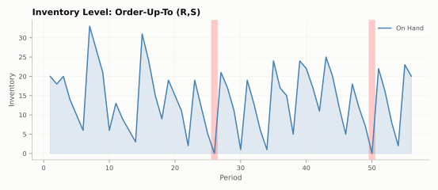
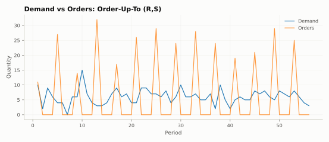
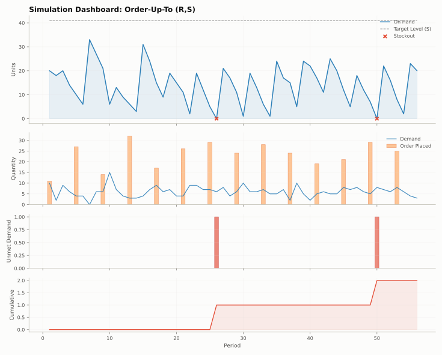
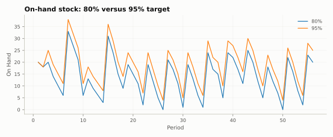
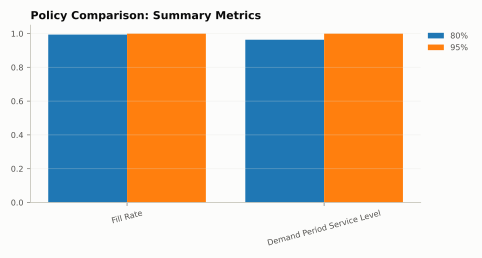
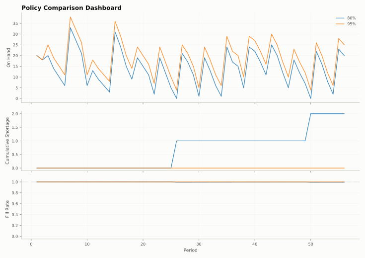

# Plots

Ready-made Matplotlib views of runs and comparisons. Guide: [Plots](../user-guide/visualization.md).

Each picture below is drawn by the function above it on the tea shop from the
[Walkthrough](../learn/index.md): one run with an 80% target, and a
comparison of the 80% and 95% targets on the same demand.

::: stockcast.visualization.plot_inventory

<figure markdown="span">
  
  <figcaption><code>plot_inventory(result, sku="tea_250g")</code>: on-hand stock, with stockout periods shaded</figcaption>
</figure>

::: stockcast.visualization.plot_demand_vs_orders

<figure markdown="span">
  
  <figcaption><code>plot_demand_vs_orders(result, sku="tea_250g")</code>: daily demand and the order placed at each review</figcaption>
</figure>

::: stockcast.visualization.plot_simulation_dashboard

<figure markdown="span">
  
  <figcaption><code>plot_simulation_dashboard(result, sku="tea_250g")</code>: stock with the target level, demand and orders, shortage, and cumulative shortage</figcaption>
</figure>

::: stockcast.visualization.plot_comparison

<figure markdown="span">
  
  <figcaption><code>plot_comparison(comparison, metric="on_hand", sku="tea_250g", ax=ax)</code>, with a title set on <code>ax</code></figcaption>
</figure>

::: stockcast.visualization.plot_summary_comparison

<figure markdown="span">
  
  <figcaption><code>plot_summary_comparison(comparison, metrics=["fill_rate", "demand_period_service_level"])</code>, with the legend moved outside</figcaption>
</figure>

::: stockcast.visualization.plot_comparison_dashboard

<figure markdown="span">
  
  <figcaption><code>plot_comparison_dashboard(comparison, sku="tea_250g")</code>: stock, cumulative shortage, and fill rate over time</figcaption>
</figure>
