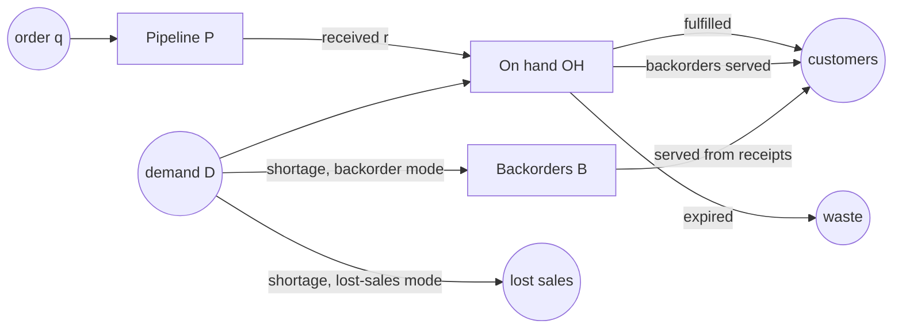

# Stock accounting

Stockcast treats a simulation like a set of books. Every unit that enters or
leaves the shelf, the pipeline, or the backorder list is written down, and
the books must balance on every row. This page lists the identities, explains
what each one means, and shows how to check them yourself.

## The four stocks

Each SKU carries four quantities from one period to the next:



and the inventory position combines them: $\mathit{IP} = \mathit{OH} + P - B$.

## The identities

For every SKU and period, the ledger satisfies:

**Demand is either served or short.**

$$
D_t = \text{fulfilled}_t + \text{shortage}_t
$$

**On-hand stock.** What is on the shelf at the end equals what was there at
the start, plus receipts, minus everything that left:

$$
\mathit{OH}^{\text{end}}_t = \mathit{OH}^{\text{start}}_t + r_t
- \text{backorders served}_t - \text{fulfilled}_t
- \text{expired}_t + \text{adjustment}_t
$$

**Pipeline.** Orders go in, receipts come out:

$$
P^{\text{end}}_t = P^{\text{start}}_t + q_t - r_t
$$

**Backorders.** New shortages are added (backorder mode), served backorders
are removed:

$$
B^{\text{end}}_t = B^{\text{start}}_t + \text{new backorders}_t - \text{backorders served}_t
$$

**Inventory position.**

$$
\mathit{IP}^{\text{end}}_t = \mathit{OH}^{\text{end}}_t + P^{\text{end}}_t - B^{\text{end}}_t
$$

**The order trail.** The requested, adjusted, constrained, and accepted
quantities are linked:

$$
\begin{aligned}
\text{callback adjusted} &= \text{requested} + \text{callback adjustment} \\
\text{constrained} &= \text{callback adjusted} + \text{constraint adjustment} \\
q_t &= \text{constrained}
\end{aligned}
$$

### Shortage rules

- **Lost sales** (`allow_backorders=False`): $\text{shortage} =
  \text{lost sales}$, and backorders stay at zero.
- **Backorders** (`allow_backorders=True`): $\text{shortage} =
  \text{new backorders}$, and lost sales stay at zero.
- Deliveries serve **old backorders first**, then today's demand.
- A SKU never has positive on-hand stock and positive backorders at the same
  time.

### When extensions add flows

Optional building blocks add their own columns, and the identities grow with
them:

| Building block | Extra columns | Enters |
|---|---|---|
| Inventory processes with general flows | `process_inflow_units`, `process_outflow_units` | on-hand: $+\,\text{inflow} - \text{outflow}$ |
| Processes with expiry flows, `ShelfLife` | `expired_units` (standard column) | on-hand: $-\,\text{expired}$ |
| `on_after_demand` callbacks | `inventory_adjustment_units` (standard column) | on-hand: $+\,\text{adjustment}$ |
| Suppliers with a `DeliveryOutcome` | `supplier_shortfall_units` | pipeline: $-\,\text{shortfall}$ |

For example, with an unreliable supplier the pipeline identity becomes
$P^{\text{end}} = P^{\text{start}} + q - r - \text{shortfall}$: units that will
never arrive leave the pipeline without entering the shelf.

## Checked as the engine runs

The engine checks the identities for every row as it is written. The tolerance
is $10^{-9}$ plus $10^{-12}$ times the size of the row's flows, so ledgers in
grams or millilitres balance just as well as ledgers in units.

`validate_event_frame` applies the same checks, and more (types, flags, window
labels), to any ledger:

??? example "Setup: the tea shop from Learn the basics"

    ```python
    --8<-- "learn-setup.py"
    ```

```python
from stockcast.evaluation import validate_event_frame

events = result.to_event_frame()
validate_event_frame(events)          # returns a validated copy

broken = events.copy()
broken.loc[3, "ending_on_hand"] += 1  # one unit appears from nowhere
try:
    validate_event_frame(broken)
except ValueError as error:
    print(error)
```

```text
event_frame violates physical inventory balance for SKU tea_250g at period 4
```

`InventoryEvaluator.fit` validates its input the same way, so metrics are
always computed from balanced books.

## Why this matters

- **Trust.** A policy, a callback, or a custom process cannot create or
  destroy stock by accident. Any bug shows up as a failed identity with the
  SKU and period.
- **Additivity.** Balanced rows can be summed over any grouping (weeks,
  stores, categories) and the totals still balance.
- **Explanations.** When a metric surprises you, the ledger tells you which
  flow caused it.

**Go deeper:** [The ledger is the record](../design/ledger.md) ·
[Output tables](../../reference/schemas.md)
