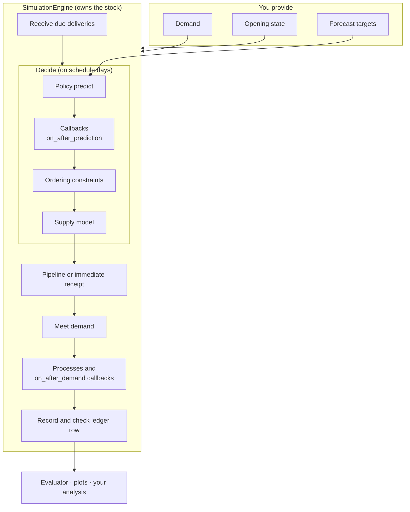

# How Stockcast fits together

Stockcast is a set of small objects, each with one job. You describe an
inventory system by choosing and combining them, the way you build a neural
network from PyTorch layers. This page introduces the objects, what each one
owns, and how the engine puts them together.

## The objects

| Object | Its one job | Built-ins | Extend by subclassing |
|---|---|---|---|
| **Inventory state** | Hold on-hand stock, the pipeline, and backorders | `InventoryStateDataFrame` | – |
| **Demand** | Say how much is requested in each period | DataFrame, `DemandGenerator` | any callable |
| **Decision schedule** | Say *when* ordering is allowed | `PeriodicSchedule`, `OneTimeSchedule`, `ExplicitSchedule` | `DecisionSchedule` |
| **Policy** | Say *how much* to order | `OrderUpToPolicy`, `ReorderPointPolicy`, `PeriodicReviewPolicy`, `SingleOrderPolicy` | `BasePolicy` |
| **Target provider** | Supply $(s, S)$ levels to a periodic-review policy | `ColumnPeriodicReviewTargets`, `FixedPeriodicReviewTargets` | `PeriodicReviewTargetProvider` |
| **Callback** | Adjust an order, or stock, at a planned moment | `ScheduledOrderOverride`, `ScheduledOrderMultiplier`, `ScheduledOrderHold`, `ScheduledInventoryAdjustment` | `SimulationCallback` |
| **Ordering constraint** | Turn a requested order into a feasible one | `MinimumOrderQuantity`, `OrderMultiple`, `MaximumOrderQuantity`, `ShelfSpaceLimit` | `OrderingConstraint` |
| **Supply model** | Decide which supplier delivers, when, and in how many parts | `SupplyModel`, `Supplier`, `SupplierShares` | `SupplierAllocation`, `DeliveryOutcome` |
| **Inventory process** | Physical flows such as expiry, inspections, returns | `ShelfLife` | `InventoryProcess` |
| **Engine** | Run the clock and apply every change to stock | `SimulationEngine`, `ShelfLifeEngine` | – |
| **Metric** | Summarise the ledger | 37 metric functions, `CoverageMetric` | any function, `BaseInventoryMetric` |

## Who owns what

The most important design rule: **only the engine changes stock.** Every
other object *proposes*, and the engine applies proposals in a fixed order and
records the result.



What this buys you:

- **Policies are interchangeable.** A policy only returns an `OrderDecision`.
  It cannot bypass accounting, so every policy is judged by the same rules.
- **Constraints and suppliers are reusable.** A case-pack rule or a supplier
  with random lead times works with any policy.
- **Every change is recorded.** The ledger records the policy's request, the
  callback-adjusted quantity, the constrained quantity, and the accepted
  order separately, so you can see what each component did.

## Everything at once

Here is one run that uses a policy, a decision schedule, two ordering
constraints, a callback, a supplier with a random lead time, and shelf life.
Each piece is one argument; remove any of them and the rest still works.

??? example "Setup: the tea shop from Learn the basics"

    ```python
    --8<-- "learn-setup.py"
    ```

```python
from stockcast.core import (
    InventoryStateDataFrame, MinimumOrderQuantity, OrderingConstraints,
    OrderMultiple, ScheduledOrderHold, ShelfLife, SimulationEngine, Supplier,
    SupplyModel,
)

# Orders of at least 12 packs, in cases of 6.
constraints = OrderingConstraints([
    MinimumOrderQuantity(12, mode="adjust"),
    OrderMultiple(6, mode="adjust"),
])

# The supplier is closed on 18 January: skip that review.
holiday = ScheduledOrderHold(pd.DataFrame({
    "unique_id": [sku],
    "date": [pd.Timestamp("2026-01-18")],
    "reason": ["supplier closed"],
    "source": ["supplier calendar"],
}))

# Deliveries take 2 days, sometimes 3.
supply = SupplyModel(
    [Supplier("tea_wholesaler", lead_time={2: 0.8, 3: 0.2})],
    random_seed=11,
)

# Tea keeps for 21 days; the opening 30 packs arrived three days ago.
shelf_life = ShelfLife(
    shelf_life_days=21,
    opening_lots=pd.DataFrame({
        "unique_id": [sku],
        "received_date": [opening_date - pd.Timedelta(days=3)],
        "quantity": [30.0],
    }),
)

# A 3-day lead time needs three pipeline slots.
inventory_3 = InventoryStateDataFrame(
    [sku], max_lead_time=3, allow_backorders=False,
).initialize_from_observed(
    pd.DataFrame({"unique_id": [sku], "on_hand": [30.0]}),
    on_hand_column="on_hand", start_date=opening_date,
)

result = SimulationEngine().run(
    policy=policy,
    demand_source=demand,
    inventory=inventory_3,
    order_constraints=constraints,
    callbacks=[holiday],
    supply=supply,
    processes=[shelf_life],
    **run_settings,
)

events = result.to_event_frame()
events.loc[events["requested_order_quantity"] > 0,
           ["date", "requested_order_quantity", "callback_adjusted_order_quantity",
            "order_quantity", "binding_constraints"]].head(6)
```

```text
         date  requested_order_quantity  callback_adjusted_order_quantity  order_quantity     binding_constraints
0  2026-01-06                      16.0                              16.0            18.0          order_multiple
4  2026-01-10                      25.0                              25.0            30.0          order_multiple
8  2026-01-14                       9.0                               9.0            12.0  minimum_order_quantity
12 2026-01-18                      29.0                               0.0             0.0
16 2026-01-22                      46.0                              46.0            48.0          order_multiple
20 2026-01-26                       9.0                               9.0            12.0  minimum_order_quantity
```

Read across a row and you see each component at work: the policy asked for 16
packs, the case-pack rule rounded it to 18; on 18 January the holiday callback
set the order to zero. The order frame (`result.to_order_frame()`) shows which
deliveries took three days, and the callback audit
(`result.to_callback_audit_frame()`) records the holiday with its reason.

!!! note "A friendly warning about lead times"

    This run prints a `UserWarning`: the policy's target was sized for a
    2-day lead time, and some deliveries take 3. Stockcast simulates exactly
    what you declared and lets you know the two differ. That is often the
    very question you want to study. See
    [Suppliers: the lead-time assumption](../suppliers.md#lead-time-assumption).

## Two pipelines, one set of objects

The same objects serve two jobs:

| | Research pipeline | Production pipeline |
|---|---|---|
| Goal | choose a forecast and a policy | compute today's orders |
| Demand | past or simulated, all at once | tonight's sales, one day at a time |
| Driver | `SimulationEngine.run` / `run_comparison` | your scheduled job: `advance_period` → `fit` → `predict` → constraints → `update_inventory_with_orders`, then `fulfill_demand` |
| Output | ledger, metrics, manifest | orders to send, the next state to save |

Because both follow the same receive → decide → demand sequence with the same
policy, constraints, and targets, a daily job reproduces its backtest exactly.
[Learn step 9](../../learn/09-production.md) shows it on the tea shop.

## Fit, predict, run, evaluate

The objects share a small vocabulary, borrowed from scikit-learn and PyTorch:

| Verb | Where | Meaning |
|---|---|---|
| `fit` | policies, evaluator | Bind data (targets, a ledger) to a configured object |
| `predict` | policies | Propose an order for a given state |
| `run` / `run_comparison` | engine | Play the system forward and record it |
| `evaluate` | evaluator | Compute metrics over a window and grouping |
| `to_*_frame()` | results | Read a record of the run as a DataFrame |

## Extension points

Each extension point is a base class with a few methods to fill in:

| Base class | Implement | Guide |
|---|---|---|
| `BasePolicy` | `fit`, `predict` | [Write your own policy](../policies/custom-policies.md) |
| `DecisionSchedule` | `should_decide`, `next_decision_period`, `to_manifest` | [Decision schedules](../decision-schedules.md) |
| `PeriodicReviewTargetProvider` | `provide` | [Periodic review](../policies/periodic-review.md) |
| `SimulationCallback` | `on_after_prediction` and/or `on_after_demand` | [Callbacks](../callbacks.md) |
| `OrderingConstraint` | `apply` | [Ordering constraints](../constraints.md) |
| `SupplierAllocation` | `allocate` | [Suppliers](../suppliers.md) |
| `DeliveryOutcome` | `resolve` | [Unreliable deliveries](../unreliable-deliveries.md) |
| `InventoryProcess` | `before_demand` and/or `after_demand` | [Processes](../processes.md) |
| `BaseInventoryMetric` | `compute` | [Metrics](../metrics.md) |

**Go deeper:** [Small parts you combine](../design/composition.md) ·
[Notebook 05c: extension points](../../notebooks/05c_extension_points.ipynb)
