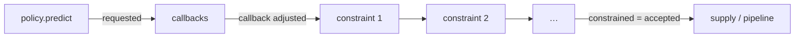

# Ordering constraints

A policy says what it would like to order. Real operations add rules: a
supplier's minimum, whole cases, a truck's capacity, the space in a chiller.
Ordering constraints turn the requested order into a feasible one, and the
ledger records what each rule changed.

## Where constraints act



Constraints run after order callbacks and before the order is placed, in the
order you list them. They apply to every policy, so an operational rule is
written once.

## Built-in constraints

Each takes a single value for all SKUs or a dict with one value per SKU, and a
`mode`: `"raise"` stops the run when an order breaks the rule, `"adjust"`
fixes the order.

| Constraint | Rule for a positive order $q$ | `"adjust"` does |
|---|---|---|
| `MinimumOrderQuantity(m)` | $q \ge m$ | $q \leftarrow m$ |
| `OrderMultiple(k)` | $q$ is a multiple of $k$ | $q \leftarrow k \lceil q / k \rceil$ |
| `MaximumOrderQuantity(M)` | $q \le M$ | $q \leftarrow M$ |
| `ShelfSpaceLimit(C)` | $q \le \max\bigl(0,\ C - (\mathit{OH} + P)\bigr)$ | $q \leftarrow$ the free space |

Zero orders are always allowed. `MaximumOrderQuantity` and `ShelfSpaceLimit`
are capacity rules: when they cut an order, the ledger's
`capacity_violation_flag` is set.

```python
from stockcast.core import (
    MaximumOrderQuantity, MinimumOrderQuantity, OrderingConstraints, OrderMultiple,
)

constraints = OrderingConstraints([
    MinimumOrderQuantity(12, mode="adjust"),     # supplier minimum
    OrderMultiple(6, mode="adjust"),             # cases of 6
    MaximumOrderQuantity(60, mode="adjust"),     # at most 10 cases per order
])
```

Pass it to the engine with `order_constraints=constraints`.

## The final order satisfies every rule

After the sequence runs, Stockcast checks the final quantity against **every**
constraint. If an adjustment by one rule breaks another, the run stops with a
message naming the SKU and the rule. For example, `OrderMultiple` rounds up to
a full case while `ShelfSpaceLimit` cuts down to the free space. When space is
tight, no order satisfies both, and Stockcast tells you rather than accepting
an impossible quantity. When you need a rule such as "whole cases that still
fit", write it as one constraint (below).

## The audit trail

Every ledger row records the order at each stage:

| Column | Meaning |
|---|---|
| `requested_order_quantity` | what the policy asked for |
| `callback_adjusted_order_quantity` | after callbacks |
| `constrained_order_quantity` | after constraints |
| `order_quantity` | what was placed (equal to the constrained quantity) |
| `constraint_adjustment_units` | constrained minus callback-adjusted |
| `constraint_binding_flag` | whether any constraint changed the order |
| `binding_constraints` | names of the rules that changed it, joined by `|` |
| `capacity_violation_flag` | whether a capacity rule cut the order |

The metrics `capacity_violation_count` and `capacity_violation_rate` summarise
the last column.

## Write your own constraint

Subclass `OrderingConstraint`, give it a unique `name`, and implement `apply`.
It receives the current `OrderDecision` and a `ConstraintContext` (the state
before demand, the policy, and the decision period), and returns a
`ConstraintResult` with the new decision and one audit row per SKU:

??? example "Setup: the tea shop from Learn the basics"

    ```python
    --8<-- "learn-setup.py"
    ```

```python
import numpy as np

from stockcast.core import (
    ConstraintResult, OrderDecision, OrderingConstraint, OrderingConstraints,
    SimulationEngine,
)


class WholeCasesThatFit(OrderingConstraint):
    """Round up to whole cases, then drop cases that do not fit on the shelf."""

    name = "whole_cases_that_fit"

    def __init__(self, case_size, shelf_space):
        self.case_size, self.shelf_space = case_size, shelf_space

    def apply(self, order, context):
        frame = order.get_dataframe()
        state = context.inventory.inventory_position().set_index("unique_id")
        occupied = frame["unique_id"].map(state["on_hand"] + state["total_in_transit"])
        requested = frame["order_quantity"].to_numpy(dtype=float)

        cases = np.ceil(requested / self.case_size)
        fitting = np.floor(np.maximum(self.shelf_space - occupied, 0) / self.case_size)
        accepted = np.minimum(cases, fitting) * self.case_size
        frame["order_quantity"] = accepted

        changed = ~np.isclose(requested, accepted)
        audit = pd.DataFrame({
            "unique_id": frame["unique_id"],
            "requested_order_quantity": requested,
            "constrained_order_quantity": accepted,
            "constraint_adjustment_units": accepted - requested,
            "constraint_binding_flag": changed,
            "capacity_violation_flag": changed & (accepted < requested),
            "binding_constraints": [self.name if flag else "" for flag in changed],
        })
        decision = OrderDecision(frame, lead_time=order.lead_time,
                                 review_period=order.review_period)
        return ConstraintResult(decision, audit)

    def to_manifest(self):
        return {**super().to_manifest(), "case_size": self.case_size,
                "shelf_space": self.shelf_space}


result = SimulationEngine().run(
    policy=policy, demand_source=demand, inventory=inventory,
    order_constraints=OrderingConstraints([WholeCasesThatFit(case_size=6, shelf_space=40)]),
    **run_settings,
)
events = result.to_event_frame()
events.loc[events["requested_order_quantity"] > 0,
           ["date", "requested_order_quantity", "order_quantity",
            "capacity_violation_flag"]].head(4)
```

```text
         date  requested_order_quantity  order_quantity  capacity_violation_flag
0  2026-01-06                      16.0             6.0                     True
4  2026-01-10                      37.0            30.0                     True
8  2026-01-14                      21.0            12.0                     True
12 2026-01-18                      41.0            30.0                     True
```

A shelf of 40 packs cannot hold what a target of 46 asks for. On 6 January,
30 packs already fill the shelf, so only one case of 6 fits; the ledger shows
every cut. `to_manifest` stores the rule's settings in the run manifest.
Implement `validate(order, context)` too if the rule should also check the
final order after later constraints; the base class checks the basic shape.

**Notebooks:** [05c: extension points](../notebooks/05c_extension_points.ipynb) ·
[09: full operational experiment](../notebooks/09_full_operational_experiment.ipynb)
