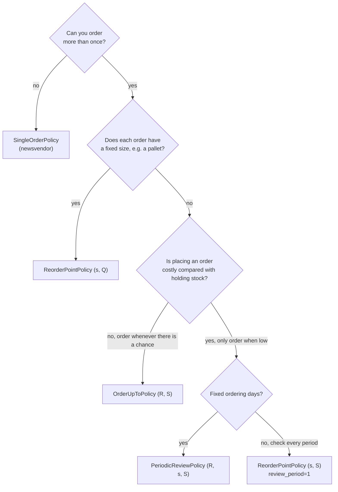

# Policies

A policy is an ordering rule: given the inventory state, how much should be
ordered? Stockcast ships the classic rules of inventory theory and lets you
write your own with the same interface.

## At a glance

| Policy | Notation | When it orders | How much |
|---|---|---|---|
| [`OrderUpToPolicy`](order-up-to.md) | $(R, S)$ | every scheduled opportunity | $\max(0, S - \mathit{IP})$ |
| [`ReorderPointPolicy("sQ")`](reorder-point.md) | $(s, Q)$ | when $\mathit{IP} \le s$ | $Q$ |
| [`ReorderPointPolicy("sS")`](reorder-point.md) | $(s, S)$ | when $\mathit{IP} \le s$ | $\max(0, S - \mathit{IP})$ |
| [`PeriodicReviewPolicy`](periodic-review.md) | $(R, s, S)$ | at scheduled opportunities when $\mathit{IP} \le s$ | $\max(0, S - \mathit{IP})$ |
| [`SingleOrderPolicy`](single-order.md) | newsvendor | once | up to a season target |
| [Your own](custom-policies.md) | – | your rule | your rule |

## Choosing a policy



These are starting points, not rules. Because every policy runs through the
same engine and ledger, the fastest way to choose is often to simulate the
candidates side by side with
[`run_comparison`](../../learn/08-compare.md).

## The shared interface

Every policy is configured with the same operational facts:

| Argument | Meaning |
|---|---|
| `lead_time` | $L \ge 0$, periods from order to delivery |
| `review_period` or `schedule` | when the policy may order (see [Decision schedules](../decision-schedules.md)) |
| `service_level` | the probability $\alpha$ its targets represent, or `None` for planner targets |
| `allow_backorders` | `True` for backorders, `False` for lost sales |

Then it follows the same lifecycle:

```py
policy = PolicyClass(lead_time=..., review_period=..., ...)   # configure
policy.fit(targets, ...)                                        # bind forecast information
decision = policy.predict(state, current_period=...)            # propose orders
```

`predict` returns an [`OrderDecision`](../../reference/state.md): one row per
SKU with `order_quantity` and the reasoning behind it (`target_level`,
`inventory_position`, `reorder_point`, `order_period`,
`expected_delivery_period`).

Fitted policies also let you inspect what they learned:

| Method | Returns |
|---|---|
| `get_target_levels()` | $S$ per SKU (order-up-to and single-order) |
| `get_parameters()` | $s$ with $Q$ or $S$ per SKU (reorder-point and periodic review) |
| `get_target_metadata()` | probability, horizon, origin, end date, source |

## What policies do not do

Policies decide; they never change stock. They receive a copy of the state and
return a request. Constraints, callbacks, suppliers, receipts, and demand are
all applied by the engine, after the policy. This keeps every policy honest
and interchangeable: whatever rule you write, it is judged by the same
accounting.

**Go deeper:** [Learn step 4](../../learn/04-policies.md) ·
[Notebook 05b](../../notebooks/05b_reorder_points_and_review_frequency.ipynb) ·
[Notebook 06](../../notebooks/06_fair_forecast_and_policy_comparisons.ipynb)
