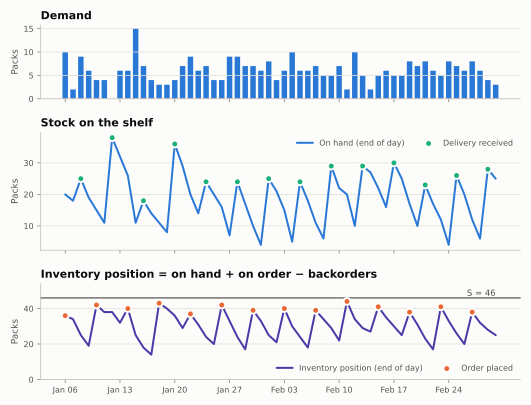

# Order-up-to $(R, S)$

The order-up-to policy is the workhorse of periodic replenishment. Every $R$
periods it looks at the inventory position and orders exactly enough to bring
it back up to a target level $S$.

## The rule

At every decision period $t$:

$$
q_t = \max\bigl(0,\; S_t - \mathit{IP}_t\bigr),
\qquad
\mathit{IP}_t = \mathit{OH}_t + P_t - B_t .
$$

After the order, the inventory position equals $S_t$ (unless it was already
above). The picture shows the typical saw-tooth: the position climbs back to
$S$ at every review, and the shelf refills $L$ periods later.



## Choosing $S$

A decision at $t$ must cover demand until the next order arrives, a window of
$H = L + R$ periods ([derivation](../concepts/timing.md#the-protection-horizon)).
With a target probability $\alpha$:

$$
S = Q_\alpha\!\left(\sum_{h=0}^{H-1} D_{t+h}\right).
$$

It is often useful to split $S$ into expected demand and a buffer:

$$
S = \underbrace{\mathbb{E}\!\left[\textstyle\sum_h D_{t+h}\right]}_{\text{cycle and pipeline stock}}
\;+\; \underbrace{\mathit{SS}}_{\text{safety stock}} .
$$

For independent normal periods, $\mathit{SS} = z_\alpha
\sqrt{\sum_h \sigma_h^2}$, and for identical periods with standard deviation
$\sigma$ this is the textbook $z_\alpha \sigma \sqrt{L + R}$ (Silver, Pyke
and Thomas, 2017). [Forecast targets](../forecast-targets.md) covers every
way of computing $S$.

### A useful property

With backorders and an inventory position at or below $S$ before each review,
the order simply replaces what was sold since the last review:

$$
q_t = S - \mathit{IP}_t = S - (S - D_{t-R} - \dots - D_{t-1}) = \sum_{k=1}^{R} D_{t-k}.
$$

Orders therefore pass demand variability straight through to the supplier,
one reason the $(R, S)$ policy is easy to plan around.

## In Stockcast

```python
import numpy as np
import pandas as pd

from stockcast.policies import OrderUpToPolicy

opening_date = pd.Timestamp("2026-01-05")
target = pd.DataFrame({
    "unique_id": ["tea_250g"],
    "S": [46.0],
    "S_end": [opening_date + pd.Timedelta(days=6)],
})

policy = OrderUpToPolicy(
    lead_time=2,
    review_period=4,
    service_level=0.95,
    allow_backorders=False,
).fit(
    target,
    target_column="S",
    target_probability=0.95,
    protection_horizon=6,               # = lead_time + review_period
    target_source="external_direct",
    forecast_origin=opening_date,
    forecast_frequency="D",
    target_end_date_column="S_end",
)
policy.get_target_metadata()
```

```text
{'representation': 'direct_protection_period_target', 'target_probability': 0.95, 'protection_horizon': 6, 'target_source': 'external_direct', 'forecast_origin': '2026-01-05T00:00:00', 'forecast_frequency': 'D', 'target_end_date': '2026-01-11T00:00:00'}
```

### Constructor

| Argument | Meaning |
|---|---|
| `lead_time` | $L$, integer $\ge 0$ |
| `review_period` | $R$, integer $\ge 1$; or pass `schedule=` for other calendars |
| `service_level` | $\alpha$, or `None` for [planner targets](../forecast-targets.md#three-ways-to-fit-a-target) |
| `allow_backorders` | `True` or `False` |
| `schedule` | any [`DecisionSchedule`](../decision-schedules.md) |

### Fitting

`fit` accepts one of two modes, described in
[Forecast targets](../forecast-targets.md#three-ways-to-fit-a-target):

- **direct**: `target_column`, `target_end_date_column`,
  `target_source="external_direct"`;
- **independent normal**: `mean_column`, `std_column`,
  `forecast_date_column`, `aggregation_method="independent_normal"`.

Both take `forecast_origin`, `forecast_frequency`, `protection_horizon`, and
(with a service level) `target_probability`.

## Special cases

| Setting | Behaviour |
|---|---|
| `review_period=1` | Order every period: a base-stock policy. $H = L + 1$. |
| `lead_time=0` | Orders arrive immediately, before demand. $H = R$. |
| `schedule=ExplicitSchedule(...)` | Irregular reviews; each decision needs a target for its own window (see [Decision schedules](../decision-schedules.md#irregular-schedules-and-their-targets)). |
| `policy_schedule={...}` in `run` | Fresh targets at later decisions, e.g. rolling forecasts. |

## Good to know

- $(R, S)$ is simple, robust, and widely used. With lost sales it is a strong
  heuristic rather than the exact optimum; the optimal lost-sales policy is
  more complex (Janakiraman and Roundy, 2004).
- Orders happen at every review in which demand occurred. If each order has a
  fixed cost, compare it with $(R, s, S)$, which skips small orders.

## References

- Silver, E. A., Pyke, D. F., and Thomas, D. J. (2017). *Inventory and
  Production Management in Supply Chains* (4th ed.). CRC Press.
- Janakiraman, G., and Roundy, R. O. (2004). Lost-sales problems with
  stochastic lead times: convexity results for base-stock policies.
  *Operations Research*, 52(5), 795–803.
  [doi:10.1287/opre.1040.0130](https://doi.org/10.1287/opre.1040.0130)

**Notebooks:** [04: weekly forecast to order](../../notebooks/04_forecast_to_inventory_integration.ipynb) ·
[04c: cumulative protection target](../../notebooks/04c_cumulative_protection_target.ipynb) ·
[04d: rolling targets](../../notebooks/04d_rolling_cumulative_targets.ipynb)
