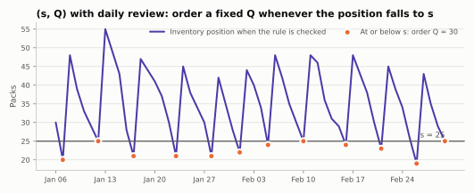

# Reorder point $(s, Q)$ and $(s, S)$

Reorder-point policies order only when stock gets low. At each opportunity
they compare the inventory position with a **reorder point** $s$. At or below
it, they order. Above it, they wait.

## The rules

At every decision period $t$:

$$
(s, Q):\quad q_t = \begin{cases} Q & \text{if } \mathit{IP}_t \le s \\ 0 & \text{otherwise} \end{cases}
\qquad\qquad
(s, S):\quad q_t = \begin{cases} \max(0, S - \mathit{IP}_t) & \text{if } \mathit{IP}_t \le s \\ 0 & \text{otherwise} \end{cases}
$$

- $(s, Q)$ orders a fixed quantity: a pallet, a truckload, an economic order
  quantity.
- $(s, S)$ orders up to a level $S \ge s$, so larger drops get larger orders.



## Choosing $s$

If the policy does not order at $t$, the next chance is the next decision
$u$, and that order arrives at $u + L$. The position at $t$ must therefore
cover demand over

$$
H = (u - t) + L
\quad\Longrightarrow\quad
H = L + R \ \text{(periodic)}, \qquad H = L + 1 \ \text{(every period)},
$$

and in quantile mode

$$
s = Q_\alpha\!\left(\sum_{h=0}^{H-1} D_{t+h}\right).
$$

Notice the $L + 1$ for a policy reviewed every period, one more than the
lead-time demand of continuous-review textbook formulas. Stockcast reviews
once per period, before demand, so an order that is not placed today can only
be placed tomorrow. [Timing](../concepts/timing.md#reorder-points) explains
this in detail, and [Notebook 05b](../../notebooks/05b_reorder_points_and_review_frequency.ipynb)
shows how finer review steps approach the continuous-review result.

$Q$ and $S$ are ordering choices rather than quantiles. $Q$ is often a pack
size or an economic order quantity, and $s$ and $S$ are usually chosen
together. Stockcast asks you to name where $Q$ comes from
(`order_quantity_source`) so the run manifest records it.

## In Stockcast

=== "(s, Q), quantile mode"

    ```python
    import numpy as np
    import pandas as pd

    from stockcast.policies import ReorderPointPolicy

    opening_date = pd.Timestamp("2026-01-05")
    L = 2
    H = L + 1                       # review every period
    totals = np.random.default_rng(42).poisson(6.0, size=(10_000, H)).sum(axis=1)

    targets = pd.DataFrame({
        "unique_id": ["tea_250g"],
        "s": [np.quantile(totals, 0.95)],
        "s_end": [opening_date + pd.Timedelta(days=H)],
    })

    sQ = ReorderPointPolicy(
        lead_time=L,
        review_period=1,
        policy_type="sQ",
        service_level=0.95,
        order_quantity=30.0,
        order_quantity_source="case_of_30",
        allow_backorders=False,
    ).fit(
        targets,
        forecast_origin=opening_date,
        forecast_frequency="D",
        reorder_point_column="s",
        reorder_end_date_column="s_end",
        reorder_horizon=H,
        target_source="external_direct",
        target_probability=0.95,
    )
    sQ.get_parameters()
    ```

    ```text
      unique_id  reorder_point  order_quantity
    0  tea_250g           25.0            30.0
    ```

=== "(s, S), planner mode"

    When $s$ and $S$ come from an optimiser or a planning rule, set
    `service_level=None`:

    ```python
    planned = pd.DataFrame({
        "unique_id": ["tea_250g"],
        "s": [20.0],
        "S": [60.0],
        "s_end": [opening_date + pd.Timedelta(days=6)],
    })
    sS = ReorderPointPolicy(
        lead_time=2, review_period=4, policy_type="sS",
        service_level=None, allow_backorders=False,
    ).fit(
        planned,
        forecast_origin=opening_date,
        forecast_frequency="D",
        reorder_point_column="s",
        order_up_to_column="S",
        reorder_end_date_column="s_end",
        reorder_horizon=6,            # L + R
        target_source="external_direct",
    )
    sS.get_parameters()
    ```

    ```text
      unique_id  reorder_point  order_up_to_level
    0  tea_250g           20.0               60.0
    ```

### Arguments

| Constructor | Meaning |
|---|---|
| `policy_type` | `"sQ"` or `"sS"` |
| `lead_time`, `review_period` / `schedule` | as for every policy |
| `service_level` | $\alpha$ for quantile mode, `None` for planner mode |
| `order_quantity`, `order_quantity_source` | $Q$ and where it comes from; $(s, Q)$ only |
| `allow_backorders` | `True` or `False` |

| `fit` | Meaning |
|---|---|
| `reorder_point_column` | column holding $s$ |
| `order_up_to_column` | column holding $S$; $(s, S)$ only |
| `reorder_horizon` | $H$: $L + R$ for periodic schedules, $(u - t) + L$ otherwise |
| `reorder_end_date_column` | last date covered by $s$: origin $+ H\Delta$ |
| `target_probability` | $\alpha$, quantile mode only |
| `forecast_origin`, `forecast_frequency`, `target_source` | as for [every target](../forecast-targets.md#the-fit-arguments) |

## Good to know

- **Undershoot.** Demand does not arrive one unit at a time. By the time the
  position is checked it may be well below $s$. With $(s, Q)$ a single $Q$
  might then not lift it above $s$ again; the policy orders $Q$ once per
  opportunity. $(s, S)$ adapts the order size to the drop.
- **Reorder points and service.** A quantile of window demand is the standard
  basis for $s$. Realised service also depends on undershoot, $Q$, and the
  shortage rule, which is exactly what a simulation measures.

**Notebooks:** [05b: reorder points and review frequency](../../notebooks/05b_reorder_points_and_review_frequency.ipynb) ·
[05: custom policies](../../notebooks/05_custom_policies.ipynb) ·
[06: fair comparisons](../../notebooks/06_fair_forecast_and_policy_comparisons.ipynb)
