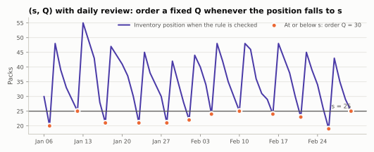

# Reorder point $(s, Q)$ and $(s, S)$

Reorder-point policies order only when stock gets low. At each opportunity
they compare the inventory position with a **reorder point** $s$. At or below
it, they order. Above it, they wait.

## The rules

At every decision period $t$:

$$
(s, Q):\quad q_t = \begin{cases} Q & \text{if } \mathit{IP}_t \le s \\ 0 & \text{otherwise} \end{cases}
\qquad\qquad
(s, S):\quad q_t = \begin{cases} \max(0, S - \mathit{IP}_t) & \text{if } \mathit{IP}_t \le s \\ 0 & \text{otherwise} \end{cases}
$$

- $(s, Q)$ orders a fixed quantity: a pallet, a truckload, an economic order
  quantity.
- $(s, S)$ orders up to a level $S \ge s$, so larger drops get larger orders.

Reviewed every $R$ periods, $(s, S)$ is the classic $(R, s, S)$ policy of
periodic inventory control (Silver, Pyke and Thomas, 2017). With $s = S$ it
behaves like order-up-to $(R, S)$; lowering $s$ skips small orders, which pays
off when each order carries a fixed cost.



## Choosing $s$

If the policy does not order at $t$, the next chance is the next decision
$u$, and that order arrives at $u + L$. The position at $t$ must therefore
cover demand over

$$
H = (u - t) + L
\quad\Longrightarrow\quad
H = L + R \ \text{(periodic)}, \qquad H = L + 1 \ \text{(every period)},
$$

and in quantile mode

$$
s = Q_\alpha\!\left(\sum_{h=0}^{H-1} D_{t+h}\right).
$$

Notice the $L + 1$ for a policy reviewed every period, one more than the
lead-time demand of continuous-review textbook formulas. Stockcast reviews
once per period, before demand, so an order that is not placed today can only
be placed tomorrow. [Timing](../concepts/timing.md#reorder-points) explains
this in detail, and [Notebook 05b](../../notebooks/05b_reorder_points_and_review_frequency.ipynb)
shows how finer review steps approach the continuous-review result.

$Q$ and $S$ are ordering choices rather than quantiles. $Q$ is often a pack
size or an economic order quantity, and $s$ and $S$ are usually chosen
together.

## Where $s$ and $S$ come from

Reorder points come from many places: one house rule, a planning table, a
forecast, a formula your team trusts. `fit` takes exactly one source:

| You have | Pass to `fit` |
|---|---|
| one pair for every SKU | `reorder_point=20.0, order_up_to_level=50.0` |
| one value per SKU | `reorder_point={"tea_250g": 25.0, ...}` or a Series by SKU, such as `table["s"]` |
| a dated forecast quantile | a table with `reorder_point_column=...` (and `order_up_to_column=...`) |
| your own rule | a table with `target_provider=YourProvider()` |

Every source goes through the same checks: finite values, $s \ge 0$, and
$S \ge s$. [Notebook 05g](../../notebooks/05g_reorder_point_sources.ipynb)
runs all of them on the same demand and compares them.

### Fixed values

Pass the numbers directly. A dict or a Series gives one value per SKU:

```python
import pandas as pd

from stockcast.core import InventoryStateDataFrame
from stockcast.policies import ReorderPointPolicy

opening_date = pd.Timestamp("2026-01-05")

policy = ReorderPointPolicy(
    lead_time=2, review_period=7, allow_backorders=False,
).fit(
    reorder_point={"tea_250g": 25.0, "coffee_1kg": 10.0},
    order_up_to_level={"tea_250g": 60.0, "coffee_1kg": 30.0},
)

state = InventoryStateDataFrame.from_observed(
    pd.DataFrame({"unique_id": ["tea_250g", "coffee_1kg"], "on_hand": [22.0, 14.0]}),
    start_date=opening_date,
)
policy.predict(state, current_period=0).get_dataframe()[
    ["unique_id", "inventory_position", "reorder_point", "target_level", "order_quantity"]]
```

```text
    unique_id  inventory_position  reorder_point  target_level  order_quantity
0    tea_250g                22.0           25.0          60.0            38.0
1  coffee_1kg                14.0           10.0          30.0             0.0
```

Tea is below its reorder point and orders up to 60; coffee is above its
reorder point and waits.

The columns of a planning table work the same way, and a single number
applies to every SKU:

```python
table = pd.DataFrame({"unique_id": ["tea_250g", "coffee_1kg"],
                      "s": [25.0, 10.0], "S": [60.0, 30.0]}).set_index("unique_id")
from_table = ReorderPointPolicy(lead_time=2, review_period=7,
                                allow_backorders=False).fit(
    reorder_point=table["s"], order_up_to_level=table["S"],
)
house_rule = ReorderPointPolicy(lead_time=2, review_period=7,
                                allow_backorders=False).fit(
    reorder_point=20.0, order_up_to_level=50.0,
)
```

Fixed values are planning levels, so they need `service_level=None` (the
default). Dates are optional: with `forecast_origin` (and the policy's
`freq`), the run checks that the values were set no later than the opening
date. Give the policy or the run a `freq` when the demand is dated.

### From a forecast

A forecast quantile is dated and covers a window, so the table carries the
dates too. The window of $s$ is checked at every decision.

=== "(s, Q), quantile mode"

    ```python
    import numpy as np
    import pandas as pd

    from stockcast.policies import ReorderPointPolicy

    opening_date = pd.Timestamp("2026-01-05")
    L = 2
    H = L + 1                       # review every period
    totals = np.random.default_rng(42).poisson(6.0, size=(10_000, H)).sum(axis=1)

    targets = pd.DataFrame({
        "unique_id": ["tea_250g"],
        "s": [np.quantile(totals, 0.95)],
        "s_end": [opening_date + pd.Timedelta(days=H)],
    })

    sQ = ReorderPointPolicy(
        lead_time=L,
        review_period=1,
        freq="D",
        policy_type="sQ",
        service_level=0.95,
        order_quantity=30.0,
        allow_backorders=False,
    ).fit(
        targets,
        forecast_origin=opening_date,
        reorder_point_column="s",
        reorder_end_date_column="s_end",
    )
    sQ.get_parameters()
    ```

    ```text
      unique_id  reorder_point  order_quantity
    0  tea_250g           25.0            30.0
    ```

=== "(s, S), planner mode"

    When $s$ and $S$ come from an optimiser or a planning rule, set
    `service_level=None`:

    ```python
    planned = pd.DataFrame({
        "unique_id": ["tea_250g"],
        "s": [20.0],
        "S": [60.0],
        "s_end": [opening_date + pd.Timedelta(days=6)],
    })
    sS = ReorderPointPolicy(
        lead_time=2, review_period=4, freq="D", policy_type="sS",
        service_level=None, allow_backorders=False,
    ).fit(
        planned,
        forecast_origin=opening_date,
        reorder_point_column="s",
        order_up_to_column="S",
        reorder_end_date_column="s_end",
    )
    sS.get_parameters()
    ```

    ```text
      unique_id  reorder_point  order_up_to_level
    0  tea_250g           20.0               60.0
    ```

### Your own rule

A target provider packages a rule of your own. It receives the table passed to
`fit` and returns `ReorderPointTargets(frame, metadata)` with one row per SKU.
Here $s$ and $S$ are days of cover of a daily rate:

```python
from stockcast.policies import ReorderPointTargetProvider, ReorderPointTargets


class DaysOfCoverTargets(ReorderPointTargetProvider):
    """s = reorder_days x rate, S = order_up_to_days x rate."""

    def __init__(self, reorder_days, order_up_to_days):
        self.reorder_days, self.order_up_to_days = reorder_days, order_up_to_days

    def provide(self, target_data, *, sku_column):
        rate = target_data["daily_rate"]
        frame = pd.DataFrame({
            sku_column: target_data[sku_column],
            "reorder_point": self.reorder_days * rate,
            "order_up_to_level": self.order_up_to_days * rate,
        })
        return ReorderPointTargets(frame=frame, metadata=self.to_manifest())

    def to_manifest(self):
        return {**super().to_manifest(), "reorder_days": self.reorder_days,
                "order_up_to_days": self.order_up_to_days}


rates = pd.DataFrame({"unique_id": ["tea_250g", "coffee_1kg"], "daily_rate": [6.0, 2.0]})
cover = ReorderPointPolicy(lead_time=2, review_period=7, allow_backorders=False).fit(
    rates, target_provider=DaysOfCoverTargets(4, 10),
)
cover.get_parameters()
```

```text
    unique_id  reorder_point  order_up_to_level
0    tea_250g           24.0               60.0
1  coffee_1kg            8.0               20.0
```

The provider's `to_manifest()` output is stored in the run manifest, so every
result records how its levels were made. For an $(s, Q)$ policy, return
`reorder_point` only. Set the class attribute
`target_source = "external_direct"` when the provider only passes along
values computed elsewhere; the default is `"custom_provider"`. Like fixed
values, provider levels need `service_level=None` and take optional dates.

### Arguments

| Constructor | Meaning |
|---|---|
| `policy_type` | `"sQ"` or `"sS"`; optional: giving `order_quantity` means `"sQ"`, otherwise `"sS"` |
| `lead_time`, `review_period` / `schedule` | as for every policy |
| `freq` | $\Delta$, the length of one period; needed for column targets, optional for fixed values and providers |
| `service_level` | $\alpha$ for quantile mode, `None` for planner mode |
| `order_quantity` | $Q$; $(s, Q)$ only |
| `allow_backorders` | `True` or `False` |

| `fit` | Meaning |
|---|---|
| `reorder_point` | fixed $s$: a number, a dict, or a Series by SKU |
| `order_up_to_level` | fixed $S$, in the same forms; $(s, S)$ only |
| `target_provider` | a `ReorderPointTargetProvider`, called with the table |
| `reorder_point_column` | column holding $s$ |
| `order_up_to_column` | column holding $S$; $(s, S)$ only |
| `reorder_horizon` | $H$: defaults to $L + R$ for periodic schedules; required otherwise, checked as $(u - t) + L$ |
| `reorder_end_date_column` | optional; last date covered by $s$: origin $+ H\Delta$ |
| `target_probability` | $\alpha$, quantile mode only; defaults to `service_level` |
| `forecast_origin` | as for [every target](../forecast-targets.md#the-fit-arguments); optional for fixed values and providers |

The window arguments (`reorder_horizon`, `reorder_end_date_column`,
`target_probability`, `order_up_to_column`) belong to column targets.

## Good to know

- **Undershoot.** Demand does not arrive one unit at a time. By the time the
  position is checked it may be well below $s$. With $(s, Q)$ a single $Q$
  might then not lift it above $s$ again; the policy orders $Q$ once per
  opportunity. $(s, S)$ adapts the order size to the drop.
- **Reorder points and service.** A quantile of window demand is the standard
  basis for $s$. Realised service also depends on undershoot, $Q$, and the
  shortage rule, which is exactly what a simulation measures.

**Notebooks:** [05b: reorder points and review frequency](../../notebooks/05b_reorder_points_and_review_frequency.ipynb) ·
[05g: reorder points from any source](../../notebooks/05g_reorder_point_sources.ipynb) ·
[02b: decision schedules](../../notebooks/02b_decision_schedules.ipynb) ·
[08: callbacks and audit](../../notebooks/08_callbacks_and_audit.ipynb) ·
[05: custom policies](../../notebooks/05_custom_policies.ipynb) ·
[06: fair comparisons](../../notebooks/06_fair_forecast_and_policy_comparisons.ipynb)
