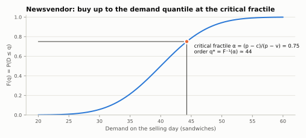

# Single order (newsvendor)

Some decisions happen once: sandwiches for today, a Christmas collection,
programmes for a concert. You buy before the season, sell during it, and
whatever is left has little value. This is the **newsvendor problem**, and
`SingleOrderPolicy` makes that single purchase.

## The economics

Let $p$ be the selling price, $c$ the purchase cost, and $v$ the salvage value
of a leftover unit ($p > c > v \ge 0$). Buying one unit too few loses the
margin $c_u = p - c$; buying one too many loses $c_o = c - v$. The best
quantity balances the two: buy until the chance of selling one more unit
equals the cost ratio,

$$
F(q^*) = \frac{c_u}{c_u + c_o} = \frac{p - c}{p - v} = \alpha ,
\qquad
q^* = F^{-1}(\alpha),
$$

where $F$ is the forecast distribution of season demand. The ratio $\alpha$ is
the **critical fractile**. This is the classical result for linear costs, lost
sales, and a single purchase (see, for example, Silver, Pyke and Thomas,
2017).



`newsvendor_critical_fractile` computes $\alpha$:

```python
from stockcast.policies import newsvendor_critical_fractile

alpha = newsvendor_critical_fractile(selling_price=10.0, purchase_cost=4.0, salvage_value=2.0)
alpha
```

```text
0.75
```

Your forecast supplies $F^{-1}(\alpha)$: a quantile of demand over the whole
season.

## A one-day season

A kiosk buys sandwiches each morning, with delivery before opening
($L = 0$). History says demand is around 40 a day:

```python
import numpy as np
import pandas as pd

from stockcast.core import InventoryStateDataFrame, SimulationEngine
from stockcast.policies import SingleOrderPolicy

history = np.random.default_rng(42).poisson(40, size=60)    # your forecast samples
quantity = float(np.quantile(history, alpha, method="inverted_cdf"))

origin = pd.Timestamp("2026-03-30")                          # last observed day
selling_day = origin + pd.Timedelta(days=1)

policy = SingleOrderPolicy(
    lead_time=0, selling_horizon=1, service_level=alpha, allow_backorders=False,
).fit(
    pd.DataFrame({"unique_id": ["sandwich"], "target": [quantity],
                  "target_end": [selling_day]}),
    forecast_origin=origin, forecast_frequency="D",
    target_column="target", target_probability=alpha,
    target_end_date_column="target_end", target_source="external_direct",
)

kiosk = InventoryStateDataFrame(["sandwich"], max_lead_time=0, allow_backorders=False)
kiosk.initialize_zero(start_date=origin)
demand = pd.DataFrame({"unique_id": ["sandwich"], "period": [0],
                       "date": [selling_day], "y": [37.0]})

result = SimulationEngine().run(
    policy=policy, demand_source=demand, inventory=kiosk, n_periods=1,
    period_frequency="D", warmup_periods=0, scoring_periods=1, settlement_periods=0,
    order_during_settlement=False, demand_source_name="one_selling_day", random_seed=None,
)
day = result.to_event_frame().iloc[0]
profit = 10.0 * day.fulfilled_units - 4.0 * day.order_quantity + 2.0 * day.ending_on_hand
day[["order_quantity", "demand", "fulfilled_units", "ending_on_hand"]].to_dict(), profit
```

```text
({'order_quantity': 44.0, 'demand': 37.0, 'fulfilled_units': 37.0, 'ending_on_hand': 7.0}, np.float64(208.0))
```

The kiosk bought 44, sold 37, and had 7 left for salvage. The profit is
computed from the ledger with your own prices: Stockcast records the physical
flows and leaves the economics of leftovers to you.

## Seasons with a lead time

With a lead time, the order must be placed before the season starts. The
season begins when the order arrives, at demand period
$\text{decision period} + L$, and lasts `selling_horizon` periods:

| Demand period | 0 | 1 | 2 | 3 … 7 | 8 |
|---|---|---|---|---|---|
| With $L = 2$, a 7-period season | order placed, no demand | in transit, no demand | delivery arrives, season day 1 | season days 2–6 | season day 7 |

The target is a quantile of **total** season demand, and it ends at
$\text{forecast origin} + (L + \text{selling horizon})\,\Delta$. The demand table
contains zeros before and after the season, and the run lasts until the season
ends:

```python
L, season = 2, 7
origin = pd.Timestamp("2026-11-30")
season_totals = np.random.default_rng(1).poisson(40, size=(10_000, season)).sum(axis=1)

seasonal = SingleOrderPolicy(
    lead_time=L, selling_horizon=season, service_level=alpha, allow_backorders=False,
).fit(
    pd.DataFrame({"unique_id": ["advent_calendar"],
                  "target": [np.quantile(season_totals, alpha)],
                  "target_end": [origin + pd.Timedelta(days=L + season)]}),
    forecast_origin=origin, forecast_frequency="D",
    target_column="target", target_probability=alpha,
    target_end_date_column="target_end", target_source="external_direct",
)

shop = InventoryStateDataFrame(["advent_calendar"], max_lead_time=L, allow_backorders=False)
shop.initialize_zero(start_date=origin)
season_demand = pd.DataFrame({
    "unique_id": "advent_calendar",
    "period": range(L + season),
    "date": pd.date_range(origin + pd.Timedelta(days=1), periods=L + season, freq="D"),
    "y": [0.0] * L + [38.0, 45.0, 41.0, 39.0, 50.0, 44.0, 36.0],
})
result = SimulationEngine().run(
    policy=seasonal, demand_source=season_demand, inventory=shop, n_periods=L + season,
    period_frequency="D", warmup_periods=0, scoring_periods=L + season,
    settlement_periods=0, order_during_settlement=False,
    demand_source_name="advent_season", random_seed=None,
)
events = result.to_event_frame()
events["order_quantity"].sum(), events["demand"].sum(), events["lost_sales_units"].sum()
```

```text
(np.float64(291.0), np.float64(293.0), np.float64(2.0))
```

The shop bought 291 calendars for a season that turned out to need 293, and
missed 2 sales.

Stockcast checks that the target covers exactly the season, that demand
outside the season is zero, that the run observes the whole season, and that
any opening pipeline arrives by the season's start.

## Good to know

- The critical fractile assumes linear costs, lost sales, and no second
  purchase. With extra costs (disposal fees, goodwill), capacity limits, or
  expiry during the season, compute your own target and pass it in; the
  policy, engine, and ledger work the same way.
- A one-row weekly demand table is a one-period season; seven daily rows are a
  seven-period season, and the target is then a quantile of the seven-day
  total.

**Notebook:** [04b: daily newsvendor](../../notebooks/04b_daily_newsvendor.ipynb)
