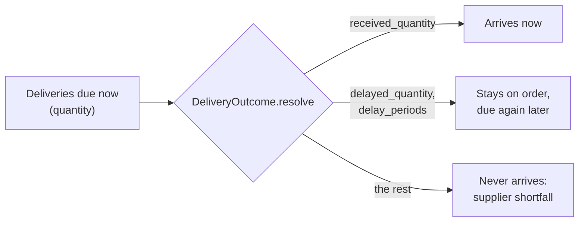

# Unreliable deliveries

Suppliers do not always deliver what was ordered, when it was promised. A
truck is late, a shipment arrives short, a line is cancelled. A
`DeliveryOutcome` attached to a supplier decides, when each delivery falls
due, how much arrives now, how much comes later, and how much never comes.

## How it works

At the start of each period, before receipts and before the policy decides,
the engine collects the deliveries of that supplier that are due now and asks
the outcome:



For every due delivery:

$$
\text{quantity} = \underbrace{\text{received}}_{\text{now}} + \underbrace{\text{delayed}}_{\text{later}} + \underbrace{\text{undelivered}}_{\text{never}} .
$$

The retailer learns about a problem only on the due date: until then the
order is on order at its full quantity, as in real life. A delayed part is
resolved again when it next falls due, so it can slip more than once.

With this one shape you can model:

- **short deliveries**: receive part, cancel the rest;
- **late deliveries**: delay everything;
- **back-ordered supply**: receive part now and delay the remainder;
- **disruptions**: decide from the date, the state, or the SKU.

## Write an outcome

Subclass `DeliveryOutcome` and implement `resolve(due, context)`. `due` has one
row per due delivery (`order_id`, the SKU column, `supplier_id`, `source`,
`order_period`, `scheduled_due_period`, `due_period`, `quantity`). Return
`None` to let everything arrive, or a DataFrame with the same index and the
columns:

| Column | Meaning |
|---|---|
| `received_quantity` (required) | arrives now |
| `delayed_quantity` (optional, default 0) | stays on order |
| `delay_periods` (required if something is delayed) | integer $\ge 1$ |

`context` is a `DeliveryContext` with a copy of the state, the SKU column,
`period`, `date`, `supplier_id`, and `rng`: a NumPy generator seeded from the
supply model's `random_seed`, one stream per supplier.

??? example "Setup: the tea shop from Learn the basics"

    ```python
    --8<-- "learn-setup.py"
    ```

```python
import warnings

import numpy as np

from stockcast.core import (
    DeliveryOutcome, InventoryStateDataFrame, SimulationEngine, Supplier, SupplyModel,
)


class ShortOrLate(DeliveryOutcome):
    """15% of deliveries arrive 2 periods late; the rest arrive 90% filled."""

    def resolve(self, due, context):
        late = context.rng.random(len(due)) < 0.15
        return due.assign(
            received_quantity=np.where(late, 0.0, 0.9 * due["quantity"]),
            delayed_quantity=np.where(late, due["quantity"], 0.0),
            delay_periods=2,
        )


supply = SupplyModel(
    [Supplier("wholesaler", lead_time=lead_time, delivery=ShortOrLate())],
    random_seed=7,
)
inventory_4 = InventoryStateDataFrame(
    [sku], max_lead_time=4, allow_backorders=False,       # room for a 2-period delay
).initialize_from_observed(
    pd.DataFrame({"unique_id": [sku], "on_hand": [30.0]}),
    on_hand_column="on_hand", start_date=opening_date,
)

with warnings.catch_warnings():
    warnings.simplefilter("ignore", UserWarning)
    result = SimulationEngine().run(
        policy=policy, demand_source=demand, inventory=inventory_4,
        supply=supply, **run_settings,
    )

events = result.to_event_frame()
events[["order_quantity", "received_units", "supplier_shortfall_units"]].sum().round(1)
```

```text
order_quantity              366.8
received_units              303.9
supplier_shortfall_units     33.8
dtype: float64
```

The shop ordered 366.8 packs. 303.9 arrived, 33.8 never will, and the rest
was still on its way when the run ended. Because the policy sees every
shortfall at its next review, it ordered more than the 333 packs of the
reliable run, and still served 98.8% of demand.

## What the ledger records

Runs with a delivery outcome add one ledger column,
`supplier_shortfall_units`: units that were due in the period and will never
arrive. It closes the pipeline balance:

$$
P^{\text{end}} = P^{\text{start}} + q - r - \text{shortfall}.
$$

`order_quantity` stays what the retailer ordered, so ordering and purchase
costs are charged on the ordered quantity. Delays need no column: a delayed
quantity simply stays on order. The policy sees the lower inventory position
at its next review and can re-order.

The order frame gains four columns, and its `status` can be `"disrupted"`:

| Column | Meaning |
|---|---|
| `scheduled_due_period` | the due period set when the order was placed |
| `received_quantity` | received from this delivery on its `due_period` |
| `delayed_quantity` | moved to a later period (a new row with the same `order_id`) |
| `undelivered_quantity` | never arrived |

```python
orders = result.to_order_frame()
orders["status"].value_counts()
```

Every delivery in this run was short or late, so all but the last (still in
transit) are marked `"disrupted"`:

```text
status
disrupted    15
open          1
Name: count, dtype: int64
```

## Supplier metrics

Supplier-level measures are one custom metric away:

```python
from stockcast.evaluation import InventoryEvaluator, fill_rate


def supplier_fill_rate(events, context=None):
    received = events["received_units"].sum()
    return received / (received + events["supplier_shortfall_units"].sum())


InventoryEvaluator().fit(result, window="scoring").evaluate(
    [fill_rate, supplier_fill_rate], groupby=[])
```

```text
   fill_rate  supplier_fill_rate
0   0.987776                 0.9
```

## Good to know

- `DeliveryOutcome()` itself lets everything arrive, so
  `Supplier(id, lead_time, delivery=DeliveryOutcome())` gives the same ledger
  as a supplier without an outcome (plus an all-zero
  `supplier_shortfall_units` column).
- A supplier with an outcome needs a lead time of at least one period.
- Delays must fit in the pipeline: a delayed delivery must still be due within
  `max_lead_time` periods of the current state.
- The engine checks every returned row: finite, non-negative quantities, and
  `received + delayed` no larger than the due quantity. Any other problem
  stops the run with a clear message.
- Only deliveries of suppliers with an outcome are passed to `resolve`,
  including their declared opening orders. Opening stock given only as
  `in_transit` has no supplier and arrives as scheduled.
- `reset()` runs before every run; `get_config()` returns settings for the
  manifest.

**Notebook:** [05f: unreliable supplier](../notebooks/05f_unreliable_supplier.ipynb)
