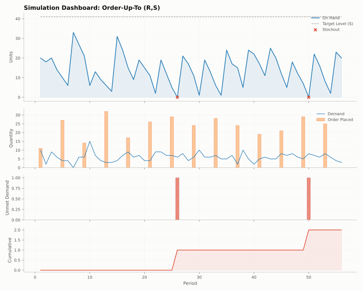

# Plots

`stockcast.visualization` draws the most common views of a run straight from
its ledger. Every function returns Matplotlib axes, so you can restyle,
annotate, or combine them, and none of them calls `plt.show()` for you.

## One run

??? example "Setup: the tea shop from Learn the basics"

    ```python
    --8<-- "learn-setup.py"
    ```

```python
import matplotlib.pyplot as plt

from stockcast.visualization import plot_simulation_dashboard

axes = plot_simulation_dashboard(result, sku=sku, figsize=(10, 8))
```



The dashboard stacks four panels that share the time axis: stock on hand with
the target level, demand with the orders placed, shortage per period, and
cumulative shortage. (This picture uses the 80% target, which shows a couple
of small stockouts.)

| Function | Draws |
|---|---|
| `plot_inventory(result, sku=None, ax=None)` | on-hand stock over time, with stockout periods highlighted |
| `plot_demand_vs_orders(result, sku=None, ax=None)` | demand and order quantities |
| `plot_simulation_dashboard(result, sku=None, show_target=True, show_safety_stock=True)` | the four-panel dashboard above |

`sku` selects one SKU or a list; `None` adds all SKUs together.

## Several runs

For a `ComparisonResult` from `run_comparison`:

| Function | Draws |
|---|---|
| `plot_comparison(comparison, metric="on_hand", sku=None, ax=None)` | one line per policy for a state column |
| `plot_summary_comparison(comparison, metrics=None)` | grouped bars of `summary()` metrics |
| `plot_comparison_dashboard(comparison, sku=None)` | a multi-panel side-by-side comparison |

```python
from stockcast.core import SimulationEngine
from stockcast.visualization import plot_comparison, plot_summary_comparison

comparison = SimulationEngine().run_comparison(
    policies=[tea_policy(0.8), tea_policy(0.95)], labels=["80%", "95%"],
    demand_source=demand, inventory=inventory, **run_settings,
)
fig, ax = plt.subplots(figsize=(9, 3))
plot_comparison(comparison, metric="on_hand", sku=sku, ax=ax)
ax.set_title("On-hand stock: 80% versus 95% target")
```

## Your own charts

The ledger is a tidy DataFrame, so any plotting library works directly on
`result.to_event_frame()`. The figures throughout these docs are drawn that
way; their source is in
[`docs/scripts/make_figures.py`](https://github.com/FilTheo/stockcast/blob/main/docs/scripts/make_figures.py).

**Go deeper:** [API: plots](../reference/visualization.md) ·
[Notebook 02](../notebooks/02_first_engine_simulation.ipynb) ·
[Notebook 06](../notebooks/06_fair_forecast_and_policy_comparisons.ipynb)
